# Aider nightly coding kit — the manual

**Goal.** Take you from a machine with nothing installed to a project that codes
itself overnight, in numbered steps you follow in order, then explain each fixed
parameter so you can change it deliberately.

**Contents.** The procedure and the reasons behind it. Measured results for a
particular machine live in `CONFIG_OLLAMA.md`; the coding rules the model obeys
live in `config/rules.md`; the kit's file inventory lives in `README.md`. This
file points at those rather than repeating them.

---

## What this builds

Two local models and one driver. Nothing leaves your machine.

| Role | Tag | What it does |
|---|---|---|
| Writes code and tests | the **tuned** coder tag, built in step 4 | executes one plan at a time and writes its tests |
| Reviews | the reviewer tag | audits at the end of every plan, and can never edit code |

You pull a base model; you **run** a tuned tag derived from it. That difference
is not cosmetic — see step 4.

The driver runs **one aider process per plan**, which is what actually drops the
context window between plans. After each plan it runs the test suite, then hands
the changed code to the reviewer, which writes `audit.md` and may reopen the plan
for one more round.

You write three documents. The night produces code, tests, commits and an audit.
A person merges.

---

## The whole process, in one figure

```mermaid
flowchart TD
    subgraph DAY["DAYTIME - you, awake. No local model runs, and nothing here is executed"]
        D0["Settle the design questions first<br/>each is a decision the night cannot take<br/>and would only surface hours into a run"]
        D1["Hand the planning prompt to a CLOUD model<br/>examples/robot-planning-prompt.md<br/>it writes NO code, only these three documents"]
        D2["spec.md - what is built, and what it must never do<br/>re-read on EVERY call, so a constraint left out<br/>is a constraint that does not exist"]
        D3["plan1.md ... planN.md - one stage each<br/>EVERY step names the file it touches:<br/>the driver hands exactly those files over as editable"]
        D4["progress.md - the ledger, the only file<br/>both you and the model write<br/>one '## planN.md' heading per plan, every box '- [ ]'"]
        D5["new-project.ps1, copy the three in,<br/>then aider-plan.ps1 -DryRun<br/>catches a missing plan or an over-budget file in seconds"]
        D0 --> D1 --> D2 --> D3 --> D4 --> D5
    end
    D5 --> N0["aider-night.bat &lt;project&gt;"]
    N0 --> N1{"Refuse before starting anything?<br/>on battery · on main or master · no config<br/>model not local · tests required with no command<br/>budget key missing · always-on file absent"}
    N1 -->|"yes"| NX["STOP with the reason. Nothing written"]
    N1 -->|"no"| N2["Create the branch, take the wake lock"]
    N2 --> N3["Read the budget and print it"]
    subgraph PLAN["FOR EACH PLAN - one aider process, so the window is dropped between plans"]
        P1["Load the WRITER model<br/>conventions.md + rules.md, always on"]
        P2["Editable: only the files this plan names"]
        P3["Write the code and its test, commit each edit"]
        P4{"Tests pass?<br/>3 attempts, aider max_reflections"}
        LX["progress.md ← '- [x] tests pass'"]
        LT1["progress.md ← '- [!] tests - no test file for &lt;file&gt;'"]
        LT2["progress.md ← '- [!] tests - suite still failing<br/>(exit N) after the fix loop'"]
        P5["EVICT the writer, load the REVIEWER<br/>no tokens, but about 110 s each way"]
        P6["Review: the code arrives as TEXT<br/>the reviewer may write only audit.md"]
        LA0["progress.md ← '- [!] audit - the reviewer wrote<br/>no report, so this plan is NOT audited'"]
        P7{"Did the audit reopen the plan?<br/>one '- [ ] audit: &lt;what to fix&gt;'<br/>per finding that must be closed"}
        P8["Round 2: fix what the audit listed"]
        LA2["progress.md ← '- [!] audit - findings still open<br/>after 2 round(s), stopped by the round limit'"]
        P9{"Section has no '- [ ]' and no '- [!]' left?"}
        PA["Archive planN.md to todo/<br/>this is the ONLY thing that archives a plan"]
        PF["The plan is blocked. Every mark above is already<br/>in progress.md, so nothing else is written here"]
        P1 --> P2 --> P3 --> P4
        P4 -->|"no, retry up to 3"| P3
        P4 -->|"no test file for a changed file"| LT1 --> PF
        P4 -->|"after 3 failures"| LT2 --> PF
        P4 -->|"yes"| LX --> P5 --> P6
        P6 -->|"audit.md is zero bytes"| LA0 --> PF
        P6 -->|"a report was written"| P7
        P7 -->|"yes, and a round is left"| P8 --> P4
        P7 -->|"yes, and round 2 is spent"| LA2 --> PF
        P7 -->|"no"| P9
        P9 -->|"yes"| PA
        P9 -->|"no, the writer left steps open"| PF
    end
    N3 --> P1
    PA --> N4["Final audit pass over everything that changed<br/>adds a '## audit.md' section to the ledger"]
    PF --> N4
    N4 --> N5{"Every plan archived AND<br/>no open line left in the ledger?"}
    N5 -->|"yes"| N6["Archive spec.md and progress.md to todo/"]
    N5 -->|"no"| N7["Leave them in place: nothing is filed<br/>as finished that is not"]
    N6 --> NR["Release the wake lock"]
    N7 --> NR
    NR --> ND{"Any plan blocked?"}
    ND -->|"no"| NOK["done - exit 0"]
    ND -->|"yes"| NBK["done_with_blocked - exit non-zero<br/>every plan still ran; read the '- [!]' lines"]
    NOK --> M1["MORNING - read audit.md AGAINST the code"]
    NBK --> M1
    M1 --> M2{"Worth keeping?"}
    M2 -->|"yes"| M3["git push, open a pull request<br/>the PR opens only if no plan file is left"]
    M2 -->|"no"| M4["Fix by hand, or write tomorrow's plan"]
    M3 --> M5["MERGE - by a person, awake.<br/>The pipeline has no code path to it"]
```



Four things in that figure are worth reading twice.

**A blocked plan does not end the night.** Every blocked exit continues to the
next plan, and the final audit runs anyway, because `audit.md` is exactly what
you pick the work back up from in the morning.

**There are three endings**, not two: `done`, `done_with_blocked` and `failed`.
A run with a blocked plan exits non-zero, so a zero exit means every plan
finished.

**A plan is archived only when its ledger section has no open line left**, `- [ ]`
or `- [!]`. Nothing is filed as finished that is not.

**The window is dropped between plans.** Whatever plan 4 needs to know must be in
`spec.md`, in `progress.md`, or in code already on disk.

---

# Step 1 — Install the tools

Nothing here runs in the system Python, and you create no virtual environment by
hand. `uv` makes and owns aider's environment; each project gets its own,
created by `new-project.ps1` in step 5.

**1.1 Install `uv`**, if you do not have it:

```powershell
winget install --id=astral-sh.uv -e
```

**1.2 Install aider** into an environment `uv` manages:

```powershell
uv tool install --force --python python3.12 --with pip aider-chat@latest
aider --version
```

`--with pip` is not optional: aider installs its own extras at run time and
cannot without it.

**1.3 Install Ollama** from its own installer, then confirm the daemon answers:

```powershell
ollama --version
Invoke-RestMethod -Uri "http://127.0.0.1:11434/api/tags" -TimeoutSec 10 | Out-Null
```

The daemon is started by its tray application at login. It does **not** survive a
reboot unless that application launched it, and nothing in this kit starts it.

**1.4 Set the daemon variables.** These are read by the daemon **at start**, so
set them, then restart the daemon, in that order.

| Variable | Value | Why |
|---|---|---|
| `OLLAMA_KEEP_ALIVE` | `-1` | keep a model resident rather than paying a reload between plans |
| `OLLAMA_MAX_LOADED_MODELS` | `1` | two large models resident together is what stops a small machine |
| `OLLAMA_FLASH_ATTENTION` | `1` | smaller attention working set |
| `OLLAMA_KV_CACHE_TYPE` | `q8_0` | halves the KV cache, the second largest consumer of VRAM |

Set them at **user scope**, in the registry or through the System panel — not in
a shell profile, because the daemon is launched by the tray application and never
sees your shell. Then verify the effect rather than the command:

```powershell
ollama ps        # UNTIL must read "Forever", not a deadline
```

**1.5 Pull the two base models.** The reviewer must be a **different** model from
the writer: a model reviewing its own output rates its own reasoning, which is
the failure this separation exists to prevent.

```powershell
ollama pull "<your-coder-model>"
ollama pull "<your-reviewer-model>"
```

Which model sizes suit your hardware is a measurement, not a preference. Step 3
takes it, and `CONFIG_OLLAMA.md` section 4 turns it into a size.

---

# Step 2 — Install the kit

**2.1 Check the download before you unzip it.** `aider-kit.zip.manifest` is
published beside the archive. Compare the two values it states against your own
copy:

```powershell
cd "$HOME\Downloads"
Get-FileHash .\aider-kit.zip -Algorithm SHA256
(Get-Item .\aider-kit.zip).Length
```

A mismatch means the download is incomplete. This matters because a truncated
zip does not announce itself: it opens, it lists files, and it is simply
missing some, so the first sign is a step failing much later for no visible
reason. The manifest also lists every file the archive holds, so after
unzipping you can name anything that did not arrive:

```powershell
cd "$HOME\aider-kit"
$d = Get-Content "$HOME\Downloads\aider-kit.zip.manifest" |
     Where-Object { $_ -notmatch '^#|^size |^sha256 ' } | Where-Object { $_ -ne '' }
$d | Where-Object { -not (Test-Path -LiteralPath $_) }
```

It prints nothing when the extraction is complete. It is not a security check:
anyone who could alter the archive could alter the manifest next to it.

**2.2 Unzip** `aider-kit.zip` somewhere you will keep, for example `%USERPROFILE%\aider-kit`.
Avoid `Downloads`, avoid any cloud-synced folder, and avoid paths containing
spaces.

The archive is **flat**: it has no `aider-kit\` folder inside it, so the 51 files
land directly in whatever folder you extract into. Extract into a NEW folder,
or they mix with whatever is already there.

**2.3 Unblock the files.** Windows marks anything downloaded, and PowerShell then
refuses the scripts:

```powershell
cd "$HOME\aider-kit"
Get-ChildItem -Recurse -Include *.ps1,*.bat | Unblock-File
```

**2.4 Install:**

```powershell
.\setup.ps1 -DryRun      # every path it would write; writes nothing
.\setup.ps1
```

It **adds and never silently replaces**: a file that already exists is kept and
reported as kept, unless you pass `-Force`. It substitutes your own home
directory for every `{{HOME}}` placeholder, so nothing installed names anyone
else's machine.

Afterwards everything lives in your home directory:

- `~\.config\aider\` — configuration, this manual, `CONFIG_OLLAMA.md`, the
  skills, and `examples\`
- `~\.local\bin\` — the driver, the probes, the tuner and their tests
- `~\.aider.conf.yml` — the one file aider finds by name

**2.3 Put `~\.local\bin` on your `PATH`** if it is not already, so the driver can
be called by name.

---

# Step 3 — Test the computer

Before spending a night on it, find out what your machine can do. Nothing here
changes a setting.

**3.1 Prove the tools work**, offline — no model loaded, no network:

```powershell
python "$HOME\.local\bin\Test\test_aider_gpu_probe.py"
python "$HOME\.local\bin\Test\test_aider_thread_probe.py"
python "$HOME\.local\bin\Test\test_aider_ollama_config.py"
& "$HOME\.local\bin\Test\verify-aider-plan.ps1"
```

Each prints its own count of checks and whether they passed. **Read that count
rather than a number written down here** — a count in prose is exactly the kind
of figure that goes stale.

**3.2 Measure the machine:**

```powershell
ollama-tune.bat floor     # the arithmetic only: seconds, no model loaded
ollama-tune.bat quick     # bandwidth, threads and offload: about 15 minutes
```

The machine is loaded while this runs and any resident model is evicted between
rungs, so do not run it during work you care about.

**What the numbers mean, and what to do with them, is `CONFIG_OLLAMA.md`.** Read
it before step 4. The short version: on a small card the context window is paid
for in model weights pushed off the GPU, and the wrong window puts **zero** layers
on the card while appearing to work.

---

# Step 4 — Tune Ollama, and build the tag you will run

A base tag runs at its architecture's native context window, which on a small
card is the worst configuration available. You run a **tuned** tag instead.

```powershell
python "$HOME\.local\bin\aider-ollama-config.py" `
  --model "<your-coder-model>" `
  --report "<the report ollama-tune printed>" `
  --yes
```

It computes the smallest window that holds this harness's assembled prompt from
`context-budget.json`, takes `num_gpu` and `num_thread` from your measurements,
writes a Modelfile, creates the tag, and then **reads the tag back** to prove the
parameters took — `ollama create` exiting 0 is not evidence that they did.
It then writes two of the three files below, and reports for each whether it
added the setting, corrected it, or found it already correct.

**4.1 Three files must agree, or the tuning does nothing.** This is the part
that fails silently. The tool now writes the second and third, because doing
them by hand meant a tuned tag and none of the wiring, which reproduces the
original failure exactly. The first is still your edit:

| File | What it must say | What goes wrong otherwise |
|---|---|---|
| `~\.aider.conf.yml` **(you)** | `model:` names the **tuned** tag | you run the base tag, at its native window |
| `~\.config\aider\model-settings.yml` **(written)** | an entry for the tuned tag whose `extra_params: num_ctx:` is the tuned window | aider sends `num_ctx` on every request, which **overrides the Modelfile** — the tag is neutered while looking correct |
| `~\.aider.model.metadata.json` **(written)** | `max_input_tokens` for the tuned tag | aider otherwise asks Ollama, which answers with the architecture's native maximum, so the driver sizes audit batches against a window several times too large, and Ollama truncates the prompt **silently** |

**4.2 Verify the whole chain in one command.** The driver prints the window it
believes, and that figure must match the one you tuned to:

```powershell
cd "$HOME\projects\my-project"
aider-plan.ps1 -DryRun -TestCommand '.\.venv\Scripts\python.exe -m unittest discover -s tests -p "test_*.py"'
```

If the printed window is the model's native maximum rather than your tuned
window, one of the three files above is wrong. Fix it before running a night.

**4.3 Tune the REVIEWER too.** Two models run every night. You have just tuned
the one that writes code; the one that reviews it is about half the night.

Do these six things, in this order.

**1.** Sweep the reviewer tag, exactly as you swept the coder:

```powershell
ollama-tune.bat layers
ollama-tune.bat threads
```

**2.** Write its Modelfile, using your own numbers from step 1:

```
FROM <your-reviewer-base-tag>
PARAMETER num_ctx    <the smallest window that holds one review>
PARAMETER num_predict <about twice your audit.md ceiling>
PARAMETER num_thread <from the test>
```

**3.** Build it:

```powershell
ollama create "myreviewer-aider" -f Modelfile
```

**4.** Register it in `model-settings.yml`, with the same `num_ctx` and
`num_predict` again, plus one line the Modelfile cannot carry:

```yaml
- name: ollama_chat/<your-reviewer>-aider
  extra_params:
    num_ctx: <same as the Modelfile>
    num_predict: <same as the Modelfile>
    think: false
```

**5.** Point the driver at it, in `context-budget.json`:

```json
"audit": { "model": "ollama_chat/<your-reviewer>-aider" }
```

**6.** Check the window you were actually GRANTED:

```powershell
ollama ps
```

The CONTEXT column must show your `num_ctx`. If it shows something else, that
is what you have: Ollama clamps a window it cannot satisfy instead of refusing
it. Measured here: a tag declaring 262144 was served 28928, aider budgeted
against the larger number, and every review was cut off mid-report.

**Do not skip step 4's `think: false`** if your reviewer is a thinking model.
Its reasoning is billed against `num_predict`, so it can spend the whole budget
deliberating and write no report, and a plan with no report is blocked.
`CONFIG_OLLAMA.md` has the measurement, and says what turning reasoning off
costs you.

**How you know it worked:** run a night. `audit.md` grows, and a plan with a
real problem comes back reopened rather than clean.

<!-- MEASURED:BEGIN your reviewer tag, before and after -->
On the reference machine, 2026-09-06: 1.6 tok/s untuned against 2.86 tuned, and
a review that had run two hours and written nothing finished in nine minutes
with nine findings.

<!-- MEASURED:TEMPLATE -->
| | your reviewer |
|---|---|
| decode before tuning | |
| decode after tuning | |
| a review took, before | |
| a review took, after | |
<!-- MEASURED:END -->

---

# Step 5 — Create a project

```powershell
cd "$HOME\aider-kit"
.\new-project.ps1 -Name my-project -Root "$HOME\projects"
```

It creates the directory, initialises git on a working branch — never `main` or
`master`, because the hooks refuse commits there — installs the two branch hooks,
writes the `docs\superpowers\plans` skeleton, creates `tests\`, and makes the
project's own `.venv`. It **refuses** rather than writing into a directory that
already exists.

Options: `-Branch` to name the branch, `-NoVenv` to provide the environment
yourself, `-Python` to choose the interpreter, `-DryRun` to see it first.

**Every project is its own directory with its own git repository.** Nothing about
a project lives in your home directory, and the hooks are per repository: a
global `core.hooksPath` hook resolves back to itself and hangs the commit until
you kill it.

**5.1 Tell git who you are, before anything commits.** `git commit` fails
outright with no `user.email`, and the driver commits after every step of every
plan, so this is a night that stops on its first commit rather than a warning:

```powershell
git config --global user.name  "Your Name"
git config --global user.email "you@example.com"
```

It also decides the branch name. With no `-Branch`, `aider-night.ps1` builds
one from `git config user.name`, slugged, as `<who>/night-<date>` — so that
two people working the same night do not collide on a date alone. With the
identity unset it falls back to `%USERNAME%` and then to `student`, which runs
but puts the wrong name on the branch and on every commit.

**5.2 GitHub, only if you want the night to push.** None of this is needed to
run: with no remote and no `gh`, every plan still executes, every commit still
lands locally, and only the push and the pull request are yours to do by hand.
If you do want them:

```powershell
cd "$HOME\projects\my-project"
git remote add origin "https://github.com/<you>/<repo>.git"
gh auth login          # once per machine, not per project
```

| Flag on `aider-night.ps1` | What it needs | What happens without it |
|---|---|---|
| `-Push` | a remote named `origin` | **REFUSED** before the night starts: "this repository has no remote" |
| `-PullRequest` | `gh` on PATH **and** `gh auth status` clean | **REFUSED** before the night starts, once for each. It implies `-Push` |

Both refusals happen at the start, deliberately, because discovering them at
4 a.m. after a night of work is the failure they exist to prevent. Neither is a
reason to change anything if you are working alone on one machine.

**5.3 A team of three to seven.** One repository, `main` protected, one branch
per person — which is what the default branch name gives you. **Nothing in this
kit merges.** The driver commits and can push and open a pull request; a person
reviews and merges, and no code path reaches the merge. The two hooks enforce
the same rule locally on every machine: a commit on `main` or `master` is
refused, so a night cannot quietly land on the protected branch.

**5.4 Check the hooks both ways, once:**

```powershell
cd "$HOME\projects\my-project"
git commit --allow-empty -m x                          # working branch: must SUCCEED
git checkout -b main; git commit --allow-empty -m x    # must be REFUSED
git checkout -                                         # back to the working branch
```

---

# Step 6 — Write the three inputs, or take the worked example

The night executes three documents. Writing them decides a night's quality, and
it is done **during the day, by a cloud model** — never by the local one.

| File | What it is | Who writes it |
|---|---|---|
| `spec.md` | what is being built and what it must never do. Re-read on every call | you |
| `plan1.md` … `planN.md` | one stage each, an ordered list of steps. **Every step names its file** | you |
| `progress.md` | the ledger, one `## planN.md` section per plan | you, then the model |

The exact format of each, and the three ledger marks, are in the template files
`new-project.ps1` wrote into `docs\superpowers\plans\`. Read those rather than a
copy here.

**A step that names no file cannot be executed**, because the driver hands over
exactly the files a plan names as editable and nothing else.

**To take the worked example instead**, which is the fastest way to see a night
run end to end. One uninterrupted sequence, from nothing to a dry run:

```powershell
# 1. the project, which gets its own .venv
.\new-project.ps1 -Name robot-planner -Root "$HOME\projects"

# 2. the example's only third-party dependencies, into THAT .venv
& "$HOME\projects\robot-planner\.venv\Scripts\python.exe" -m pip install matplotlib numpy

# 3. the documents, replacing the templates
Copy-Item "$HOME\.config\aider\examples\robot-planner-plans\*.md" `
          "$HOME\projects\robot-planner\docs\superpowers\plans\" -Force
Remove-Item "$HOME\projects\robot-planner\docs\superpowers\plans\README.md"

# 4. dry-run first, then drop -DryRun to run the night
cd "$HOME\projects\robot-planner"
aider-plan.ps1 -DryRun -TestCommand '.\.venv\Scripts\python.exe -m unittest discover -s tests -p "test_*.py"'
```

**Step 2 is not optional.** `new-project.ps1` creates an EMPTY `.venv`, and
`spec.md` declares matplotlib and numpy as the example's only permitted
third-party libraries. Without them the suite fails on `import` before the
model has written a line, and that failure reads as the model's fault rather
than as a missing install.

That is a seven-plan mobile-robot simulator: Theta* path planning, trapezoidal
motion profiles in cylindrical coordinates, arc collision verification, and a
live matplotlib view with a velocity plot. The prompt that produced it is
`examples\robot-planning-prompt.md`, and it is worth reading even if you never
run it — it shows what a plan set that fits the token ceilings looks like, and
why it took seven plans rather than three.

---

# Step 7 — Run it

**Always dry-run first.** It writes nothing and catches a missing plan, an
unparseable budget or an over-budget file in seconds:

```powershell
cd "$HOME\projects\my-project"
aider-plan.ps1 -DryRun `
  -TestCommand '.\.venv\Scripts\python.exe -m unittest discover -s tests -p "test_*.py"'
```

**Then the real run.** It takes hours, so run it detached: it survives closing the
terminal, holds a wake lock so the machine does not throttle, and writes its exit
code only when it finishes — so the **absence** of the `.rc` file is how you know
it is still going.

```powershell
& "$HOME\.local\bin\run-detached.ps1" `
  -Project     "$HOME\projects\my-project" `
  -LogFile     "$env:TEMP\my-project-run.log" `
  -RcFile      "$env:TEMP\my-project-run.rc" `
  -TestCommand '.\.venv\Scripts\python.exe -m unittest discover -s tests -p "test_*.py"'
```

Read the log as UTF-16, which is how it is written:

```powershell
Get-Content "$env:TEMP\my-project-run.log" -Encoding Unicode -Tail 40
```

To watch it instead, run it in the foreground and capture the exit code on the
**very next line** — any other command overwrites `$LASTEXITCODE`:

```powershell
aider-plan.ps1 -TestCommand '.\.venv\Scripts\python.exe -m unittest discover -s tests -p "test_*.py"'
$rc = $LASTEXITCODE; "DRIVER EXIT = $rc"
```

`aider-night.bat <project>` is the same thing with the per-stage skills wired in.

**What it refuses before starting anything**: running on battery, being on `main`
or `master`, no config file, a model that is not local, tests required with no
test command, a missing budget key, an always-on file that does not exist. Each
refusal names what is missing and writes nothing.

---

# Step 8 — Read the result

**First, install what the night declared it needed.** A plan that introduced a
third-party import added it to `requirements.txt` and did **not** install it,
because the run is unattended and `pip install` of a package name a local model
chose at 3 a.m. is not a decision to take while you sleep. So a plan needing a
package will have failed its tests overnight, by design, and this is the one
command that fixes it:

```powershell
cd "$HOME\projects\my-project"
Get-Content requirements.txt            # read it BEFORE installing it
.\.venv\Scripts\python.exe -m pip install -r requirements.txt
```

Read the file first. It is the one place the night can ask your machine to
fetch something from the internet, and it is a plain list you can check in
seconds.

Then read the run:

```powershell
cd "$HOME\projects\my-project"
git log --oneline
Get-Content docs\superpowers\plans\audit.md
Get-Content docs\superpowers\plans\progress.md
```

**Read `audit.md` against the code.** Every finding must name something that is
actually there. A finding about a line that looks fine is a signal that the
prompt reached the model damaged, not that the model is confused.

`- [!]` lines in `progress.md` are where a plan stopped, and why. A non-zero exit
means at least one plan was blocked; every other plan still ran.

The pipeline has no path to a merge. That is deliberate — see the last section.

---

# Reference

## The budgets

Every file the model reads has a token ceiling, and the sum of those ceilings is
the smallest context window this harness can run in. The ceilings live in
`config\context-budget.json`, the skill ceilings in `config\skills.json`, and
each carries a comment saying where its number came from.

**The driver prints the whole budget, against your files, at the top of every run
including a dry run. Read that rather than any number written down here.** That
is the one rule keeping this manual from going stale, and it is the same rule the
kit applies to `rules.md`.

Two things are worth understanding before changing any ceiling:

- **The reserves hold no file at all.** The reply reserve, aider's own harness
  overhead and the repo map are present on every call before a single line of a
  rule, a plan or a source file is loaded.
- **Only one plan is loaded at a time**, because the context is dropped between
  plans, so the plans are not summed.

What each ceiling costs in VRAM, how to measure your own floor, and how to choose
a window are `CONFIG_OLLAMA.md`.

**Do not raise the repo map above aider's own ceiling.** Set above it, aider
prints `Warning: map-tokens > 8192 is not recommended. Too much irrelevant code
can confuse LLMs.`, and a plan run once spent sixteen minutes and produced
nothing. A large window makes a big map affordable; it does not make it useful.

## Skills

A skill here is a Markdown file handed to the model as read-only context at one
stage of the loop. `config\skills.json` says which file reaches the model at
which stage, with a ceiling per stage. **One stage is active per call**, so the
floor pays the largest stage once rather than all of them added together.

The files are **copies**, not pointers, so an upstream update cannot change what
your model reads mid-project. Some are third-party:
`config\skills\LICENSE-superpowers.txt` records their licence and states exactly
which were modified and how.

The mechanism, the copying decision and the ordering rule are explained in the
comments of `skills.json` itself, at the point where a maintainer would change
them. Read them there rather than a paragraph here.

**If you refresh a skill file from an upstream installation, re-check its token
count against its ceiling.** The shipped copies were trimmed to fit; the
originals are larger.

## Git during a run

The driver creates a working branch and commits each edit aider makes. It never
pushes, never merges, and never touches `main` or `master` — the hooks installed
in step 5 refuse commits there, which is what makes an unattended run safe to
leave alone.

In the morning you push and open a pull request — which needs the remote from
step 5.2; without one the commits simply stay local — and the pull request opens only
if no plan file is left unarchived. A person merges.

For a team with a protected `main`: the working branch is per project and per
night, so two people running two nights never collide. Rebase in the morning, not
overnight.

## Watching a run while it happens

The driver writes a run record as it goes, and `rt-observe` renders it. The
states are the pipeline itself — `starting`, `writing`, `testing`, `evicting`,
`auditing`, `archiving`, then `done`, `done_with_blocked` or `failed`. The record
also carries how many plans were blocked and a note saying why, because a
dashboard showing a blocked night as green would hide the very lines you are
meant to open.

## Measured failure modes

The most useful table in this kit. Each row cost time to find.

| What happened | Cause | What to do |
|---|---|---|
| A plan produced nothing after a long time | the repo map was set above aider's own ceiling | keep `repo_map_tokens` at or below 8192 |
| The installed config was rejected as invalid YAML while the kit's own copy was fine | `Set-Content -Encoding UTF8` writes a **byte order mark** in PowerShell 5.1, and aider's YAML parser refuses it. The file is valid until it is copied, so every static check passed and two full nights ran before it surfaced | write UTF-8 **without** a BOM: `[System.IO.File]::WriteAllText($p, $text, (New-Object System.Text.UTF8Encoding $false))`. This is the one defect here that would have blocked every student, and it was found by installing rather than by inspecting |
| aider resolved a **paid cloud model** and would have spent a quota all night | with no config reachable it fell back to an API key present in the environment | this is why the driver refuses a model that is not local, before starting anything. If that refusal fires, the config was not found - do not work around it by naming a cloud tag |
| A script died on a `git add -A` that had **succeeded** | git printed `LF will be replaced by CRLF` on stderr, PowerShell wrapped it in an ErrorRecord, and `$ErrorActionPreference = "Stop"` killed the script | the third occurrence of one trap: a native command's stderr is not an error. Redirect inside `cmd`, or capture with `*>&1` |
| The audit reported `NameError` on ordinary string literals | PowerShell strips double quotes when passing a multi-line argument to a native executable, so the source reached the reviewer damaged | fixed: all three message paths write a file and pass `--message-file`. If it recurs, read the prompt file under `.logs\` and check the quotes survived |
| A run reported success while the audit had written nothing | the driver inferred "clean" from an absence of reopened steps | fixed: it compares `audit.md`'s size before and after, and stops if it did not grow |
| `python` on `PATH` resolved to another profile's interpreter | several user profiles on one machine | always call the project's `.venv\Scripts\python.exe` explicitly in `-TestCommand` |
| The test suite killed the run when it passed | `python -m unittest` writes results to **stderr**, and PowerShell wraps a native command's stderr in error records | fixed: the redirection happens inside `cmd`. The greener the suite, the more certainly the old form died |
| Zero bytes written for a quarter of an hour | a model loaded from disk because it did not fit in VRAM | check the offloaded layer count in the server log, not the VRAM figure |
| `ollama ps` showed a small GPU percentage and the card looked idle | that column is a **memory** ratio, not a layer ratio | read `offloaded N/M layers` from the server log |
| The GPU showed 0 percent in Task Manager | its graphs default to the 3D engine; CUDA work appears under `Cuda` or `Compute_0` | use `nvidia-smi --query-gpu=utilization.gpu --format=csv` |
| A tuned tag ran at the wrong window | `model-settings.yml` sends `num_ctx` per request and overrides the Modelfile | step 4.1 |
| A plan is blocked as `audit - the reviewer wrote no report` | the reviewer ended its turn asking whether to apply fixes instead of writing them down. Its own log is the only record of what it found | fixed; both audit prompts forbid ending on a question |
| The audit found real problems and the next plan ran anyway | its `- [ ] audit:` lines landed under the previous plan's heading, so the audited plan read as finished | fixed; the driver moves them and says how many |
| The driver REFUSES saying the window it would budget against is not the one it will get | `~\.aider.model.metadata.json` has no entry for the tuned tag, so aider asked Ollama and was told the architecture maximum. Every budget would have been computed against a window several times too large | run step 4 |
| A plan names `config.json` or `requirements.txt` and the file is never written | until 2026-09-05 only source extensions could be named by a plan, so data files were never added to the chat | fixed; a plan may now name `.json`, `.txt`, `.toml`, `.yml`, `.yaml`, `.cfg`, `.ini`, `.csv` |
| A file was created but is **empty**, and the suite says `Ran 0 tests ... OK` | the reply was cut off at the reply reserve mid-edit; aider writes a file only after parsing a COMPLETE edit block. A plan creating three files at the 4000-token ceiling asks for 12000 tokens of output | `reserve.reply_tokens` |
| aider says `Output tokens: ~N of M` with N far below M, yet the reply is clearly truncated | its counts are approximate and were wrong by a factor of four when measured. Trust the Ollama server log: `stop processing: n_tokens` minus your reserve gives the prompt size | `CONFIG_OLLAMA.md` |
| A commit hung until killed | a global `core.hooksPath` hook resolved back to itself | hooks are per repository, in `.git\hooks` |
| A plan was handed only `progress.md` as editable | no step in it named a source file | every step names its file |
| Files created **empty** again, with the reply reserve already generous | the model is a **thinking** model, and its reasoning tokens are billed against `num_predict` like any others. Measured: 14336 tokens generated, exactly the cap, of which the editor counted 2803 as content - the rest was reasoning nobody ever saw, because `reasoning_tag` hides it and hiding is not the same as not generating | send `think: false` in `extra_params`. It cannot be baked into the tag. See `CONFIG_OLLAMA.md`, and read what it costs before taking it |
| The reviewer **rewrote your code** and committed it, while `audit.md` stayed empty | the audit runs with `--yes`, so when the reviewer emits an edit block for a file, aider adds that file to the chat by itself and applies it. Telling it in the prompt that sources are read-only removed its REASON to ask and not its ability to write | fixed: both audit passes now run in a sandbox directory holding only the file the reviewer may write, and a guard compares content hashes before and after, restoring anything touched |
| A plan is `BLOCKED: tests fail` for two nights running, and the failing test is not the one the plan wrote | a test written by an earlier pass asserts something the code never promised. One such test blocks every plan after it, because a plan is judged on the WHOLE suite | read the failure before assuming the newest code is at fault. Measured here: a reviewer's own test asserted a matplotlib API that does not exist, and two plans each spent a full write pass failing to satisfy it |
| The whole run is blocked but every file looks written | a plan is complete only when its ledger steps are ticked AND the suite is green. `progress.md` is the record; `[!]` lines say why | read the `[!]` lines first, then `audit.md`, then the suite |

## Running a correction round

A night rarely ends with everything green. Some plans finish, some come back
blocked, and the audit leaves findings nobody has acted on. The next step is a
**correction round**: a new set of small plans, each one tracing to a finding
you can point at, kept beside the first attempt instead of overwriting it.

**1.** Make the round a directory inside your plans directory:

```powershell
cd "$HOME\projects\my-project\docs\superpowers\plans"
New-Item -ItemType Directory round1
Copy-Item spec.md round1\
```

**2.** Give it its own `progress.md`, its own `audit.md`, and one plan file per
group of findings. Keep them SMALL - one concern each. A correction plan that
asks for three unrelated fixes fails on the hardest and leaves the other two
undone.

**3.** Write into each plan WHERE its finding came from - the line of
`audit.md`, or the test that failed. A correction with no traceable cause is
somebody's guess, and next month nobody will know which.

**4.** Run it with `-Round`:

```powershell
aider-plan.ps1 -Round round1 -DryRun -TestCommand '.\.venv\Scripts\python.exe -m unittest discover -s tests -p "test_*.py"'
```

Everything follows the round: its own `todo\`, its own `.logs\`, its own audit.
The first attempt is untouched, so the two can be read side by side.

**Read the failure before deciding what is wrong.** A test written by an
earlier pass can assert something the code never promised, and then it blocks
every plan after it. Measured here: one such test cost two plans a full write
pass each. The newest code is not automatically the guilty one.

## What is deliberately not automated

- **The merge.** No code path reaches it.
- **Adopting a tuned model.** `aider-ollama-config.py` builds the tag, verifies
  it, and wires `model-settings.yml` and the litellm metadata to it, since those
  two fail silently when they disagree. Naming it in `~\.aider.conf.yml` is
  your edit, because that one line changes what every future night executes.
  `--no-wire` skips the two writes.
- **Writing the plans.** A local model does not plan its own work here.
- **Choosing a context window.** The tool computes and recommends; you decide.

Each is a place where being wrong costs more than the automation saves.
