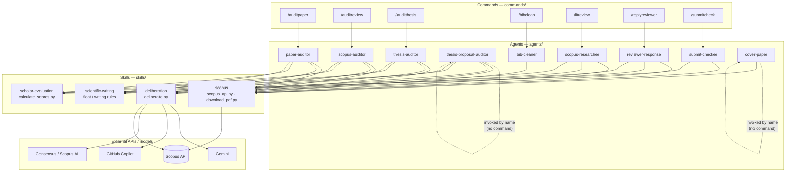
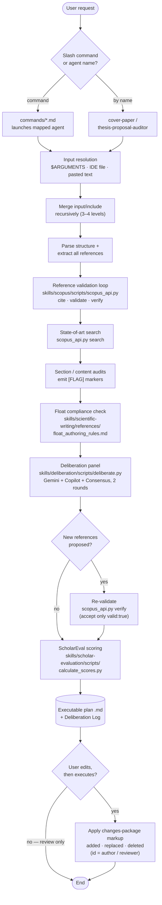
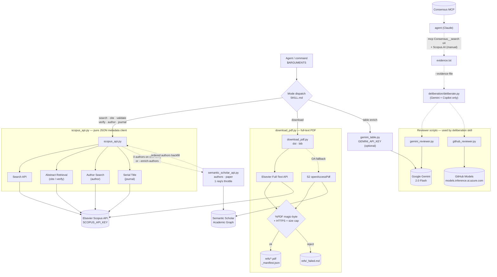
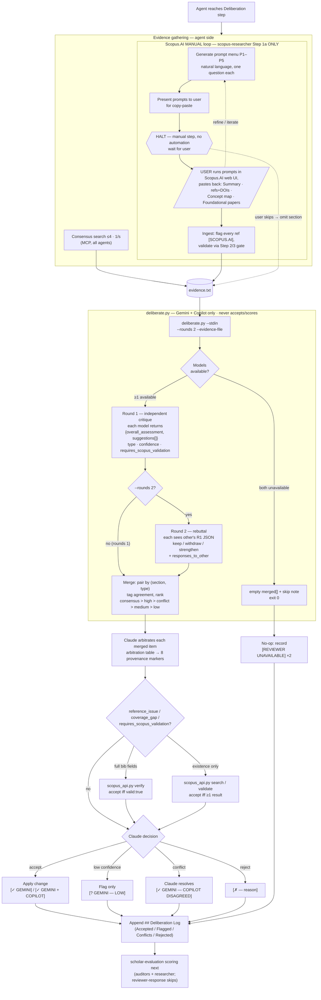

# Architecture — Academic Agents, Commands, and Skills

This document maps the academic tooling layer under [.claude/](.). Three layers cooperate: user-facing **slash commands** ([commands/](commands)) launch **agents** ([agents/](agents)), and each agent draws on shared **skills** ([skills/](skills)) and the external Scopus / multi-model APIs. All paths below are relative to the [.claude/](.) directory.

## Layer 1 — Component architecture

The diagram shows which command launches which agent, and which skills each agent consumes. Two agents — [cover-paper](agents/cover-paper/AGENT.md) and [thesis-proposal-auditor](agents/thesis-proposal-auditor/AGENT.md) — have no dedicated slash command; they are invoked by name. Every agent depends on the [scopus](skills/scopus) skill for reference validation; the auditors and the researcher additionally route through [deliberation](skills/deliberation), [scholar-evaluation](skills/scholar-evaluation), and [scientific-writing](skills/scientific-writing).

### Command → agent → skill matrix

| Command | Agent | scopus | deliberation | scholar-evaluation | scientific-writing |
| --- | --- | --- | --- | --- | --- |
| `/auditpaper` | [paper-auditor](agents/paper-auditor/AGENT.md) | yes | yes | yes | yes |
| `/auditreview` | [scopus-auditor](agents/scopus-auditor/AGENT.md) | yes | yes | yes | yes |
| `/auditthesis` | [thesis-auditor](agents/thesis-auditor/AGENT.md) | yes | yes | yes | yes |
| *(by name)* | [thesis-proposal-auditor](agents/thesis-proposal-auditor/AGENT.md) | yes | yes | yes | yes |
| `/bibclean` | [bib-cleaner](agents/bib-cleaner/AGENT.md) | yes | no | no | no |
| `/litreview` | [scopus-researcher](agents/scopus-researcher/AGENT.md) | yes | yes | no | yes |
| `/replyreviewer` | [reviewer-response](agents/reviewer-response/AGENT.md) | yes | yes | no | yes |
| `/submitcheck` | [submit-checker](agents/submit-checker/AGENT.md) | yes | no | yes | no |
| *(by name)* | [cover-paper](agents/cover-paper/AGENT.md) | yes | no | no | no |

## Layer 2 — Execution flowchart

The auditors ([paper-auditor](agents/paper-auditor/AGENT.md), [scopus-auditor](agents/scopus-auditor/AGENT.md), [thesis-auditor](agents/thesis-auditor/AGENT.md), [thesis-proposal-auditor](agents/thesis-proposal-auditor/AGENT.md)) share one canonical pipeline. This flowchart traces a request from the slash command through input resolution, Scopus validation, the multi-model deliberation panel, ScholarEval scoring, and the executable improvement plan, then to optional execution with `changes`-package markup. The skill script invoked at each stage is labelled on the node. Agents with a narrower scope ([bib-cleaner](agents/bib-cleaner/AGENT.md), [submit-checker](agents/submit-checker/AGENT.md), [cover-paper](agents/cover-paper/AGENT.md), [reviewer-response](agents/reviewer-response/AGENT.md), [scopus-researcher](agents/scopus-researcher/AGENT.md)) enter the same path but skip the stages their matrix row marks "no".

## Layer 3 — Scopus skill internals

The [scopus](skills/scopus) skill is the busiest dependency: six scripts under [skills/scopus/scripts/](skills/scopus/scripts) split metadata, full-text retrieval, author backfill, and the multi-model reviewers. [SKILL.md](skills/scopus/SKILL.md) dispatches `$ARGUMENTS` to one of six metadata modes on `scopus_api.py` (a pure JSON client that never writes files), to `download_pdf.py` for PDFs, or to `gemini_table.py` for comparison-table cell enrichment. `semantic_scholar_api.py` is a throttled fallback that backfills the full ordered author list when Scopus returns none. `gemini_reviewer.py` and `github_reviewer.py` live here too but are consumed by the [deliberation](skills/deliberation) panel, not by `scopus_api.py`.

**Consensus is not a scopus script.** No file under [skills/scopus](skills/scopus) references it. Consensus is the MCP tool `mcp__claude_ai_Consensus__search`, called by the agent (Claude) itself during the [deliberation](skills/deliberation) step; the agent runs up to four searches, writes them to `evidence.txt`, and hands that file to `deliberate.py` via `--evidence-file`. `deliberate.py` performs only the Gemini and Copilot API calls. The dashed evidence path is shown in the cluster below to make this boundary explicit. (Scopus.AI — Elsevier's manual generative tool — and the `scopus` skill scripts are three distinct things.)

### Scopus script reference

| Script | Modes / subcommands | External endpoint | Env var |
| --- | --- | --- | --- |
| [scopus_api.py](skills/scopus/scripts/scopus_api.py) | search · cite · validate · verify · author · journal | Elsevier Search / Abstract Retrieval / Author Search / Serial Title | `SCOPUS_API_KEY` |
| [semantic_scholar_api.py](skills/scopus/scripts/semantic_scholar_api.py) | authors · paper | Semantic Scholar Academic Graph | `S2_API_KEY` / `SEMANTIC_SCHOLAR_API_KEY` (optional) |
| [download_pdf.py](skills/scopus/scripts/download_pdf.py) | doi · bib | Elsevier Full-Text → S2 openAccessPdf | `SCOPUS_API_KEY` |
| [gemini_table.py](skills/scopus/scripts/gemini_table.py) | table-cell enrichment | Google Gemini 2.0 Flash | `GEMINI_API_KEY` |
| [gemini_reviewer.py](skills/scopus/scripts/gemini_reviewer.py) | peer-review (deliberation) | Google Gemini 2.0 Flash | `GEMINI_API_KEY` |
| [github_reviewer.py](skills/scopus/scripts/github_reviewer.py) | peer-review (deliberation) | GitHub Models (Azure inference) | GitHub token |

## Layer 4 — Deliberation process

The [deliberation](skills/deliberation) skill runs a two-round Gemini + Copilot debate, then hands the merged suggestions to Claude for arbitration. Two hard boundaries shape it ([deliberation-protocol.md](skills/deliberation/references/deliberation-protocol.md)): there is no nested-agent dispatch (it is a skill module, not an agent), and a subprocess cannot reach MCP, so `deliberate.py` runs only the two model APIs while the agent gathers Consensus (and, for [scopus-researcher](agents/scopus-researcher/AGENT.md) only, Scopus.AI) evidence itself and passes it in as a file. The script never accepts, validates, or scores anything — it emits evidence; Claude judges. The deliberation step itself is fully autonomous (no user pause); the one manual checkpoint is the Scopus.AI loop, which belongs to [scopus-researcher](agents/scopus-researcher/AGENT.md) Step 1a upstream — the agent generates a copy-paste prompt menu, HALTs for the user to run it in the Scopus.AI web UI and paste the result back, then folds that output into the same evidence file. The other five agents have no Scopus.AI branch.

The arbitration table maps each merged item's `agreement` (`consensus`, `gemini_only`, `copilot_only`, `conflict`) to one of eight provenance markers. Any item proposing a specific paper passes the Scopus gate first — `verify` (accept on `valid: true`) when full fields exist, else `search`/`validate` (accept on ≥1 result). [reviewer-response](agents/reviewer-response/AGENT.md) is host-stricter: a panel-proposed reference there runs its own decision tree instead of this generic gate. Graceful skips never abort the host pipeline: one model down → debate with the survivor; both down → empty `merged[]`, step is a no-op; Consensus unreachable → empty evidence file, debate runs on the draft alone.

## Notes

- The [deliberation](skills/deliberation) skill is itself a composite step: it runs a two-round Gemini + GitHub Copilot debate, enriches with Consensus and optional Scopus.AI evidence, then re-validates every newly proposed reference through the [scopus](skills/scopus) gate before any suggestion is merged into the plan.
- Reference enrichment and PDF retrieval share one script set under [skills/scopus/scripts/](skills/scopus/scripts): `scopus_api.py` (Elsevier API first) and `download_pdf.py` (Elsevier, then Semantic Scholar open-access fallback).
- The non-academic agents in [agents/](agents) (analysis-engine, blazor-dev, cost-tester, flask-api, react-dev, latex-writer, security-auditor, word-to-latex) serve the CostEstimator software project and are out of scope for this diagram.
