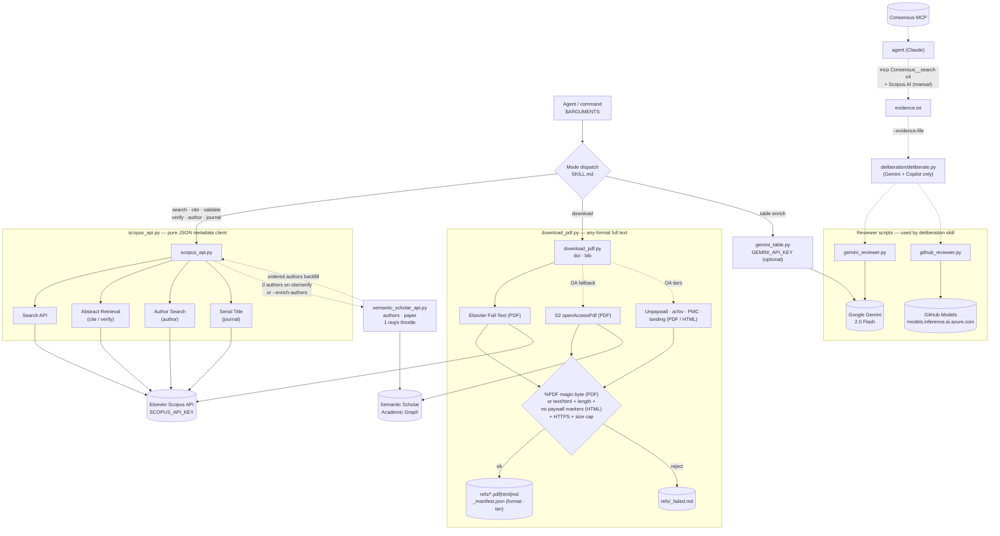
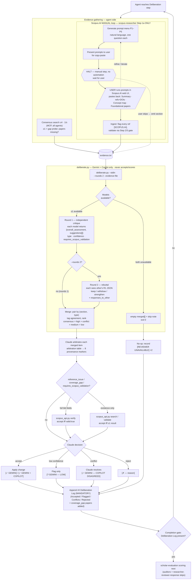

# Architecture — Academic Agents, Commands, and Skills

This document maps the academic tooling layer under [.claude/](.). Three layers cooperate: user-facing **slash commands** ([commands/](commands)) launch **agents** ([agents/](agents)), and each agent draws on shared **skills** ([skills/](skills)) and the external Scopus / multi-model APIs. All paths below are relative to the [.claude/](.) directory.

## Layer 1 — Component architecture

The diagram shows which command launches which agent, and which skills each agent consumes. Two agents — [cover-paper](agents/cover-paper.md) and [thesis-proposal-auditor](agents/thesis-proposal-auditor.md) — have no dedicated slash command; they are invoked by name. Every agent depends on the [scopus](skills/scopus) skill for reference validation; the auditors and the researcher additionally route through [deliberation](skills/deliberation), [scholar-evaluation](skills/scholar-evaluation), and [scientific-writing](skills/scientific-writing). The [extract-statistic](skills/extract-statistic) skill is consumed by [paper-auditor](agents/paper-auditor.md) and [thesis-auditor](agents/thesis-auditor.md) (mode `audit`, to review a manuscript's own statistics) and by [scopus-researcher](agents/scopus-researcher.md) (mode `mine`, to extract the reported statistics of the corpus PDFs). The [latex-writer](agents/latex-writer.md) authoring agent — invoked by context to draft LaTeX, Beamer, and TiKZ — enters the [scientific-writing](skills/scientific-writing) skill through its LaTeX-authoritative entry point and consumes the skill in full (see the Notes). The same agent converts draw.io sheets to TiKZ through the [drawio2tikz](skills/drawio2tikz) skill, whose absolute-coordinate output is the documented exception to the relative-positioning rule. The [geolocalisation](skills/geolocalisation) skill is the one skill a command drives directly rather than through an agent: `/geolocalisation` maps a review corpus's study locations from its `.bib` (draft table + per-paper provenance note, override CSV wins, optional `--full-text` PDF scan), consuming no agent and none of the shared skills.

```mermaid
graph TD
  subgraph CMD["Commands — commands/"]
    c1["/auditpaper"]
    c2["/auditreview"]
    c3["/auditthesis"]
    c4["/bibclean"]
    c5["/litreview"]
    c6["/replyreviewer"]
    c7["/submitcheck"]
    c8["/geolocalisation"]
  end

  subgraph AG["Agents — agents/"]
    a1["paper-auditor"]
    a2["scopus-auditor"]
    a3["thesis-auditor"]
    a4["thesis-proposal-auditor"]
    a5["bib-cleaner"]
    a6["scopus-researcher"]
    a7["reviewer-response"]
    a8["submit-checker"]
    a9["cover-paper"]
    a10["latex-writer<br/>LaTeX/Beamer/TiKZ authoring"]
  end

  subgraph SK["Skills — skills/"]
    s1["scopus<br/>scopus_api.py · download_pdf.py"]
    s2["deliberation<br/>deliberate.py"]
    s3["scholar-evaluation<br/>calculate_scores.py"]
    s4["scientific-writing<br/>float / writing rules"]
    s5["extract-statistic<br/>extract_text.py (--stats-scan)"]
    s6["drawio2tikz<br/>drawio2tikz.py"]
    s7["extract-futureworks<br/>extract_text.py (--section-scan)"]
    s8["geolocalisation<br/>extract_locations.py · generate_geomap.py"]
  end

  subgraph EXT["External APIs / models"]
    e1[("Scopus API")]
    e2["Gemini"]
    e3["GitHub Copilot"]
    e4["Consensus / Scopus.AI"]
  end

  c1 --> a1
  c2 --> a2
  c3 --> a3
  c4 --> a5
  c5 --> a6
  c6 --> a7
  c7 --> a8
  c8 --> s8
  a4 -.->|"invoked by name<br/>(no command)"| a4
  a9 -.->|"invoked by name<br/>(no command)"| a9
  a10 -.->|"invoked by context<br/>(no command)"| a10

  a1 --> s1 & s2 & s3 & s4 & s5
  a2 --> s1 & s2 & s3 & s4
  a3 --> s1 & s2 & s3 & s4 & s5
  a4 --> s1 & s2 & s3 & s4
  a6 --> s1 & s2 & s4 & s5
  a7 --> s1 & s2 & s4
  a8 --> s1 & s3
  a5 --> s1
  a9 --> s1
  a10 --> s4
  a10 --> s6

  s1 --> e1
  s2 --> e2 & e3 & e4 & e1
  s5 --> e1
```

### Command → agent → skill matrix

| Command | Agent | scopus | deliberation | scholar-evaluation | scientific-writing | extract-statistic | extract-futureworks |
| --- | --- | --- | --- | --- | --- | --- | --- |
| `/auditpaper` | [paper-auditor](agents/paper-auditor.md) | yes | mandatory | yes | yes | audit | audit |
| `/auditreview` | [scopus-auditor](agents/scopus-auditor.md) | yes | mandatory | yes | yes | no | audit |
| `/auditthesis` | [thesis-auditor](agents/thesis-auditor.md) | yes | mandatory | yes | yes | audit | audit |
| *(by name)* | [thesis-proposal-auditor](agents/thesis-proposal-auditor.md) | yes | mandatory | yes | yes | no | audit |
| `/bibclean` | [bib-cleaner](agents/bib-cleaner.md) | yes | no | no | no | no | no |
| `/litreview` | [scopus-researcher](agents/scopus-researcher.md) | yes | mandatory | no | yes | mine | mine |
| `/replyreviewer` | [reviewer-response](agents/reviewer-response.md) | yes | mandatory | no | yes | no | no |
| `/submitcheck` | [submit-checker](agents/submit-checker.md) | yes | no | yes | no | no | no |
| *(by name)* | [cover-paper](agents/cover-paper.md) | yes | no | no | no | no | no |

`/geolocalisation` invokes the [geolocalisation](skills/geolocalisation) skill directly (no agent, none of the shared skills above), so it is omitted from this matrix; it reuses only the [scopus](skills/scopus) skill's `download_pdf.py` for the optional `--full-text` scan.

### Domain profiles

Domain-specific values live outside the agents, in `profiles/<name>.yaml` at the repo root
(`engineering` default, `cosmetic`, plus `_template.yaml`). The active profile is selected
by the `active_profile:` line in [.claude/CLAUDE.md](CLAUDE.md), written by
`install.ps1 -Profile <name>`. Wired consumer today: [scopus-researcher](agents/scopus-researcher.md)
reads `scopus.subject_areas` / `scopus.exclude_areas` (query clauses),
`scopus.relevance_signals` / `off_topic_flag` (Step 3a topical-relevance check), and
`framework_default` (synthesis framework). The remaining fields (`author`, `stats_profile`,
`course_context`, `language`) are schema-ready for the other agents. Spec and fallback
rules: [profiles/README.md](../profiles/README.md).

## Layer 2 — Execution flowchart

The auditors ([paper-auditor](agents/paper-auditor.md), [scopus-auditor](agents/scopus-auditor.md), [thesis-auditor](agents/thesis-auditor.md), [thesis-proposal-auditor](agents/thesis-proposal-auditor.md)) share one canonical pipeline. This flowchart traces a request from the slash command through input resolution, Scopus validation, the multi-model deliberation panel, ScholarEval scoring, and the executable improvement plan, then to optional execution with `changes`-package markup. The skill script invoked at each stage is labelled on the node. Agents with a narrower scope ([bib-cleaner](agents/bib-cleaner.md), [submit-checker](agents/submit-checker.md), [cover-paper](agents/cover-paper.md), [reviewer-response](agents/reviewer-response.md), [scopus-researcher](agents/scopus-researcher.md)) enter the same path but skip the stages their matrix row marks "no".

## Layer 3 — Scopus skill internals

The [scopus](skills/scopus) skill is the busiest dependency: six scripts under [skills/scopus/scripts/](skills/scopus/scripts) split metadata, full-text retrieval, author backfill, and the multi-model reviewers. [SKILL.md](skills/scopus/SKILL.md) dispatches `$ARGUMENTS` to one of six metadata modes on `scopus_api.py` (a pure JSON client that never writes files), to `download_pdf.py` for PDFs, or to `gemini_table.py` for comparison-table cell enrichment. `semantic_scholar_api.py` is a throttled fallback that backfills the full ordered author list when Scopus returns none. `gemini_reviewer.py` and `github_reviewer.py` live here too but are consumed by the [deliberation](skills/deliberation) panel, not by `scopus_api.py`.

**Consensus is not a scopus script.** No file under [skills/scopus](skills/scopus) references it. Consensus is the MCP tool `mcp__claude_ai_Consensus__search`, called by the agent (Claude) itself during the [deliberation](skills/deliberation) step; the agent runs up to four searches, writes them to `evidence.txt`, and hands that file to `deliberate.py` via `--evidence-file`. `deliberate.py` performs only the Gemini and Copilot API calls. The dashed evidence path is shown in the cluster below to make this boundary explicit. (Scopus.AI — Elsevier's manual generative tool — and the `scopus` skill scripts are three distinct things.)

### Scopus script reference

| Script | Modes / subcommands | External endpoint | Env var |
| --- | --- | --- | --- |
| [scopus_api.py](skills/scopus/scripts/scopus_api.py) | search · cite · validate · verify · author · journal | Elsevier Search / Abstract Retrieval / Author Search / Serial Title | `SCOPUS_API_KEY` |
| [semantic_scholar_api.py](skills/scopus/scripts/semantic_scholar_api.py) | authors · paper · external_ids_for_doi | Semantic Scholar Academic Graph | `S2_API_KEY` / `SEMANTIC_SCHOLAR_API_KEY` (optional) |
| [download_pdf.py](skills/scopus/scripts/download_pdf.py) | doi · bib (any format: pdf/html/md) | Elsevier → S2 → Unpaywall → arXiv → PMC → DOI landing | `SCOPUS_API_KEY`, `UNPAYWALL_EMAIL` (optional) |
| [gemini_table.py](skills/scopus/scripts/gemini_table.py) | table-cell enrichment | Google Gemini 2.0 Flash | `GEMINI_API_KEY` |
| [gemini_reviewer.py](skills/scopus/scripts/gemini_reviewer.py) | peer-review (deliberation) | Google Gemini 2.0 Flash | `GEMINI_API_KEY` |
| [github_reviewer.py](skills/scopus/scripts/github_reviewer.py) | peer-review (deliberation) | GitHub Models (Azure inference) | GitHub token |

## Layer 4 — Deliberation process

The [deliberation](skills/deliberation) skill runs a two-round Gemini + Copilot debate, then hands the merged suggestions to Claude for arbitration. The step is **MANDATORY** in every host agent and enforced by a completion gate (the four auditors and [scopus-researcher](agents/scopus-researcher.md) refuse "done" until a populated `## Deliberation Log` exists; [reviewer-response](agents/reviewer-response.md) does the same on its Step 8 summary): the model does not skip it on usefulness, length, or confidence grounds, and the only sanctioned skip is genuinely missing model keys, which still records a `[REVIEWER UNAVAILABLE: ...]` marker. Beyond critiquing the draft, the panel actively probes for **missing references to add** — at least one Consensus query per run is a gap probe, and each accepted `coverage_gap` is Scopus-validated, turned into a BibTeX entry with a one-sentence introduction and an insertion point, and routed into the host agent's gap section. Two hard boundaries shape it ([deliberation-protocol.md](skills/deliberation/references/deliberation-protocol.md)): there is no nested-agent dispatch (it is a skill module, not an agent), and a subprocess cannot reach MCP, so `deliberate.py` runs only the two model APIs while the agent gathers Consensus (and, for [scopus-researcher](agents/scopus-researcher.md) only, Scopus.AI) evidence itself and passes it in as a file. The script never accepts, validates, or scores anything — it emits evidence; Claude judges. The deliberation step itself is fully autonomous (no user pause); the one manual checkpoint is the Scopus.AI loop, which belongs to [scopus-researcher](agents/scopus-researcher.md) Step 1a upstream — the agent generates a copy-paste prompt menu, HALTs for the user to run it in the Scopus.AI web UI and paste the result back, then folds that output into the same evidence file. The other five agents have no Scopus.AI branch.

The arbitration table maps each merged item's `agreement` (`consensus`, `gemini_only`, `copilot_only`, `conflict`) to one of eight provenance markers. Any item proposing a specific paper passes the Scopus gate first — `verify` (accept on `valid: true`) when full fields exist, else `search`/`validate` (accept on ≥1 result). An accepted `coverage_gap` becomes a Scopus-validated BibTeX entry with a one-sentence introduction and an insertion point, routed into the host agent's gap section (paper-auditor Section N, scopus-auditor Section C/G, the thesis auditors' coverage/novelty section, or the researcher synthesis). [reviewer-response](agents/reviewer-response.md) is host-stricter: a panel-proposed reference there runs its own decision tree instead of this generic gate. Graceful skips never abort the host pipeline but are still gated to a logged `[REVIEWER UNAVAILABLE: ...]` marker: one model down → debate with the survivor; both down → empty `merged[]`, step is a no-op; Consensus unreachable → empty evidence file, debate runs on the draft alone.

## Notes

- **Agent file format.** Each agent is one flat markdown file [agents/](agents)`<name>.md` whose line 1 opens YAML frontmatter (`name:`, `description:`) — the layout Claude Code's subagent discovery scans. Skills are the opposite: folder-based (`skills/<name>/SKILL.md`). The `.claude/agents/` files are canonical; `install.ps1` (repo root) regenerates the GitHub Copilot (`.github/agents/*.agent.md`), OpenCode, Continue, and Aider mirrors from them, and `install-junctions.ps1` links them per-file into `~/.claude/agents/` for global availability.
- The [deliberation](skills/deliberation) skill is itself a composite step: it runs a two-round Gemini + GitHub Copilot debate, enriches with Consensus and optional Scopus.AI evidence, then re-validates every newly proposed reference through the [scopus](skills/scopus) gate before any suggestion is merged into the plan. It is MANDATORY in all six academic agents and enforced by a completion gate that blocks "done" until a populated `## Deliberation Log` exists; it also actively surfaces missing references to add (gap probe + Scopus-validated `coverage_gap` routing), not only counter-evidence on existing claims.
- Reference enrichment and PDF retrieval share one script set under [skills/scopus/scripts/](skills/scopus/scripts): `scopus_api.py` (Elsevier API first) and `download_pdf.py` (Elsevier, then Semantic Scholar open-access fallback).
- The [extract-statistic](skills/extract-statistic) skill has two modes. `audit` ([paper-auditor](agents/paper-auditor.md) Step 5.7, [thesis-auditor](agents/thesis-auditor.md) Step 8b) reviews a manuscript's own statistics and routes `[STATS …]` flags into the host plan's Results section. `mine` ([scopus-researcher](agents/scopus-researcher.md) Step 3b-stats) extracts the reported statistics of the corpus PDFs and feeds a corpus statistics table plus an improvement-opportunity list into the gap map (9b), Pareto matrix (9d), and hypotheses (10). Its `extract_text.py` is the first text-extraction consumer of `download_pdf.py` output (which it reuses for retrieval rather than reimplementing); it adds PyMuPDF (`pymupdf4llm` for LLM-ready Markdown with tables inline, `pymupdf` for structured `find_tables`), which are AGPL-3.0 and isolated in `read_pdf()` so an MIT parser can be swapped back if the repo is ever distributed. The skill never runs a deliberation panel itself — its findings are critiqued by the host agent's single mandatory [deliberation](skills/deliberation) step, keeping one panel per run. It has engineering-default domain checks with a selectable cosmetic profile ([domain-profiles.md](skills/extract-statistic/references/domain-profiles.md)).
- ScholarEval scoring is standardized across the three auditors ([paper-auditor](agents/paper-auditor.md), [thesis-auditor](agents/thesis-auditor.md), [thesis-proposal-auditor](agents/thesis-proposal-auditor.md)): each invokes `calculate_scores.py` **before** writing its plan, embeds the score section in the plan, and emits a standalone `_scholareval_report.txt` plus the `_scholareval_scores.json` it was computed from. A final completion gate blocks "done" until all three artifacts exist. The `thesis-proposal-auditor` passes a custom `--weights` file (proposal weights differ); the script defaults already match `thesis-auditor`/`paper-auditor`, so only the proposal needs one.
- The [latex-writer](agents/latex-writer.md) agent is the academic LaTeX authoring helper (papers, Beamer slides, TiKZ figures, theses), invoked by context from the top-level session — when it authors a section fresh or executes an auditor's improvement plan — rather than by a slash command. Its definition carries no inline rule copies: on every authoring or revision task it reads [skills/scientific-writing/SKILL.md](skills/scientific-writing/SKILL.md) in full, treats that skill's **"LaTeX Academic Writing (ResearchTools)"** section as authoritative (the LaTeX option), and loads all six `references/` files on demand — `float_authoring_rules.md`, `citation_styles.md`, `imrad_structure.md`, `figures_tables.md`, `reporting_guidelines.md`, `writing_principles.md`. The skill is therefore the single source of truth; the agent never relies on a memorized subset. Figure conversion from draw.io routes through the [drawio2tikz](skills/drawio2tikz) skill; its absolute-coordinate, non-TiKZiT output is the sanctioned exception to the relative-positioning rule and still obeys the float citation/label/caption rules.
- **How every academic agent consumes `scientific-writing` (single source of truth).** The four auditors ([scopus-auditor](agents/scopus-auditor.md), [paper-auditor](agents/paper-auditor.md), [thesis-auditor](agents/thesis-auditor.md), [thesis-proposal-auditor](agents/thesis-proposal-auditor.md)) and the two author agents ([scopus-researcher](agents/scopus-researcher.md), [reviewer-response](agents/reviewer-response.md)) each open with a **"Skill consultation (mandatory first step)"** that reads `SKILL.md` in full, treats the LaTeX Academic Writing section as authoritative, and loads the six `references/` files on demand — not just `float_authoring_rules.md` as before. The inline float checklist each agent keeps is now explicitly the float slice of that skill, and the anti-AI-style reminders point to `writing_principles.md` as canonical.
- **Where authoring happens — the rule that avoids nested-subagent spawning.** Top-level authoring (writing a section, or *executing* an auditor's plan) delegates to [latex-writer](agents/latex-writer.md), which loads the full skill; a top-level spawn is reliable. The six academic agents above run as subagents, so they cannot reliably spawn another subagent — they read `SKILL.md` directly and author/check themselves, and must not call `latex-writer`. Accordingly, each auditor's plan footer and execution mode route plan execution through `latex-writer` so every `\added`/`\replaced` float and paragraph follows the full skill.
- The non-academic agents in [agents/](agents) (analysis-engine, blazor-dev, cost-tester, flask-api, react-dev, security-auditor, word-to-latex) serve the CostEstimator software project and are out of scope for this diagram.
