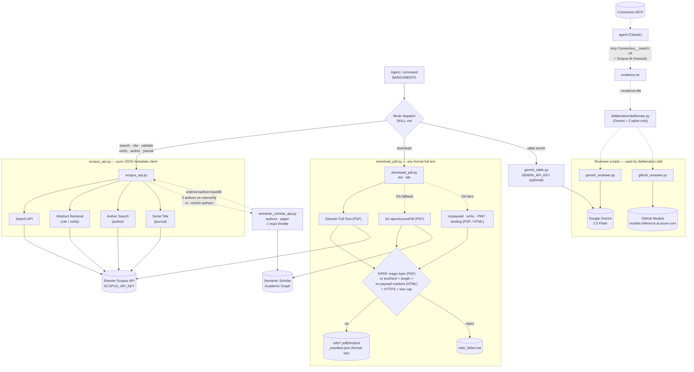
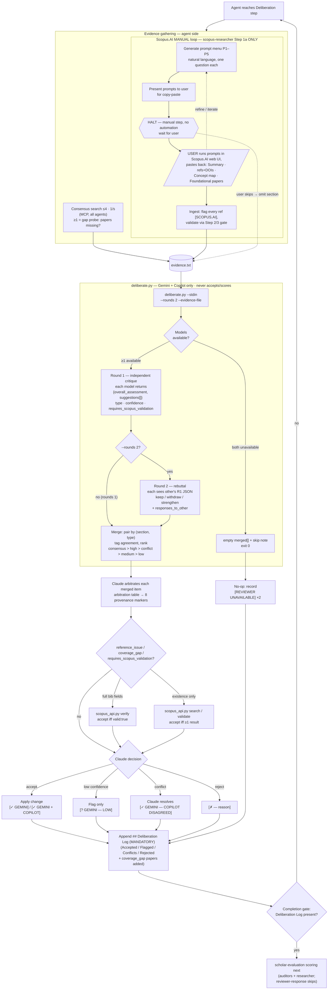
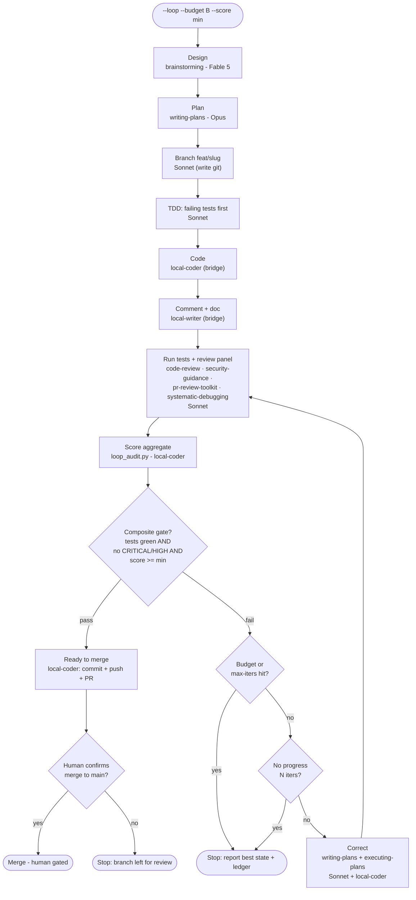
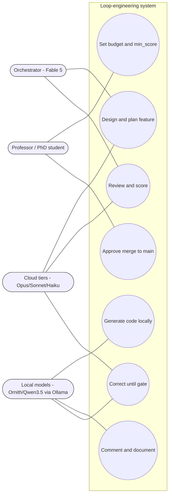
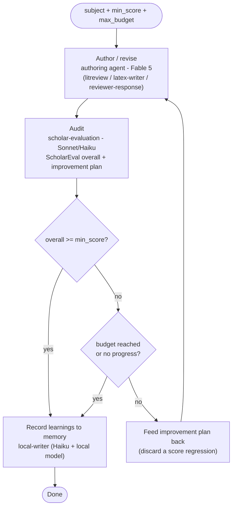

# Architecture — Academic Agents, Commands, and Skills

This document maps the academic tooling layer under [.claude/](.). Three layers cooperate: user-facing **slash commands** ([commands/](commands)) launch **agents** ([agents/](agents)), and each agent draws on shared **skills** ([skills/](skills)) and the external Scopus / multi-model APIs. All paths below are relative to the [.claude/](.) directory.

## Layer 1 — Component architecture

The diagram shows which command launches which agent, and which skills each agent consumes. Two agents — [cover-paper](agents/cover-paper.md) and [thesis-proposal-auditor](agents/thesis-proposal-auditor.md) — have no dedicated slash command; they are invoked by name. Every agent depends on the [scopus](skills/scopus) skill for reference validation; the auditors and the researcher additionally route through [deliberation](skills/deliberation), [scholar-evaluation](skills/scholar-evaluation), and [scientific-writing](skills/scientific-writing). The [extract-statistic](skills/extract-statistic) skill is consumed by [paper-auditor](agents/paper-auditor.md) and [thesis-auditor](agents/thesis-auditor.md) (mode `audit`, to review a manuscript's own statistics) and by [scopus-researcher](agents/scopus-researcher.md) (mode `mine`, to extract the reported statistics of the corpus PDFs). The [latex-writer](agents/latex-writer.md) authoring agent — invoked by context to draft LaTeX, Beamer, and TiKZ — enters the [scientific-writing](skills/scientific-writing) skill through its LaTeX-authoritative entry point and consumes the skill in full (see the Notes). The same agent converts draw.io sheets to TiKZ through the [drawio2tikz](skills/drawio2tikz) skill, whose absolute-coordinate output is the documented exception to the relative-positioning rule. The [geolocalisation](skills/geolocalisation) skill is the one skill a command drives directly rather than through an agent: `/geolocalisation` maps a review corpus's study locations from its `.bib` (draft table + per-paper provenance note, override CSV wins, optional `--full-text` PDF scan), consuming no agent and none of the shared skills. One academic agent is an orchestrator rather than a leaf: [thesis-to-paper](agents/thesis-to-paper.md) turns a student thesis plus its conference papers into one submission-ready journal manuscript, composing `/litreview`, `scientific-writing`, `/bibclean`, `/submitcheck`, and `/auditpaper` INLINE (it runs as a top-level workflow and executes those pipelines itself rather than dispatching them as nested subagents, since a subagent cannot reliably spawn another). It is invoked by name and carries its own multi-session checkpoint protocol; it is documented in the Notes rather than drawn into the diagram above. Two further agents — [local-writer](agents/local-writer.md) and [local-coder](agents/local-coder.md) — sit outside this academic flow: they are local-delegation agents (a Haiku wrapper driving a local Ollama model over a Bash bridge) used for documentation, comments, and code generation, and they are orchestrated by the [loop-engineer](skills/loop-engineer) skill. Both are documented in "Layer 5 — Loop engineering" below rather than in the diagram above.

```mermaid
graph TD
  subgraph CMD["Commands — commands/"]
    c1["/auditpaper"]
    c2["/auditreview"]
    c3["/auditthesis"]
    c4["/bibclean"]
    c5["/litreview"]
    c6["/replyreviewer"]
    c7["/submitcheck"]
    c8["/geolocalisation"]
    c9["/recommendation-letter"]
    c10["/litupdate"]
    c11["/talk"]
  end

  subgraph AG["Agents — agents/"]
    a1["paper-auditor"]
    a2["scopus-auditor"]
    a3["thesis-auditor"]
    a4["thesis-proposal-auditor"]
    a5["bib-cleaner"]
    a6["scopus-researcher"]
    a7["reviewer-response"]
    a8["submit-checker"]
    a9["cover-paper"]
    a10["latex-writer<br/>LaTeX/Beamer/TiKZ authoring"]
    a11["litreview-updater<br/>incremental review refresh"]
    a12["talk-builder<br/>accepted paper -> conference talk"]
  end

  subgraph SK["Skills — skills/"]
    s1["scopus<br/>scopus_api.py · download_pdf.py"]
    s2["deliberation<br/>deliberate.py"]
    s3["scholar-evaluation<br/>calculate_scores.py"]
    s4["scientific-writing<br/>float / writing rules"]
    s5["extract-statistic<br/>extract_text.py (--stats-scan)"]
    s6["drawio2tikz<br/>drawio2tikz.py"]
    s7["extract-futureworks<br/>extract_text.py (--section-scan)"]
    s8["geolocalisation<br/>extract_locations.py · generate_geomap.py"]
    s9["recommendation-letter<br/>generate_letter.py · letter_templates.py"]
    s16["uqac-forms<br/>pdf_ingest.py (validated ingest contract)"]
    s10["paper2talk<br/>talk_model.py · talk_render.py · talk_notes.py"]
    s11["latex-hygiene<br/>tex_check.py (read + patch/scan/accept/build)"]
  end

  subgraph EXT["External APIs / models"]
    e1[("Scopus API")]
    e2["Gemini"]
    e3["GitHub Copilot"]
    e4["Consensus / Scopus.AI"]
  end

  c1 --> a1
  c2 --> a2
  c3 --> a3
  c4 --> a5
  c5 --> a6
  c6 --> a7
  c7 --> a8
  c8 --> s8
  c9 --> s9
  c10 --> a11
  c11 --> a12
  a12 --> s10
  a12 --> s1
  a4 -.->|"invoked by name<br/>(no command)"| a4
  a9 -.->|"invoked by name<br/>(no command)"| a9
  a10 -.->|"invoked by context<br/>(no command)"| a10

  a1 --> s1 & s2 & s3 & s4 & s5 & s11
  a2 --> s1 & s2 & s3 & s4
  a3 --> s1 & s2 & s3 & s4 & s5 & s11
  a4 --> s1 & s2 & s3 & s4
  a6 --> s1 & s2 & s4 & s5
  a11 --> s1 & s2 & s3 & s4 & s5 & s7
  a7 --> s1 & s2 & s4 & s11
  a8 --> s1 & s3 & s11
  a5 --> s1
  a9 --> s1
  a10 --> s4
  a10 --> s6
  a10 --> s11

  s1 --> e1
  s2 --> e2 & e3 & e4 & e1
  s5 --> e1
```

### Command → agent → skill matrix

| Command | Agent | scopus | deliberation | scholar-evaluation | scientific-writing | extract-statistic | extract-futureworks |
| --- | --- | --- | --- | --- | --- | --- | --- |
| `/auditpaper` | [paper-auditor](agents/paper-auditor.md) | yes | mandatory | yes | yes | audit | audit |
| `/auditreview` | [scopus-auditor](agents/scopus-auditor.md) | yes | mandatory | yes | yes | no | audit |
| `/auditthesis` | [thesis-auditor](agents/thesis-auditor.md) | yes | mandatory | yes | yes | audit | audit |
| *(by name)* | [thesis-proposal-auditor](agents/thesis-proposal-auditor.md) | yes | mandatory | yes | yes | no | audit |
| `/bibclean` | [bib-cleaner](agents/bib-cleaner.md) | yes | no | no | no | no | no |
| `/litreview` | [scopus-researcher](agents/scopus-researcher.md) | yes | mandatory | no | yes | mine | mine |
| `/litupdate` | [litreview-updater](agents/litreview-updater.md) | yes | mandatory | yes | yes | mine | mine |
| `/replyreviewer` | [reviewer-response](agents/reviewer-response.md) | yes | mandatory | no | yes | no | no |
| `/submitcheck` | [submit-checker](agents/submit-checker.md) | yes | no | yes | no | no | no |
| *(by name)* | [cover-paper](agents/cover-paper.md) | yes | no | no | no | no | no |
| `/talk` | [talk-builder](agents/talk-builder.md) | yes | no | no | no | no | no |

`/geolocalisation` invokes the [geolocalisation](skills/geolocalisation) skill directly (no agent, none of the shared skills above), so it is omitted from this matrix; it reuses only the [scopus](skills/scopus) skill's `download_pdf.py` for the optional `--full-text` scan.

`/talk` drives the [talk-builder](agents/talk-builder.md) agent, which consumes the [paper2talk](skills/paper2talk) skill (its own scripts and renderers) and the [scopus](skills/scopus) skill only for reference checks on a borrowed figure; it uses none of the audit skills, since the paper is already accepted and the deliverable is the deck rather than a review. Where the paper lifecycle is concerned, `paper2talk` starts exactly where [submit-checker](agents/submit-checker.md) and [cover-paper](agents/cover-paper.md) stop: acceptance.

`/recommendation-letter` likewise invokes the [recommendation-letter](skills/recommendation-letter) skill directly (no agent, none of the shared skills above), so it is omitted from this matrix; its `generate_letter.py` is standard-library only and compiles the letter with `pdflatex`.

### Domain profiles

Domain-specific values live outside the agents, in `profiles/<name>.yaml` at the repo root
(`engineering` default, `cosmetic`, plus `_template.yaml`). The active profile is selected
by the `active_profile:` line in [.claude/CLAUDE.md](CLAUDE.md), written by
`install.ps1 -Profile <name>`. Wired consumer today: [scopus-researcher](agents/scopus-researcher.md)
reads `scopus.subject_areas` / `scopus.exclude_areas` (query clauses),
`scopus.relevance_signals` / `off_topic_flag` (Step 3a topical-relevance check), and
`framework_default` (synthesis framework). The remaining fields (`author`, `stats_profile`,
`course_context`, `language`) are schema-ready for the other agents. Spec and fallback
rules: [profiles/README.md](../profiles/README.md).

## Layer 2 — Execution flowchart

The auditors ([paper-auditor](agents/paper-auditor.md), [scopus-auditor](agents/scopus-auditor.md), [thesis-auditor](agents/thesis-auditor.md), [thesis-proposal-auditor](agents/thesis-proposal-auditor.md)) share one canonical pipeline. This flowchart traces a request from the slash command through input resolution, Scopus validation, the multi-model deliberation panel, ScholarEval scoring, and the executable improvement plan, then to optional execution with `changes`-package markup. The skill script invoked at each stage is labelled on the node. Agents with a narrower scope ([bib-cleaner](agents/bib-cleaner.md), [submit-checker](agents/submit-checker.md), [cover-paper](agents/cover-paper.md), [reviewer-response](agents/reviewer-response.md), [scopus-researcher](agents/scopus-researcher.md)) enter the same path but skip the stages their matrix row marks "no".

```mermaid
flowchart TD
  U([User request]) --> CMD{"Slash command<br/>or agent name?"}
  CMD -->|"command"| MAP["commands/*.md<br/>launches mapped agent"]
  CMD -->|"by name"| MAP2["cover-paper /<br/>thesis-proposal-auditor"]
  MAP --> IN
  MAP2 --> IN

  IN["Input resolution<br/>$ARGUMENTS · IDE file · pasted text"]
  IN --> MERGE["Merge input/include<br/>recursively (3–4 levels)"]
  MERGE --> PARSE["Parse structure +<br/>extract all references"]

  PARSE --> VAL["Reference validation loop<br/>skills/scopus/scripts/scopus_api.py<br/>cite · validate · verify"]
  VAL --> SOTA["State-of-art search<br/>scopus_api.py search"]
  SOTA --> AUDIT["Section / content audits<br/>emit [FLAG] markers"]
  AUDIT --> FLOAT["scientific-writing compliance check<br/>read SKILL.md (LaTeX section) +<br/>references/ loaded on demand"]

  FLOAT --> DELIB["Deliberation panel<br/>skills/deliberation/scripts/deliberate.py<br/>Gemini + Copilot + Consensus, 2 rounds"]
  DELIB --> GATE{"New references<br/>proposed?"}
  GATE -->|"yes"| REVAL["Re-validate<br/>scopus_api.py verify<br/>(accept only valid:true)"]
  GATE -->|"no"| SCORE
  REVAL --> SCORE

  SCORE["ScholarEval baseline scoring (before plan write)<br/>skills/scholar-evaluation/scripts/calculate_scores.py<br/>emits _scholareval_scores.json + _scholareval_report.txt"]
  SCORE --> PLAN[("Executable plan .md<br/>+ embedded ScholarEval section<br/>(baseline + Score Improvement Tracking table)<br/>+ Deliberation Log")]
  PLAN --> GATE2{"ScholarEval artifacts<br/>present? (json + report<br/>+ plan section)"}

  GATE2 --> EXEC{"User edits,<br/>then executes?"}
  EXEC -->|"yes"| APPLY["Apply changes-package markup<br/>added · replaced · deleted<br/>(id = author / reviewer)"]
  EXEC -->|"no — review only"| END([End])
  APPLY --> RESCORE["Re-run ScholarEval on revised source<br/>calculate_scores.py<br/>emits _scholareval_scores_post.json + _scholareval_report_post.txt"]
  RESCORE --> GATE3{"post overall ><br/>baseline overall?"}
  GATE3 -->|"no — regression"| APPLY
  GATE3 -->|"yes"| END
```

## Layer 3 — Scopus skill internals

The [scopus](skills/scopus) skill is the busiest dependency: six scripts under [skills/scopus/scripts/](skills/scopus/scripts) split metadata, full-text retrieval, author backfill, and the multi-model reviewers. [SKILL.md](skills/scopus/SKILL.md) dispatches `$ARGUMENTS` to one of six metadata modes on `scopus_api.py` (a pure JSON client that never writes files), to `download_pdf.py` for PDFs, or to `gemini_table.py` for comparison-table cell enrichment. `semantic_scholar_api.py` is a throttled fallback that backfills the full ordered author list when Scopus returns none. `gemini_reviewer.py` and `github_reviewer.py` live here too but are consumed by the [deliberation](skills/deliberation) panel, not by `scopus_api.py`.

**Consensus is not a scopus script.** No file under [skills/scopus](skills/scopus) references it. Consensus is the MCP tool `mcp__claude_ai_Consensus__search`, called by the agent (Claude) itself during the [deliberation](skills/deliberation) step; the agent runs up to four searches, writes them to `evidence.txt`, and hands that file to `deliberate.py` via `--evidence-file`. `deliberate.py` performs only the Gemini and Copilot API calls. The dashed evidence path is shown in the cluster below to make this boundary explicit. (Scopus.AI — Elsevier's manual generative tool — and the `scopus` skill scripts are three distinct things.)

### Scopus script reference

| Script | Modes / subcommands | External endpoint | Env var |
| --- | --- | --- | --- |
| [scopus_api.py](skills/scopus/scripts/scopus_api.py) | search · cite · validate · verify · author · journal | Elsevier Search / Abstract Retrieval / Author Search / Serial Title | `SCOPUS_API_KEY` |
| [semantic_scholar_api.py](skills/scopus/scripts/semantic_scholar_api.py) | authors · paper · external_ids_for_doi | Semantic Scholar Academic Graph | `S2_API_KEY` / `SEMANTIC_SCHOLAR_API_KEY` (optional) |
| [download_pdf.py](skills/scopus/scripts/download_pdf.py) | doi · bib (any format: pdf/html/md) | Elsevier → S2 → publisher → Unpaywall → arXiv → PMC → DOI landing → browser (`--browser`) | `SCOPUS_API_KEY`, `UNPAYWALL_EMAIL` (optional) |
| [browser_fetch.py](skills/scopus/scripts/browser_fetch.py) | tier 8 for download_pdf.py (opt-in) | real Playwright Chromium; per-paper `refs/_sources.json` override URL (e.g. ResearchGate) | optional: `playwright` + `playwright install chromium` |
| [bib_batch.py](skills/scopus/scripts/bib_batch.py) | resolve · enrich · bib · all (candidates → `.bib`: title→DOI, grade A–D, BibTeX) | wraps `scopus_api.py` | `SCOPUS_API_KEY` |
| [bib_audit.py](skills/scopus/scripts/bib_audit.py) | audit an existing `.bib` (required fields, duplicates, DOI validation, venue metrics by ISSN, publisher approval) → `<base>_clean.bib` + `<base>_bib_report.md` + JSON summary; `--no-network` replays the cache | wraps `scopus_api.py` (`cite`, `journal --issn`) | `SCOPUS_API_KEY` |
| [litreview_update.py](skills/scopus/scripts/litreview_update.py) | baseline · delta · changelog (incremental `/litupdate` bookkeeping; reuses `bib_batch.title_match`) | none (offline) | — |
| [gemini_table.py](skills/scopus/scripts/gemini_table.py) | table-cell enrichment | Google Gemini 2.0 Flash | `GEMINI_API_KEY` |
| [gemini_reviewer.py](skills/scopus/scripts/gemini_reviewer.py) | peer-review (deliberation) | Google Gemini 2.0 Flash | `GEMINI_API_KEY` |
| [github_reviewer.py](skills/scopus/scripts/github_reviewer.py) | peer-review (deliberation) | GitHub Models (Azure inference) | GitHub token |

## Layer 4 — Deliberation process

The [deliberation](skills/deliberation) skill runs a two-round Gemini + Copilot debate, then hands the merged suggestions to Claude for arbitration. The step is **MANDATORY** in every host agent and enforced by a completion gate (the four auditors and [scopus-researcher](agents/scopus-researcher.md) refuse "done" until a populated `## Deliberation Log` exists; [reviewer-response](agents/reviewer-response.md) does the same on its Step 8 summary): the model does not skip it on usefulness, length, or confidence grounds, and the only sanctioned skip is genuinely missing model keys, which still records a `[REVIEWER UNAVAILABLE: ...]` marker. Beyond critiquing the draft, the panel actively probes for **missing references to add** — at least one Consensus query per run is a gap probe, and each accepted `coverage_gap` is Scopus-validated, turned into a BibTeX entry with a one-sentence introduction and an insertion point, and routed into the host agent's gap section. Two hard boundaries shape it ([deliberation-protocol.md](skills/deliberation/references/deliberation-protocol.md)): there is no nested-agent dispatch (it is a skill module, not an agent), and a subprocess cannot reach MCP, so `deliberate.py` runs only the two model APIs while the agent gathers Consensus (and, for [scopus-researcher](agents/scopus-researcher.md) only, Scopus.AI) evidence itself and passes it in as a file. The script never accepts, validates, or scores anything — it emits evidence; Claude judges. The deliberation step itself is fully autonomous (no user pause); the one manual checkpoint is the Scopus.AI loop, which belongs to [scopus-researcher](agents/scopus-researcher.md) Step 1a upstream — the agent generates a copy-paste prompt menu, HALTs for the user to run it in the Scopus.AI web UI and paste the result back, then folds that output into the same evidence file. The other five agents have no Scopus.AI branch.

The arbitration table maps each merged item's `agreement` (`consensus`, `gemini_only`, `copilot_only`, `conflict`) to one of eight provenance markers. Any item proposing a specific paper passes the Scopus gate first — `verify` (accept on `valid: true`) when full fields exist, else `search`/`validate` (accept on ≥1 result). An accepted `coverage_gap` becomes a Scopus-validated BibTeX entry with a one-sentence introduction and an insertion point, routed into the host agent's gap section (paper-auditor Section N, scopus-auditor Section C/G, the thesis auditors' coverage/novelty section, or the researcher synthesis). [reviewer-response](agents/reviewer-response.md) is host-stricter: a panel-proposed reference there runs its own decision tree instead of this generic gate. Graceful skips never abort the host pipeline but are still gated to a logged `[REVIEWER UNAVAILABLE: ...]` marker: one model down → debate with the survivor; both down → empty `merged[]`, step is a no-op; Consensus unreachable → empty evidence file, debate runs on the draft alone.

## Layer 5 — Loop engineering (local-model loop)

The [loop-engineer](skills/loop-engineer) skill is a standalone Agent SDK program
(`scripts/loop_engineer.py`) that runs a budget-bounded develop-and-improve loop while
minimizing cloud cost. The best cloud model (Fable 5) stays orchestrator and judge; cheaper
tiers act (Opus plans, Sonnet executes tests, runs the review panel, and applies
corrections); and code and comments are generated by the local-delegation agents
([local-coder](agents/local-coder.md), [local-writer](agents/local-writer.md)) over
`ollama_bridge.py`, so the bulk generation is free. Neither agent names a model: each passes
its ROLE (`--role coder` / `--role writer`) and `model_resolver.py` returns the tag qualified
for that role from `local-model-state.json`'s `current_by_role` map, with no fallback tag if
none has qualified. The score is computed
by `scripts/loop_audit.py`, a deterministic aggregator over the installed reviewers
(`/code-review`, `/security-guidance`, `pr-review-toolkit`, `systematic-debugging`) and the
betterleaks / pip-audit hooks; it is distinct from the referenced loop-audit tool, which
scores loop *readiness* rather than code quality. Cloud runs on the user's subscription auth
and local via the bridge; no gateway and no separate API key are involved.

Before a local model can be qualified for a role it first needs a tuned tag, which is what the
[opt-local-vram-llm](skills/opt-local-vram-llm) skill produces: it reads the base tag's manifest
and the daemon's own settings, renders a Modelfile with `num_gpu` pinned at 99, then sweeps
`num_ctx` against `OLLAMA_KV_CACHE_TYPE` to find the largest context window that stays fully
resident in VRAM among configurations whose decode throughput clears a floor. It stops at
declaring the tuned tag a role candidate in `local-models.json` and prints the
`model_resolver.py --qualify` command; qualification, which grades code quality against a
frozen task set rather than memory or speed, stays a separate step run on purpose.

The loop wraps the evaluate → correct → rescore sub-cycle. It stops on the composite gate
(tests green AND no CRITICAL/HIGH finding AND aggregate score `>=` min_score, default 90), or
on any hard stop: the budget cap (`--budget`), the max-iteration cap, or a no-progress
plateau. Security is a hard floor — any CRITICAL finding fails the gate regardless of the
aggregate — and the merge to a protected branch is human-gated, so the loop ends at
"ready to merge" and waits for confirmation.

Memory loop, both memories: the same routing and the same enforcement cover the Obsidian vault and
the graphify code graph. `local-writer` is the single caller allowed to read or write either, and
`vault-access-guard.py` refuses every other caller at the tool boundary - the vault since
2026-08-27, the graph since 2026-08-30, that second arm matching the `graphify-out/` path, the
`graphify` CLI and both graph audit scripts by name. Running a read-only graph health check to
learn the graph's state is a consultation, not an exemption.

Vault knowledge loop: throughout the run, `local-writer` writes learnings, decisions, and review
findings to the Obsidian vault (single serialized writer; every write routes through the outbox,
which is the write path, not a fallback - a closed Obsidian does not block the write, it only
defers delivery to the next session start), and the local agents read the vault at task start,
checkpoints, and error recovery so a lesson captured in one iteration feeds the next. Plan-time reads (Design/Plan steps) are baked
into the plan; `executing-plans` does not read. Requires Obsidian open with the CLI enabled. The
[obsidian-cli](skills/obsidian-cli) skill is what both directions of this loop actually call: it
scopes reads to the allowed command surface (`read`, `search`, `list`, `property:get`/
`property:set`, `tasks`, `links`, `tags`, `move`, `rename`) and routes every write through the
outbox instead of a direct CLI write command, since `create`/`append`/`prepend` are measured to
fail silently above a JSON-header size threshold. See
[docs/contributor-notes.md](docs/contributor-notes.md) section 5.

Mermaid has no native use-case diagram type, so the actor / use-case view is emulated with a
`flowchart LR`: actors sit outside a system-boundary subgraph, and the oval nodes are the use
cases. The professor sets the budget and threshold and approves the merge; the cloud
orchestrator and tiers plan, review, and correct; the local models generate.

### Authoring loop (ScholarEval-gated variant)

The same loop applies to writing, driven by the [authoring-loop](agents/authoring-loop.md)
agent. The score comes from the `scholar-evaluation` skill (prose quality) instead of the code
reviewers, and the actors are the authoring agents. Define a subject, author with the matching
agent on Fable 5, audit with `scholar-evaluation` on a cheap model to get the ScholarEval
overall score, loop until the score reaches `min_score` or the spend reaches `max_budget`, then
record the learnings to the project memory with `local-writer`. The gate is the single
ScholarEval overall plus a regression guard (a revision that lowers the score is discarded), and
the budget is advisory unless the run is wrapped in the loop-engineer SDK driver. The five steps
are the contract in the loop-engineer [SKILL.md](skills/loop-engineer/SKILL.md).

## Notes

- **Agent file format.** Each agent is one flat markdown file [agents/](agents)`<name>.md` whose line 1 opens YAML frontmatter (`name:`, `description:`) — the layout Claude Code's subagent discovery scans. Skills are the opposite: folder-based (`skills/<name>/SKILL.md`). The `.claude/agents/` files are canonical; `install.ps1` (repo root) regenerates the GitHub Copilot (`.github/agents/*.agent.md`), OpenCode, Continue, and Aider mirrors from them, and `install-junctions.ps1` links them per-file into `~/.claude/agents/` for global availability. Skills additionally get a Codex mirror, `.agents/skills/<name>/SKILL.md` — a pointer carrying only the frontmatter, since Codex is the sole harness that discovers skills natively (it scans `.agents/skills` from the working directory up to the repo root); its description is trimmed to whole sentences to fit Codex's skill-list budget, and `.claude/skills/AGENTS.md` is the nested instruction file Codex appends to the root `AGENTS.md` when the working directory sits inside that tree.
- The [deliberation](skills/deliberation) skill is itself a composite step: it runs a two-round Gemini + GitHub Copilot debate, enriches with Consensus and optional Scopus.AI evidence, then re-validates every newly proposed reference through the [scopus](skills/scopus) gate before any suggestion is merged into the plan. It is MANDATORY in all six academic agents and enforced by a completion gate that blocks "done" until a populated `## Deliberation Log` exists; it also actively surfaces missing references to add (gap probe + Scopus-validated `coverage_gap` routing), not only counter-evidence on existing claims.
- Reference enrichment and PDF retrieval share one script set under [skills/scopus/scripts/](skills/scopus/scripts): `scopus_api.py` (Elsevier API first) and `download_pdf.py` (Elsevier, then Semantic Scholar open-access fallback).
- The [extract-statistic](skills/extract-statistic) skill has two modes. `audit` ([paper-auditor](agents/paper-auditor.md) Step 5.7, [thesis-auditor](agents/thesis-auditor.md) Step 8b) reviews a manuscript's own statistics and routes `[STATS …]` flags into the host plan's Results section. `mine` ([scopus-researcher](agents/scopus-researcher.md) Step 3b-stats) extracts the reported statistics of the corpus PDFs and feeds a corpus statistics table plus an improvement-opportunity list into the gap map (9b), Pareto matrix (9d), and hypotheses (10). Its `extract_text.py` is the first text-extraction consumer of `download_pdf.py` output (which it reuses for retrieval rather than reimplementing); it adds PyMuPDF (`pymupdf4llm` for LLM-ready Markdown with tables inline, `pymupdf` for structured `find_tables`), which are AGPL-3.0 and isolated in `read_pdf()` so an MIT parser can be swapped back if the repo is ever distributed. The skill never runs a deliberation panel itself — its findings are critiqued by the host agent's single mandatory [deliberation](skills/deliberation) step, keeping one panel per run. It has engineering-default domain checks with a selectable cosmetic profile ([domain-profiles.md](skills/extract-statistic/references/domain-profiles.md)).
- ScholarEval scoring is standardized across the three auditors ([paper-auditor](agents/paper-auditor.md), [thesis-auditor](agents/thesis-auditor.md), [thesis-proposal-auditor](agents/thesis-proposal-auditor.md)): each invokes `calculate_scores.py` **before** writing its plan, embeds the score section in the plan, and emits a standalone `_scholareval_report.txt` plus the `_scholareval_scores.json` it was computed from. A final completion gate blocks "done" until all three artifacts exist. The `thesis-proposal-auditor` passes a custom `--weights` file (proposal weights differ); the script defaults already match `thesis-auditor`/`paper-auditor`, so only the proposal needs one.
- The [latex-writer](agents/latex-writer.md) agent is the academic LaTeX authoring helper (papers, Beamer slides, TiKZ figures, theses), invoked by context from the top-level session — when it authors a section fresh or executes an auditor's improvement plan — rather than by a slash command. Its definition carries no inline rule copies: on every authoring or revision task it reads [skills/scientific-writing/SKILL.md](skills/scientific-writing/SKILL.md) in full, treats that skill's **"LaTeX Academic Writing (ResearchTools)"** section as authoritative (the LaTeX option), and loads all six `references/` files on demand — `float_authoring_rules.md`, `citation_styles.md`, `imrad_structure.md`, `figures_tables.md`, `reporting_guidelines.md`, `writing_principles.md`. The skill is therefore the single source of truth; the agent never relies on a memorized subset. Figure conversion from draw.io routes through the [drawio2tikz](skills/drawio2tikz) skill; its absolute-coordinate, non-TiKZiT output is the sanctioned exception to the relative-positioning rule and still obeys the float citation/label/caption rules.
- **How every academic agent consumes `scientific-writing` (single source of truth).** The four auditors ([scopus-auditor](agents/scopus-auditor.md), [paper-auditor](agents/paper-auditor.md), [thesis-auditor](agents/thesis-auditor.md), [thesis-proposal-auditor](agents/thesis-proposal-auditor.md)) and the two author agents ([scopus-researcher](agents/scopus-researcher.md), [reviewer-response](agents/reviewer-response.md)) each open with a **"Skill consultation (mandatory first step)"** that reads `SKILL.md` in full, treats the LaTeX Academic Writing section as authoritative, and loads the six `references/` files on demand — not just `float_authoring_rules.md` as before. The inline float checklist each agent keeps is now explicitly the float slice of that skill, and the anti-AI-style reminders point to `writing_principles.md` as canonical.
- **Where authoring happens — the rule that avoids nested-subagent spawning.** Top-level authoring (writing a section, or *executing* an auditor's plan) delegates to [latex-writer](agents/latex-writer.md), which loads the full skill; a top-level spawn is reliable. The six academic agents above run as subagents, so they cannot reliably spawn another subagent — they read `SKILL.md` directly and author/check themselves, and must not call `latex-writer`. Accordingly, each auditor's plan footer and execution mode route plan execution through `latex-writer` so every `\added`/`\replaced` float and paragraph follows the full skill.
- **thesis-to-paper orchestrator.** [thesis-to-paper](agents/thesis-to-paper.md) integrates a thesis and its conference papers into one journal manuscript through a 12-task pipeline (pandoc reference conversion into a read-only `reference_latex/`, a figure pipeline, a content-delta matrix measured against the published baseline, then `/litreview`, `scientific-writing`, `/bibclean`, `/submitcheck`, and `/auditpaper`). Because it runs as a top-level workflow, it executes those deliberation-dependent pipelines INLINE (a subagent cannot reliably spawn another), including their sanctioned pauses and exit checklists. It survives usage limits via a `PROGRESS.md` + plan-doc checkpoint protocol and journals to Obsidian (global CLAUDE.md Case 1). Invoked by name.
- **paper2talk / talk-builder — the deliverable after acceptance.** [talk-builder](agents/talk-builder.md) is the one academic agent whose input is an accepted paper rather than a draft, so it consumes none of the audit skills. Its pipeline is fixed by [skills/paper2talk/SKILL.md](skills/paper2talk/SKILL.md): six opening questions as the first two actions (audience, duration, output target, aspect ratio, PDF format, deck ending), an echoed build contract, one `talk_model.json`, then a renderer chosen by the target — `talk_pptx.py`, which opens the lab gabarit (`gabarit_these_maitrise_DSA_UQAC/src/slides/Gabarit169.pptx` for 16:9, `Gabarit43.pptx` for 4:3 and for an A4 handout) and adds slides on ITS eighteen named layouts rather than imitating them, `beamer_skeleton.tex.j2` on the `main.tex` theme in the same folder, or a self-contained `web_skeleton.html.j2` (`assets/deck_skeleton.js` remains the pptxgenjs fallback when there is no gabarit at all). The model exists so that the action titles, the numbers and the speaker notes are written once instead of three times; a renderer that cannot draw a block raises rather than dropping it. Three rules are mechanical rather than advisory: the cadence formula `n_content = floor(minutes - 0.5*(title+thanks) - 0.33*dividers)`, the 130 wpm budget aimed at `(minutes - 1.5) x 130`, and the audience font floor (16 / 16 / 20 pt) that replaces the reference skills' bullet cap. On Windows the render loop is PowerPoint COM `SaveAs(..., 32)` then `pdftoppm`, because the `document-skills` `soffice.py` wrapper assumes a POSIX socket and fails with `AF_UNIX`.
- **Local-delegation agents.** [local-writer](agents/local-writer.md) and [local-coder](agents/local-coder.md) each run on a Haiku wrapper whose `model:`, `tools:`, and `skills:` live in YAML frontmatter (Claude Code honours them; `install.ps1` reads only `name`/`description`, so the extra keys are ignored by the mirror generation). Their sole cloud cost is the wrapper framing the task; the heavy generation runs on the local Ollama model via the Bash bridge. They are consumed by the [loop-engineer](skills/loop-engineer) skill (Layer 5). `local-writer` never authors LaTeX prose — `%` comments only — so LaTeX authoring stays with [latex-writer](agents/latex-writer.md) on the latest cloud model. `local-writer` is also the keeper of BOTH memories, which is the part most easily missed: the Obsidian vault holds what was LEARNED across every project, and the graphify knowledge graph in `graphify-out/` holds what this repository's code IS right now. A question about this code goes to the graph first (`query`, `path`, `explain` are deterministic traversals and cost no model at all), a question about a failure mode, a misbehaving tool or a past decision goes to the vault first, and many tasks want both in that order. Neither is touched by hand: consulting or refreshing the graph outside `local-writer` is the same breach as reading the vault outside it, the graph is refreshed by writing the file and then pointing `graphify update <path>` at it rather than by editing `graph.json`, and the one thing a session may read directly is the graph's own METADATA, through the read-only `scripts/audit/check-graph-health.ps1` (contents, coverage, staleness by modification time; exit 0 where a project has no graph at all).
- **opt-local-vram-llm.** The [opt-local-vram-llm](skills/opt-local-vram-llm) skill tunes a base
  Ollama tag for the machine's own GPU before it is ever handed to `local-writer` or
  `local-coder`: `vram_probe.py` reads the manifest and the daemon's current settings read-only,
  `vram_modelfile.py` renders the tuned Modelfile, `vram_daemon.py` owns the
  `OLLAMA_KV_CACHE_TYPE` axis (a daemon-wide variable read only at start, so each swept value
  costs a restart, verified from `server.log` and reverted on failure), and
  `vram_optimizer.py` drives the search and calls `optimize_ollama.evaluate_rung`, imported
  from [loop-engineer](skills/loop-engineer) rather than reimplemented, so the two skills never
  measure a rung two different ways. It declares the tuned tag a role candidate in
  `local-models.json` and stops there; qualification stays a separate, deliberate step run
  through `model_resolver.py --qualify`.
- **obsidian-cli.** The skill behind every vault touch in Layer 5's knowledge-capture loop: it names the allowed read command surface (`read`, `search`, `list`, `property:get`/`property:set`, `tasks`, `links`, `tags`, `move`, `rename`) and the outbox as the single write path, and forbids `create`/`append`/`prepend` (with `eval`, `dev:*`, `plugin:install`, `theme:install`, `sync*` except read-only `sync:history`) for a measured reason: the write fails on the whole JSON header size, not the content, between a 3850-byte header that passes and a 4343-byte one that does not (4096, a Windows named-pipe buffer, falls between the two), the CLI exits 0 on that failure too, and `create` on an existing file writes a numbered duplicate instead of failing. `scripts/vault_consolidate.py` is the deterministic half of note consolidation (shared tags/`domaine`/term overlap, proposed links, no decisions); `--mode links` reports dead wiki-links read-only, and `--apply <map.json> --yes` is the one guarded exception to the outbox-only write rule, a dry-run-by-default, map-validated, single-pass rewrite of existing links that refuses any entry not shaped `[[...]]` and any path outside the vault, run only by `local-writer`. No dedicated agent or command; consumed by [local-writer](agents/local-writer.md) and [local-coder](agents/local-coder.md) wherever they touch the vault. Since 2026-08-28 the skill also carries the UNATTENDED path, `scripts/vault_daemon.py`: a raw, unrouted drop in `~/.claude/obsidian-outbox/raw/` is classified and drafted by the LOCAL model and filed by Python, so the cloud wrapper pushes knowledge rather than deciding where it goes, and what the model is not confident about is parked in `needs-review/` for the wrapper's full judgment. The filesystem is the queue, which keeps the skill free of any pip dependency; three separate mechanisms hold it together and are not interchangeable - a write lock so a file is never corrupted, a singleton lock admitting one daemon per machine (without it two daemons classify and draft every drop twice, which serializing the writes does not prevent), and an atomic claim by rename. Producers are unlimited, the consumer is one, because the card holds one resident model. Consolidation and graphify are drained in batch off the event path, since judging fifteen pairs inline would pin the GPU for about ten minutes per drop.
- **authoring-loop orchestrator.** [authoring-loop](agents/authoring-loop.md) is the ScholarEval-gated writing counterpart of the code loop (Layer 5, "Authoring loop"): it runs author (Fable 5) -> `scholar-evaluation` audit (Sonnet/Haiku) -> loop to `min_score`/`max_budget` -> memory via `local-writer`. Like [thesis-to-paper](agents/thesis-to-paper.md) it runs at the top level (inline execution of the authoring/audit pipelines) and keeps a `PROGRESS.md` + ledger; its budget is advisory unless wrapped in the loop-engineer SDK driver. Invoked by name.
- The non-academic agents in [agents/](agents) (analysis-engine, blazor-dev, cost-tester, flask-api, react-dev, security-auditor, word-to-latex) serve the CostEstimator software project and are out of scope for this diagram.
