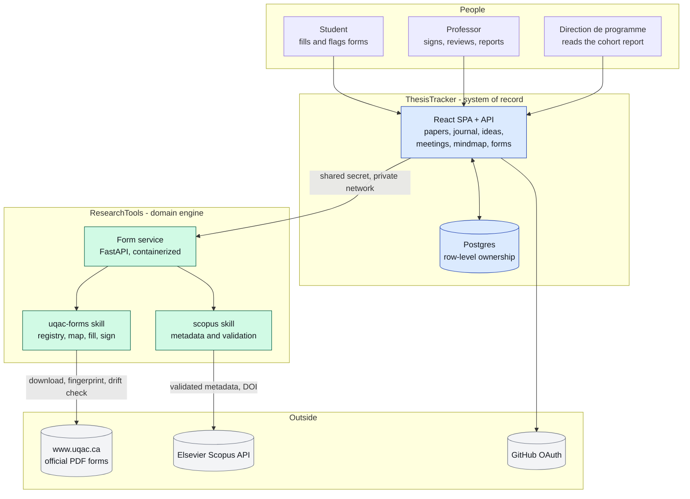
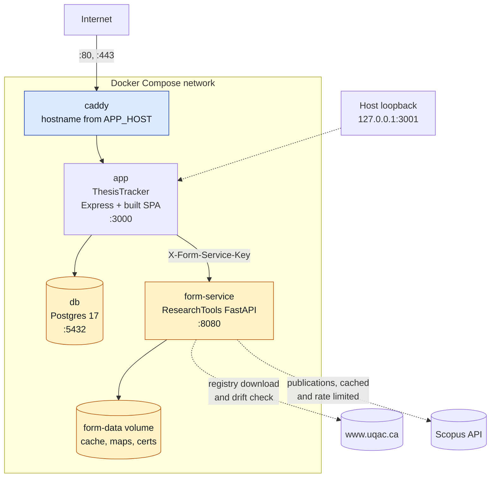
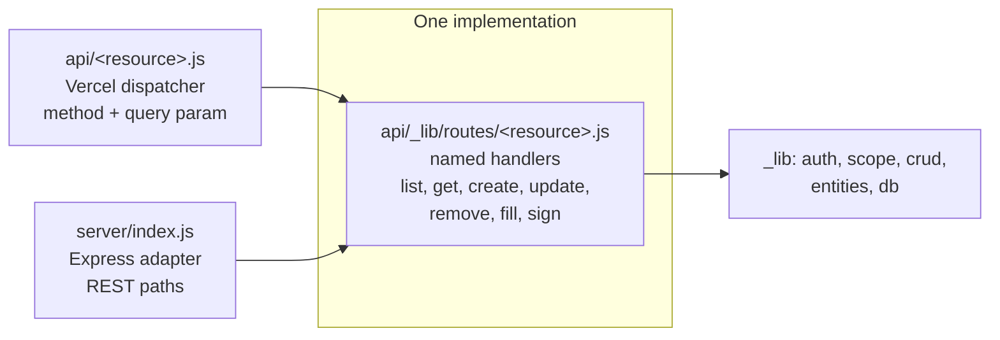
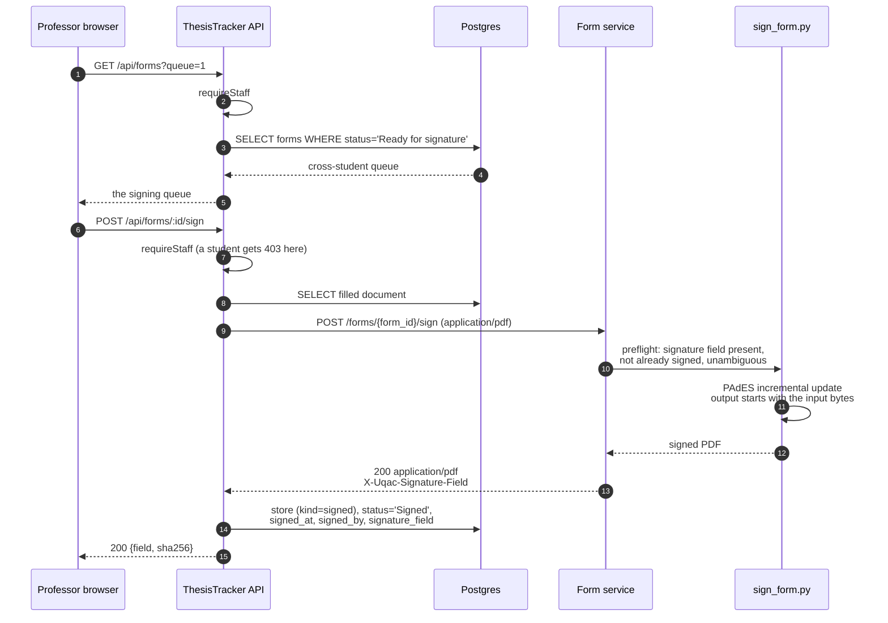
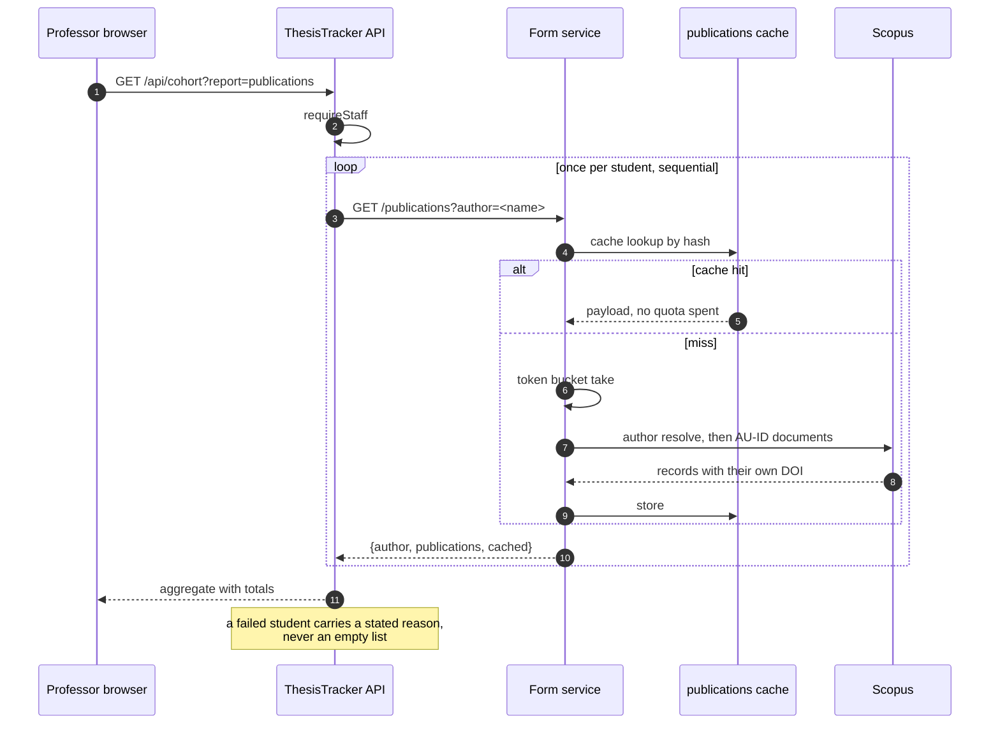
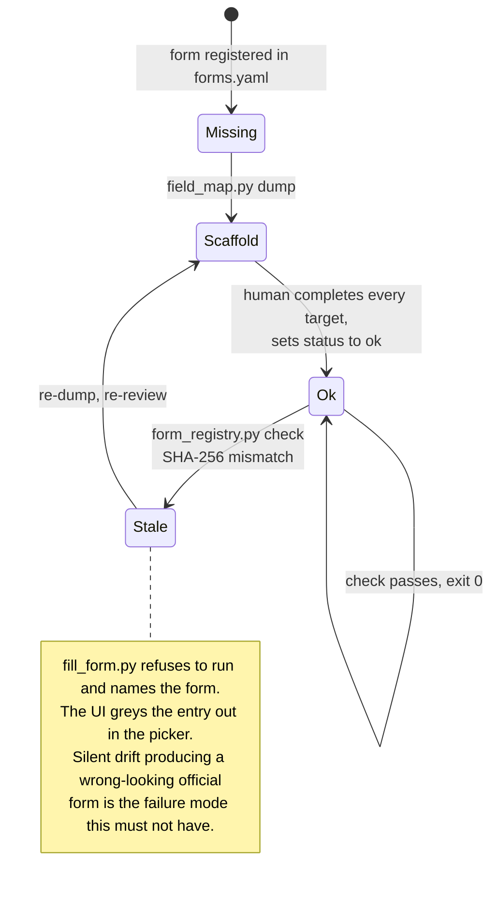
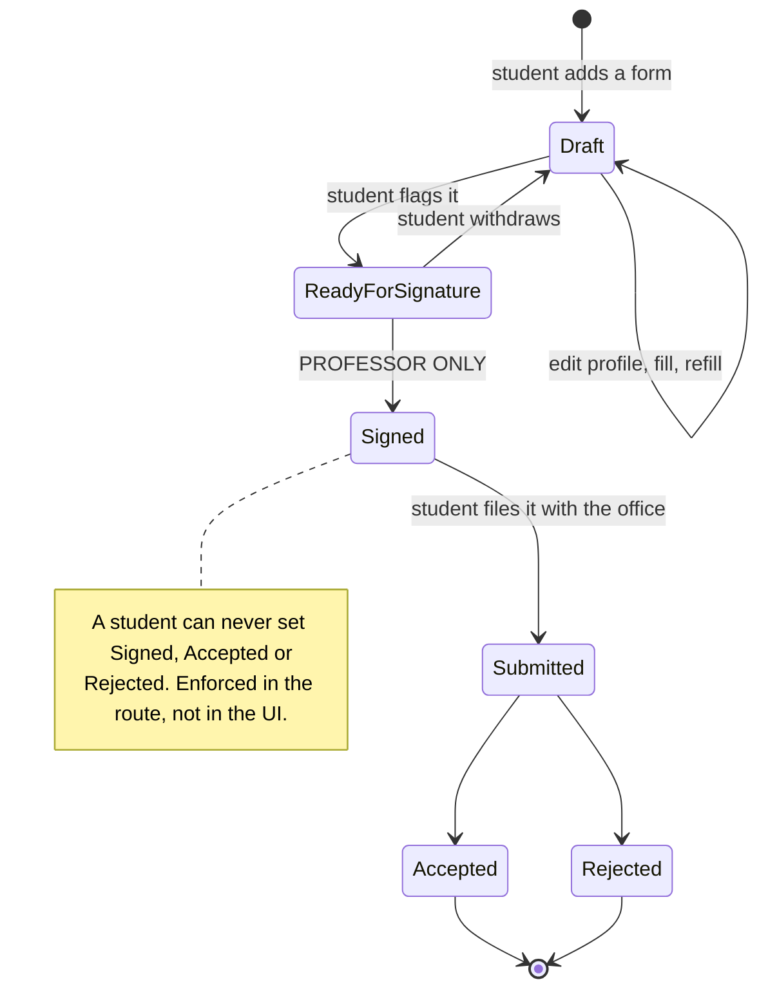
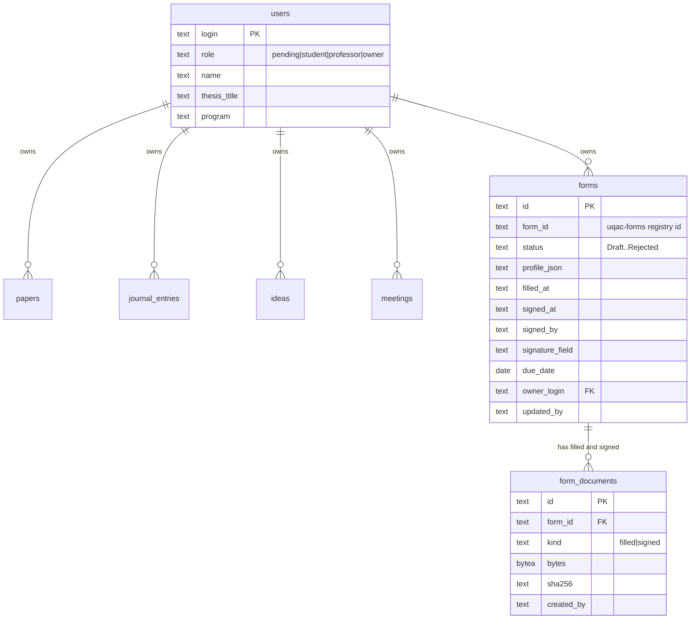
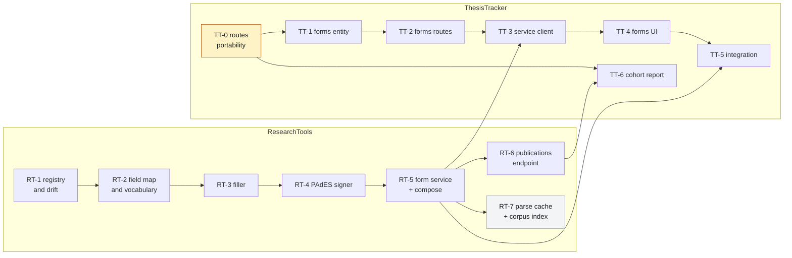
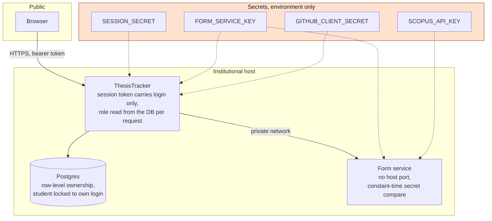

# NEW_ARCHITECTURE.md - the UQAC form engine

Shared architecture document for the two repositories that make up the UQAC form engine:
**ResearchTools** (`LARi-UQAC/ResearchTools`) and **ThesisTracker** (`JdUmuhoza/ThesisTracker`).
The same file is committed to `main` in both, so either checkout tells the whole story.

**Status: planned, not implemented.** Fourteen branches carry one plan document each, and
fifteen issues track them. No implementation code exists yet. Written 2026-07-29.

Outcome when all fourteen units land: a student fills a registered UQAC form from their
ThesisTracker profile, flags it, the professor signs it cryptographically, and the signed PDF is
stored against the student record, running on institutional Docker infrastructure, with automatic
detection when UQAC silently replaces a form at the same URL.

---

## 1. Why this shape

`README.md` TODO item 3 in ResearchTools targeted, for end of 2026, a Thesis-Tracker with user
login, a database, paperwork and forms, submission tracking, and mindmaps, with an open question
about n8n. The original proposal was Plane plus n8n plus Graphify plus a local LLM, replacing
ThesisTracker. Investigation rejected that shape.

| Question | Decision | Why |
|---|---|---|
| Plane as system of record | **Rejected** | ThesisTracker already has tested per-row RBAC that Plane Community cannot express. Migrating would trade it for one project per student and discard the nine-status domain semantics. Plane granular access control is Enterprise-only, and Plane webhooks do not cover Pages, which kills the "Pages edit triggers the mindmap" design. |
| Graphify for mindmaps | **Rejected** | Code-first knowledge-graph tool, not a research-notes concept extractor. The need is already served by the markmap view, the Obsidian vault, and `extract-futureworks` mine mode. |
| n8n now | **Deferred to Phase 3** | Every automation currently wanted is one cron and one script. Entry criteria in section 10. |
| Runtime | **Dual-target, converging to Docker** | Vercel sat at 12 of 12 Hobby functions, is licensed for personal non-commercial use, and would place matricules and signed expense claims on United States infrastructure under Quebec Law 25. |
| Form service language | **Python** | `pypdf` plus `pyhanko`. Node has no PAdES equivalent. |
| PDF library | **`pypdf`, BSD-3** | PyMuPDF is AGPL-3.0 and stays isolated in the `extract-statistic` skill. The deployable container carries no AGPL. |
| Signature | **PAdES, pluggable signer, self-signed development default** | Unblocks implementation while the Décanat and SRF acceptance question stays open. |
| Docker host | **Undecided by choice** | Compose and Caddy read the hostname from the environment. Chosen before real data loads, not before build. |

---

## 2. System context



**Dependency direction is one way: ThesisTracker depends on ResearchTools, never the reverse.**
ThesisTracker never calls Elsevier and never holds the Scopus key. The key, the throttling, and
the approved-publisher policy stay in ResearchTools.

---

## 3. The two repositories

| | ResearchTools | ThesisTracker |
|---|---|---|
| Role | Domain engine and academic toolbox | System of record and user interface |
| Stack | Python 3.13, FastAPI, `pypdf`, `pyhanko` | Node 20 ESM, React 19, Vite 8, Postgres |
| Visibility | Public | Private |
| Knows about | UQAC forms, Scopus, PDF semantics | Students, papers, ownership, roles |
| Does not know | Who a student is | What a PDF field is |
| New surface | `.claude/skills/uqac-forms/`, `deploy/form-service/` | `api/_lib/routes/`, `server/`, the `forms` entity |

The boundary rule: **ResearchTools knows forms, ThesisTracker knows people.** A field name, a
checkbox on-state, and a signature field never appear in ThesisTracker code. A student login, a
role, and an ownership guard never appear in ResearchTools code.

---

## 4. Runtime topology

One compose file, one network, one public door.



Deliberate properties:

- **The form service has no published host port.** It is reachable only on the compose network, so
  the shared secret never crosses a public interface.
- The app is published on `127.0.0.1` only; everything public goes through Caddy.
- Every hostname comes from the environment. No domain is hardcoded anywhere.
- The Postgres of the ResearchTools compose carries the `pgvector` extension, which RT-7 uses. In
  the combined stack the two databases may be merged or kept separate; the compose files are
  written so either works.

Vercel remains the second front door until retirement (section 11). One implementation, two doors:
`api/_lib/routes/*.js` holds every handler, a thin Vercel entry dispatches on method plus query
parameter, and the Express app mounts the same handlers on REST paths.



---

## 5. Request flows

### 5.1 Fill a form

```mermaid
sequenceDiagram
  autonumber
  participant S as Student browser
  participant A as ThesisTracker API
  participant D as Postgres
  participant F as Form service
  participant K as uqac-forms skill

  S->>A: POST /api/forms/:id/fill
  A->>A: requireUser, resolveScope
  A->>D: SELECT form WHERE id AND owner_login
  D-->>A: row with profile_json
  Note over A: a client-supplied profile is ignored;<br/>the stored row is the record
  A->>F: POST /forms/{form_id}/fill<br/>X-Form-Service-Key, {profile, flatten}
  F->>K: require_fresh_map(form_id)
  alt field map stale
    K-->>F: StaleMapError
    F-->>A: 409 stale map
    A-->>S: 409 "UQAC changed this form"
  else map ok
    K->>K: resolve values, write, NeedAppearances,<br/>lock non-signature fields
    K-->>F: filled PDF bytes
    F-->>A: 200 application/pdf<br/>X-Uqac-Filled, X-Uqac-Skipped
    A->>D: store in form_documents (kind=filled)
    A->>D: UPDATE forms SET filled_at
    A-->>S: 200 {filled, skipped, sha256}
  end
```

### 5.2 Sign a form



### 5.3 Cohort publication report



---

## 6. The drift guard

The piece that makes the engine survive contact with UQAC. Forms can be added, modified, or
withdrawn by the Direction at any time, always at the same URL.



`check` re-downloads each registered form, compares SHA-256 to the stored baseline, and on a
mismatch re-dumps the field set, diffs it against the stored map (added, removed, relocated
fields), and marks the map `stale`. Exit code 1, so a scheduled check fails loudly.

---

## 7. Form lifecycle

Enforced server-side in `api/_lib/routes/forms.js`, mirrored in the UI by a pure state machine so
the same rules are not restated in three components.



---

## 8. Data model

New tables in bold. The four existing entities are unchanged; the fifth inherits ownership and the
audit trail from the same shared layer, which is why `crud.js`, `scope.js` and `auth.js` are not
modified by any unit.



`form_documents` is served by a dedicated route and never through the generic CRUD layer, so the
declarative schema never has to carry binary.

On the ResearchTools side the state is files, not rows:

| Artifact | Content | Committed |
|---|---|---|
| `registry/forms.yaml` | the registered forms, human-curated | yes |
| `registry/baseline.json` | one SHA-256 fingerprint per form | yes |
| `registry/maps/<form_id>.json` | the reviewed field map, `status` ok or stale | yes |
| `registry/schema.yaml` | the profile vocabulary | yes |
| `out/uqac-forms/cache/*.pdf` | the downloaded official PDFs | no, gitignored |
| `.claude/skills/uqac-forms/certs/` | development signing material | no, gitignored |

---

## 9. The fourteen units

One plan document, one branch, one issue each. Every branch is cut from its repository's `main`
and its only commit is its own plan file.



**Execution order:** TT-0 first, it unblocks every ThesisTracker unit and frees the function
budget. RT-1 through RT-5 run in parallel with TT-0 through TT-2. TT-3 needs RT-5. RT-6 and RT-7
both branch off RT-5 and are independent of each other. TT-6 needs RT-6. RT-7 is on no critical
path and can land last.

| Unit | Branch | Issue | Deliverable |
|---|---|---|---|
| RT-1 | `feat/uqac-forms-registry` | ResearchTools #4 | `uqac-forms` skill scaffold, registry, validated downloader, SHA-256 baseline, drift check refusing stale maps, full repo wiring |
| RT-2 | `feat/uqac-forms-field-map` | ResearchTools #5 | `field_map.py` dump / validate / diff, checkbox on-states from `/AP /N`, byte-exact field keys, profile vocabulary |
| RT-3 | `feat/uqac-forms-filler` | ResearchTools #6 | `fill_form.py`, `NeedAppearances`, non-signature field locking, stale-map refusal |
| RT-4 | `feat/uqac-forms-signer` | ResearchTools #7 | `sign_form.py`, `Signer` protocol, `SelfSignedSigner`, PAdES incremental update, pyhanko validation in tests |
| RT-5 | `feat/uqac-forms-service` | ResearchTools #8 | FastAPI service, Dockerfile, shared-secret gate, compose with a `pgvector` Postgres and Caddy |
| RT-6 | `feat/publications-endpoint` | ResearchTools #9 | `scopus_api.author_documents`, cached and rate-limited `GET /publications`, approved-publisher flag |
| RT-7 | `feat/corpus-index` | ResearchTools #10 | Content-addressed parse cache, deterministic chunker, injected embedder, pgvector store, opt-in build |
| TT-0 | `feat/routes-portability` | ThesisTracker #1 | Named handlers, thin Vercel dispatchers (12 functions to 8), `pg` swap, Express front door, container |
| TT-1 | `feat/forms-entity` | ThesisTracker #2 | Fifth entity plus additive migration; `crud.js`, `scope.js`, `auth.js` untouched |
| TT-2 | `feat/forms-routes` | ThesisTracker #3 | Owner-scoped routes, staff signing queue, server-side status rule, binary document routes |
| TT-3 | `feat/forms-service-client` | ThesisTracker #4 | Injected-fetch client, fill and sign orchestration, complete failure-to-status mapping |
| TT-4 | `feat/forms-ui` | ThesisTracker #5 | Pure state machine, schema-driven profile editor, Forms view, professor signing queue |
| TT-5 | `feat/forms-integration` | ThesisTracker #6 | Combined compose, executable acceptance checklist, Vercel retirement checklist |
| TT-6 | `feat/cohort-report` | ThesisTracker #7 | Publications client method, staff-only roster walk, printable cohort report |

Plans live at `docs/superpowers/plans/2026-07-29-<unit>.md` on each unit's own branch.

---

## 10. Security and Law 25



Binding rules, each enforced by a test or a startup check:

| Rule | Where |
|---|---|
| A student reads and writes only rows where `owner_login` equals their login; a cross-tenant id returns 404 | `scope.js`, `crud.js`, unchanged by every unit |
| Only a professor may sign; a student attempting it gets 403 | `signForm`, and the status rule on `PATCH` |
| The form service refuses to start without a shared secret of at least 32 characters | `config.load_settings` |
| The shared secret is compared in constant time, never logged, never in a response body | `security.keys_match` |
| No CORS middleware anywhere on the service | server to server only |
| No profile, field value, key, or PDF byte is ever logged | asserted by tests in RT-3, RT-5, TT-2, TT-3 |
| Downloads are HTTPS only, magic-byte validated, size capped, redirect capped | `form_registry.fetch_form` |
| Stored documents must start with `%PDF` and stay under the cap | `putDocument` |
| No AGPL dependency in the deployable image | `deploy/form-service/requirements.txt` |
| Dependencies pinned exactly, `pip-audit --strict` before use | both requirements files |
| TLS verified against the system trust store for any remote database host | `api/_lib/db.js` |

Law 25 drives the runtime decision: matricules, addresses, and signed expense claims stay on the
institutional host. Retiring Vercel removes the last location of student personal information
outside the institution.

---

## 11. Deferred and open

### Phase 3, n8n

Not dropped, deferred with explicit entry criteria. Reintroduce when any **two** hold:

1. Three or more scheduled automations exist that share credentials and need retry.
2. A non-developer must change rules without a deploy.
3. Two or more OAuth-bound external systems are in play.
4. Failed automations have become a support burden needing run history and a retry UI.

Criterion 2 is the one the original specification implies; building a configuration UI for it
costs more than adopting n8n. Constraints for that phase: self-hosted on the same UQAC host, never
n8n Cloud; workflows authored from scratch and reviewed as source, never imported; paper metadata
from the `scopus` skill, never a scraper or Google Scholar; no LLM node drafts scientific prose.
Full rationale in ThesisTracker issue #8.

### Vercel retirement

Planned, not urgent, checklist written in TT-5. Order: choose the host, provision Postgres,
migrate with row-count verification, repoint the GitHub OAuth callback, set DNS, run the
acceptance checklist, keep Vercel read-only for two weeks, delete. The OAuth callback is the
rollback pivot, which is why it is late and adjacent to DNS.

### Open items

| Item | Status | Who answers |
|---|---|---|
| Does the Décanat des études accept a PAdES signature on a thesis form, and which authority does it recognize? | **Unverified.** The signer is pluggable with a self-signed development default, so implementation proceeds. A production credential is a configuration change, not a code change. | Someone must ask the Décanat |
| Does the Service des ressources financières accept a PAdES signature on an expense claim? | **Unverified**, same shape | Someone must ask the SRF |
| Which institutional Docker host, and who administers it? | **Undecided by choice.** The stack is host-agnostic | The professor, with UQAC IT |
| Backup policy for the institutional Postgres | Open. A `pg_dump` cron container is the intended answer and needs no n8n | Whoever administers the host |

---

## 12. Where to look next

| You want | Read |
|---|---|
| The academic tooling inventory | `ResearchTools/README.md`, `ResearchTools/Architecture.md` |
| The routing table for agents, skills, commands | `ResearchTools/.claude/CLAUDE.md` |
| How to add a skill, agent, or command | `ResearchTools/docs/authoring-and-mirrors.md` |
| One unit's implementation steps | `docs/superpowers/plans/2026-07-29-<unit>.md` on that unit's branch |
| The app's own roadmap | `ThesisTracker/ROADMAP.md` |
| The acceptance checklist, once TT-5 lands | `ThesisTracker/docs/acceptance-forms.md` |
| The retirement procedure, once TT-5 lands | `ThesisTracker/docs/vercel-retirement.md` |
