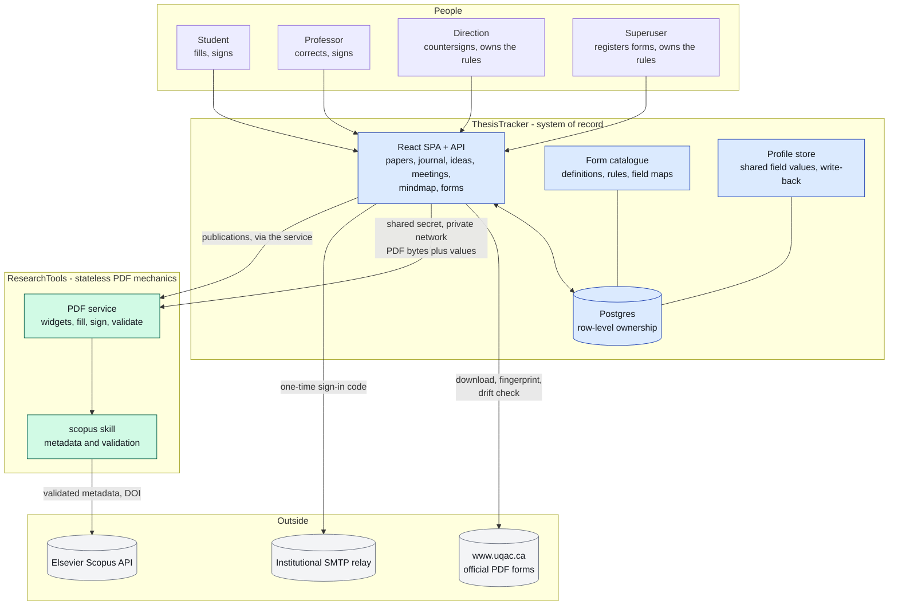
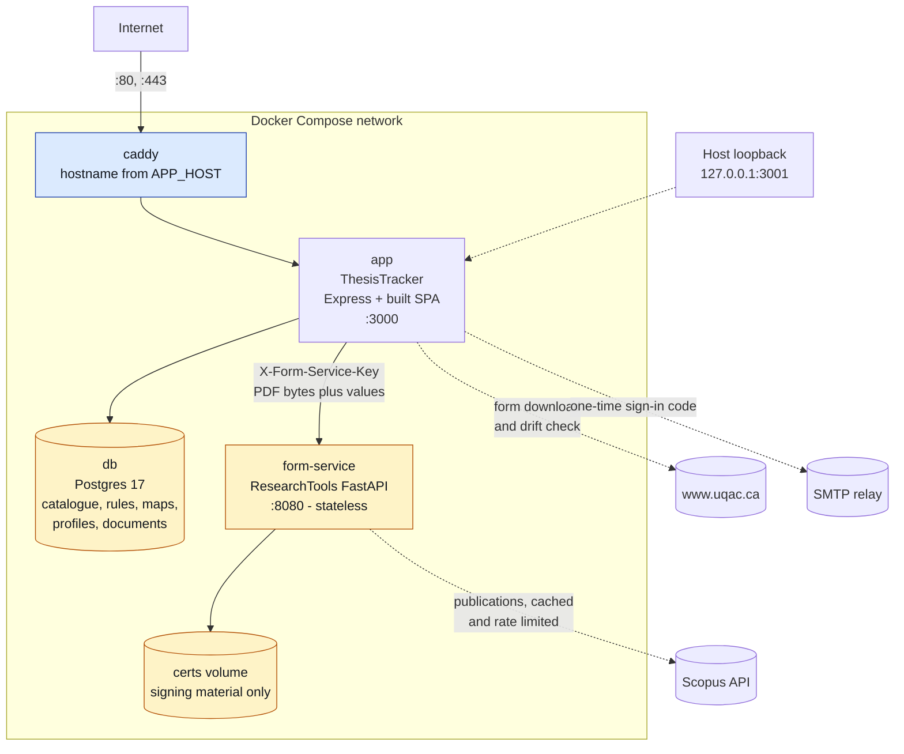
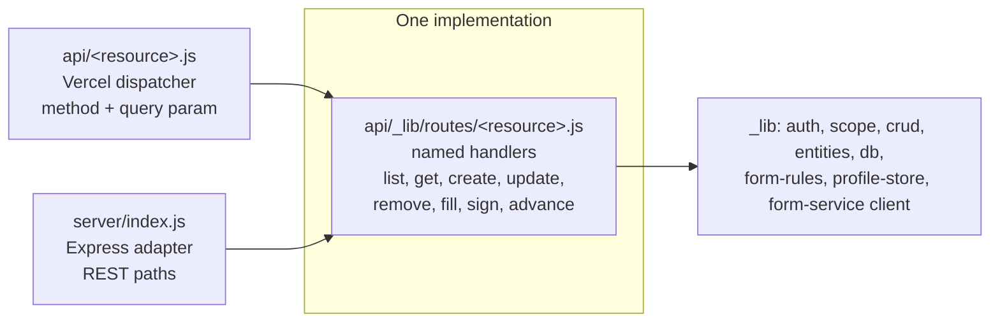
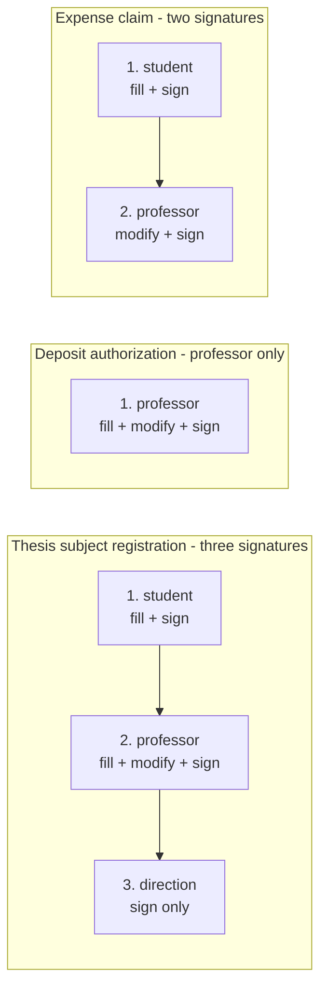
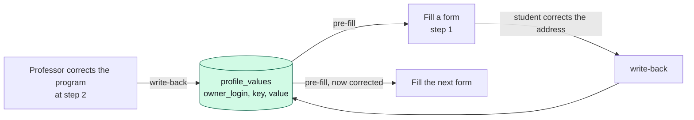
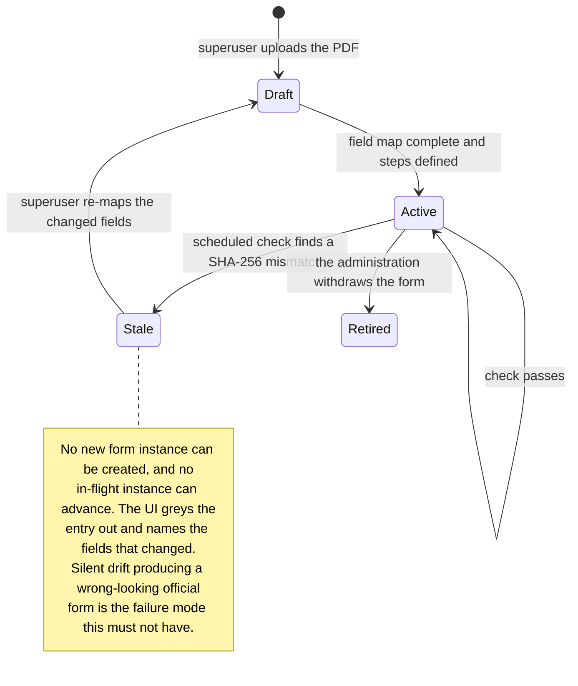
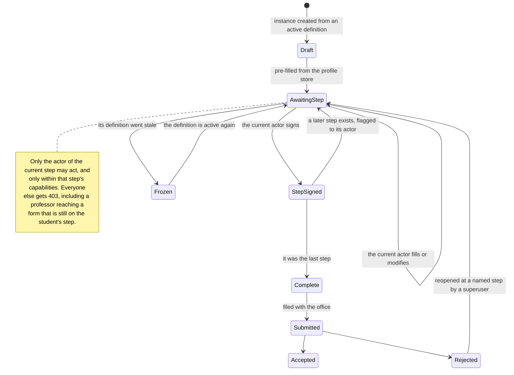
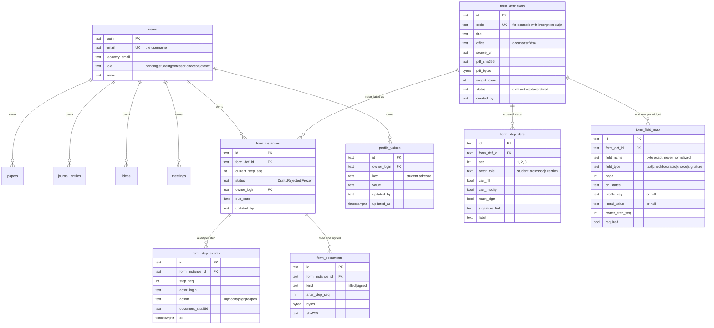
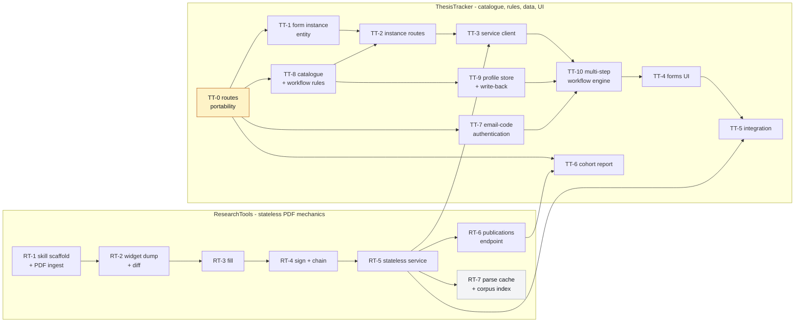
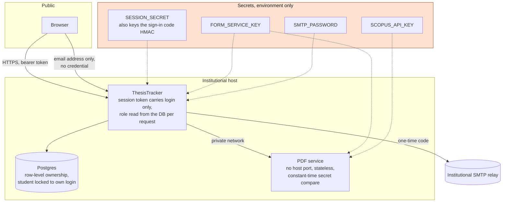

# NEW_ARCHITECTURE.md - the UQAC form engine

Shared architecture document for the two repositories that make up the UQAC form engine:
**ResearchTools** (`LARi-UQAC/ResearchTools`) and **ThesisTracker** (`JdUmuhoza/ThesisTracker`).
The same file is committed to `main` in both, so either checkout tells the whole story.

**Status: planned, not implemented.** Eighteen branches carry one plan document each, and
nineteen issues track them. No implementation code exists yet. Written 2026-07-29.

Outcome when all eighteen units land: a superuser registers an official UQAC PDF and defines its
rules; a student signs in with a one-time code sent to their institutional address and fills the
form, with the fields common to every form filled in automatically from what they entered last
time; they sign it, the professor corrects and signs, the Direction countersigns; the fully signed
PDF is stored against the student record, on institutional Docker infrastructure, with automatic
detection when UQAC silently replaces a form at the same URL.

**Revision note, 2026-07-29.** Two decisions changed after the first fourteen plans were written,
and this document is the authority on both. Sign-in is an email one-time code, not GitHub OAuth
(section 2, unit TT-7). And the form catalogue, the workflow rules, the field maps and the student
data all live in the **ThesisTracker** database, not in a ResearchTools registry: ResearchTools is
skills, agents and commands for a thesis, a paper, a review or a report, it cannot track a form and
it cannot know what fills one. Its service is reduced to stateless PDF mechanics. Sections 3, 6, 7
and 9 carry the consequences, and every affected plan carries a scope-change block.

---

## 1. Why this shape

`README.md` TODO item 3 in ResearchTools targeted, for end of 2026, a Thesis-Tracker with user
login, a database, paperwork and forms, submission tracking, and mindmaps, with an open question
about n8n. The original proposal was Plane plus n8n plus Graphify plus a local LLM, replacing
ThesisTracker. Investigation rejected that shape.

| Question | Decision | Why |
|---|---|---|
| Plane as system of record | **Rejected** | ThesisTracker already has tested per-row RBAC that Plane Community cannot express. Migrating would trade it for one project per student and discard the nine-status domain semantics. Plane granular access control is Enterprise-only, and Plane webhooks do not cover Pages, which kills the "Pages edit triggers the mindmap" design. |
| Graphify for mindmaps | **Rejected** | Code-first knowledge-graph tool, not a research-notes concept extractor. The need is already served by the markmap view, the Obsidian vault, and `extract-futureworks` mine mode. |
| n8n now | **Deferred to Phase 3** | Every automation currently wanted is one cron and one script. Entry criteria in section 12. |
| Where the form catalogue, the rules, the field maps and the student data live | **The ThesisTracker database, edited in the UI** | Only ThesisTracker writes that database. ResearchTools is skills, agents and commands operating on a thesis, a paper, a review or a report: it cannot track a form and cannot know the information that fills one. |
| What the ResearchTools form service does | **Stateless PDF mechanics only** | Enumerate the widgets of a PDF it is handed, write given values into given fields, sign a named signature field, validate a signature. No registry, no map, no profile, no state between requests. Python holds this because `pypdf` and `pyhanko` have no Node equivalent. |
| Who may add a form or change its rules | **`owner` (superuser) or `direction`** | Every PDF comes from the University administration, so a professor neither adds forms nor rewrites the rules of an official document. A professor uses them. |
| The Direction de programme | **A fourth role that signs in the app** | Signature only: the Direction never writes a field. They see a signing queue and the rules editor, never a student's tracker. |
| Fields repeated on every form (name, address, program) | **Filled automatically from a profile store, written back on every edit** | A student types their address once. When a student or a professor corrects a value while filling, the correction is saved and becomes the default for the next form. |
| GitHub OAuth for sign-in | **Replaced by an email one-time code (TT-7)** | It required every user to hold a GitHub account, a handle is not an identity a supervisor recognizes, and the OAuth callback was the one step of the Vercel retirement that could not be rolled back instantly. The institutional email address becomes the username; `users.login` stays the primary key, so no data row moves. |
| Personal email (gmail, hotmail) | **Recovery and security notices only, never a login** | Rebinding an institutional address is an `owner` action, so a compromised personal mailbox alone cannot take over an account. |
| Which domains may sign in | **A configurable allowlist with no default** | `ALLOWED_EMAIL_DOMAINS`, and the application refuses to start when it is empty. A wrong default would silently admit a domain nobody vetted. |
| Runtime | **Dual-target, converging to Docker** | Vercel sat at 12 of 12 Hobby functions, is licensed for personal non-commercial use, and would place matricules and signed expense claims on United States infrastructure under Quebec Law 25. |
| PDF library | **`pypdf`, BSD-3** | PyMuPDF is AGPL-3.0 and stays isolated in the `extract-statistic` skill. The deployable container carries no AGPL. |
| Signature | **PAdES, pluggable signer, self-signed development default** | Unblocks implementation while the Décanat and SRF acceptance question stays open. |
| Docker host | **Undecided by choice** | Compose and Caddy read the hostname from the environment. Chosen before real data loads, not before build. |

---

## 2. System context



**Dependency direction is one way: ThesisTracker depends on ResearchTools, never the reverse.**
ThesisTracker never calls Elsevier and never holds the Scopus key. The key, the throttling, and the
approved-publisher policy stay in ResearchTools. Note what moved with the revision: ThesisTracker
now downloads and fingerprints the UQAC PDFs itself, because it owns the catalogue, and a download
plus a SHA-256 is a `fetch` in Node.

---

## 3. The two repositories

| | ResearchTools | ThesisTracker |
|---|---|---|
| Role | Stateless PDF mechanics, plus the academic toolbox | System of record, catalogue, rules, data, interface |
| Stack | Python 3.13, FastAPI, `pypdf`, `pyhanko` | Node 20 ESM, React 19, Vite 8, Postgres |
| Visibility | Public | Private |
| Knows about | What a PDF widget is, how to write a value into one, how to sign | Which forms exist, who fills what, in what order, and with which data |
| Does **not** know | Which forms exist, who a student is, what any field means, how anyone signs in | How to parse a PDF |
| State it keeps | None per request. A signing certificate, nothing else | Everything: catalogue, rules, maps, profiles, documents, workflow position |
| New surface | `.claude/skills/uqac-forms/` (PDF mechanics), `deploy/form-service/` | `api/_lib/routes/`, `server/`, the form catalogue, the profile store, the workflow engine, email-code sign-in |

The boundary rule, corrected: **ResearchTools manipulates PDF bytes, ThesisTracker knows what they
mean.** A form code, a profile key, a role, an email address, and an ownership guard never appear in
ResearchTools code. A `pypdf` call never appears in ThesisTracker code.

The consequence worth stating plainly: **the ResearchTools service is a function, not a system.**
Hand it a PDF and a set of field values and it hands back a PDF. It cannot answer "which forms
exist", "who signs this next", or "what is this student's address", because it holds nothing. That
is what makes it safe to deploy publicly-sourced code beside private student data: it has no data.

Identity is entirely ThesisTracker's. The service authenticates a **machine** with a shared secret
and never sees a user, a session, or an email address.

---

## 4. Runtime topology

One compose file, one network, one public door.



Deliberate properties:

- **The form service has no published host port.** It is reachable only on the compose network, so
  the shared secret never crosses a public interface.
- **The form service keeps one volume, for signing material.** It no longer caches PDFs or stores
  field maps: those are rows in the ThesisTracker database.
- The app is published on `127.0.0.1` only; everything public goes through Caddy.
- Every hostname comes from the environment. No domain is hardcoded anywhere.
- The `pgvector` extension is needed by RT-7 only. It rides whichever Postgres the deployment
  gives it; the compose files are written so a merged or a separate instance both work.

Vercel remains the second front door until retirement (section 12). One implementation, two doors:
`api/_lib/routes/*.js` holds every handler, a thin Vercel entry dispatches on method plus query
parameter, and the Express app mounts the same handlers on REST paths.



---

## 5. Per-form workflow rules

**Every registered PDF carries its own rules.** They are defined once, when the PDF is added to the
catalogue, and they say who touches the form, in what order, and what each of them may do.

### 5.1 The capability model

A form definition owns an ordered list of steps. Each step names one **actor role** and grants a
subset of three capabilities:

| Capability | Meaning | Enforced by |
|---|---|---|
| `fill` | may write a field that is currently **empty** | the route rejects a write to a non-empty field |
| `modify` | may **overwrite** a field that already has a value, to correct an error | the route rejects any write when absent |
| `sign` | must sign the signature field named by the step | the step cannot complete without it |

The three shapes the University's forms actually take:

| Step | Actor | `fill` | `modify` | `sign` |
|---|---|---|---|---|
| 1 | `student` | yes | no | yes |
| 2 | `professor` | yes | **yes** | yes |
| 3 | `direction` | no | **no** | yes |

The professor's `modify` is the point of the model: the student fills the form, and the professor
corrects an error before signing rather than sending it back. The Direction's step is a signature
and nothing else: they cannot change a form they are countersigning.

### 5.2 Three worked examples



A form with a single professor step never appears in a student's list at all. A form whose first
step is the student's appears for the student and only reaches the professor when the student
completes their step.

### 5.3 Who defines the rules

**`owner` (superuser) or `direction`. Never a professor, never a student.** Every PDF comes from the
University administration, so a professor neither adds a form nor rewrites the rules of an official
document; they use them.

Registration is a guided flow, because the rules cannot be guessed from the file:

```mermaid
sequenceDiagram
  autonumber
  participant U as Superuser or Direction
  participant A as ThesisTracker API
  participant F as PDF service
  participant D as Postgres

  U->>A: upload the official PDF, with its source URL
  A->>A: validate: %PDF magic, size cap, https source
  A->>F: POST /pdf/widgets (the bytes)
  F-->>A: every widget: name, type, page, rect, on-states
  A->>D: store the definition, its SHA-256, and the raw widget list
  A-->>U: "56 fields found. Map them, then define the steps."
  U->>A: bind each field to a profile key, a literal, or "not filled"
  U->>A: define the ordered steps: actor, fill, modify, sign, signature field
  A->>A: validate: every signature field exists; every actor role exists;<br/>at least one step; no step with no capability
  A->>D: store the field map and the step definitions, status active
  A-->>U: the form is available to the roles its first step names
```

Nothing is inferred. A field nobody fills is marked as such explicitly, so a blank on an official
form is a decision on the record rather than an oversight.

---

## 6. Shared fields and the profile store

Many forms ask for the same things: name, permanent code, address, program, supervisor. A student
types them once.



Rules, each enforced server-side:

- A field bound to a profile key is **pre-filled** from the store, so the student sees it already
  entered and only corrects it if it is wrong.
- **Any `fill` or `modify` writes back.** A student correcting their address, or a professor
  correcting a program code, updates the store and therefore every later form.
- The write-back is **owner-scoped**: it updates the profile of the student the form belongs to,
  never the profile of the person doing the editing. A professor correcting a student's address
  writes the student's profile, and the audit trail records who did it.
- Every change is versioned, so "the address was wrong on the form I submitted in March" is an
  answerable question.
- A field bound to a literal or marked as not filled is never written back.

---

## 7. The drift guard

The piece that makes the engine survive contact with UQAC. Forms can be added, modified, or
withdrawn by the administration at any time, always at the same URL. **This now lives in
ThesisTracker**, which owns the catalogue: a download and a SHA-256 comparison is a `fetch` in Node.



The check re-downloads each active definition, compares the SHA-256, and on a mismatch asks the PDF
service for the new widget list, diffs it against the stored map (added, removed, relocated fields),
marks the definition `stale`, and notifies the superuser and the Direction. An in-flight instance is
frozen rather than silently continued on a form that no longer matches its map.

---

## 8. Form instance lifecycle

A form instance walks its definition's steps. Status is derived from the position, not typed in by
hand, which is why the previous fixed six-status flow is gone.



Signatures accumulate: each step's signature is a PAdES incremental update appended to the previous
one, so signature 2 does not invalidate signature 1 and the final PDF carries a verifiable chain in
step order.

---

## 9. Data model

New tables in bold. The four original entities are unchanged, and they and the form tables share one
ownership and audit layer, which is why `crud.js`, `scope.js` and `auth.js` are not modified.



`form_field_map.field_name` holds the PDF's own byte-exact widget name and is never normalized: the
probed forms carry accented, space-bearing and generic names such as `code permanent`,
`no_matricule` and `TachesAEffectuerRow1`, and two forms name the same thing differently. That is
precisely why one profile key maps to many field names.

On the ResearchTools side there is no state to model. The service holds a signing certificate and
nothing else.

---

## 10. The eighteen units

One plan document, one branch, one issue each. Every branch is cut from its repository's `main` and
its only commit is its own plan file.



**Execution order:** TT-0 first, it unblocks every ThesisTracker unit and frees the function budget.
Then TT-7, because until it lands every new user needs a GitHub account. RT-1 through RT-5 run in
parallel with TT-8 and TT-9. TT-3 needs RT-5. TT-10 needs TT-9 for the profile store and TT-7 for
the `direction` role. RT-6 and RT-7 branch off RT-5 and are independent of each other. TT-6 needs
RT-6. RT-7 is on no critical path and can land last.

| Unit | Branch | Issue | Deliverable |
|---|---|---|---|
| RT-1 | `feat/uqac-forms-registry` | ResearchTools #4 | `uqac-forms` skill scaffold and the validated PDF-ingest contract (`%PDF` magic, size cap, https only, capped redirects). **Scope reduced:** the registry and the drift check moved to TT-8. |
| RT-2 | `feat/uqac-forms-field-map` | ResearchTools #5 | `dump_widgets` with byte-exact names and `/AP /N` on-states, and `diff_widgets(a, b)` for drift reporting. **Scope reduced:** the map and the vocabulary are TT-8's rows. |
| RT-3 | `feat/uqac-forms-filler` | ResearchTools #6 | Stateless `fill(pdf_bytes, values, flatten_fields) -> bytes`, `NeedAppearances`, selective field locking. **Scope reduced:** no profile, no map, no stale gate. |
| RT-4 | `feat/uqac-forms-signer` | ResearchTools #7 | Stateless PAdES sign of a named field, pluggable signer, and the guarantee that a new signature preserves every previous one. |
| RT-5 | `feat/uqac-forms-service` | ResearchTools #8 | Stateless service: `/pdf/widgets`, `/pdf/fill`, `/pdf/sign`, `/pdf/validate`. Shared-secret gate, no CORS, nothing persisted, no map volume. |
| RT-6 | `feat/publications-endpoint` | ResearchTools #9 | `scopus_api.author_documents`, cached and rate-limited `GET /publications`, approved-publisher flag |
| RT-7 | `feat/corpus-index` | ResearchTools #10 | Content-addressed parse cache, deterministic chunker, injected embedder, pgvector store, opt-in build |
| TT-0 | `feat/routes-portability` | ThesisTracker #1 | Named handlers, thin Vercel dispatchers, `pg` swap, Express front door, container |
| TT-1 | `feat/forms-entity` | ThesisTracker #2 | `form_instances` entity and its additive migration; `crud.js`, `scope.js`, `auth.js` untouched |
| TT-2 | `feat/forms-routes` | ThesisTracker #3 | Owner-scoped instance routes, signing queues, binary document routes |
| TT-3 | `feat/forms-service-client` | ThesisTracker #4 | Injected-fetch client for the stateless PDF service, with a complete failure-to-status mapping |
| TT-4 | `feat/forms-ui` | ThesisTracker #5 | Step-aware Forms view, per-role queues, pre-filled fields, the rules editor for a superuser |
| TT-5 | `feat/forms-integration` | ThesisTracker #6 | Combined compose, executable acceptance checklist, Vercel retirement checklist |
| TT-6 | `feat/cohort-report` | ThesisTracker #7 | Publications client method, staff-only roster walk, printable cohort report |
| TT-7 | `feat/email-code-auth` | ThesisTracker #9 | Email one-time code replaces GitHub OAuth; domain allowlist with no default; the `direction` role |
| TT-8 | `feat/form-catalogue` | ThesisTracker #10 | `form_definitions`, `form_step_defs`, `form_field_map`; superuser-only registration and rules editing; the drift check in Node |
| TT-9 | `feat/profile-store` | ThesisTracker #11 | `profile_values` with history, pre-fill resolution, owner-scoped write-back on every fill and modify |
| TT-10 | `feat/workflow-engine` | ThesisTracker #12 | Step instances, actor and capability enforcement, sequential signature stacking, reopen at a named step |

Plans live at `docs/superpowers/plans/2026-07-29-<unit>.md` on each unit's own branch. Every plan
whose scope the 2026-07-29 revision changed carries a scope-change block at the top pointing here.

---

## 11. Security and Law 25



Binding rules, each enforced by a test or a startup check:

| Rule | Where |
|---|---|
| A student reads and writes only rows where `owner_login` equals their login; a cross-tenant id returns 404 | `scope.js`, `crud.js`, unchanged by every unit |
| Only the actor of the **current** step may act on an instance, and only within that step's capabilities | TT-10 workflow engine |
| A step without `modify` cannot overwrite a non-empty field; a step without `fill` cannot write at all | TT-10, asserted per capability |
| The `direction` role can sign and edit rules, and can never write a form field or browse a tracker | TT-7 role, TT-8 rules routes, TT-10 capabilities |
| Only `owner` or `direction` may add a form definition or change its rules; a professor gets 403 | TT-8 |
| A profile write-back updates the **form owner's** profile, never the editor's, and records who did it | TT-9 |
| A new signature preserves every previous one; the chain is verifiable in step order | RT-4, asserted by test |
| An instance whose definition went stale is frozen, not silently advanced | TT-8 drift check, TT-10 gate |
| The PDF service persists nothing from a request and logs no field value | RT-5, asserted by test |
| The form service refuses to start without a shared secret of at least 32 characters, compared in constant time | RT-5 `config.load_settings`, `security.keys_match` |
| No CORS middleware anywhere on the service | server to server only |
| Only an address on an approved institutional domain may sign in; the allowlist has **no default** and the app refuses to start when empty | TT-7 `email-policy.allowedDomains`, called in `createApp()` |
| A sign-in code is stored only as `HMAC-SHA256(code, SESSION_SECRET)`, single use, 10 minutes, 5 attempts, rate limited | TT-7 `login-codes.js` |
| The code request answers identically whether or not the account exists, and all invalid-code reasons return one body | TT-7, asserted by test |
| A personal address can never sign in; rebinding an institutional address is an `owner` action | TT-7 |
| Downloads are HTTPS only, magic-byte validated, size capped, redirect capped | TT-8 ingest, RT-1 contract |
| Stored documents must start with `%PDF` and stay under the cap | TT-2 |
| No AGPL dependency in the deployable image | `deploy/form-service/requirements.txt` |
| Dependencies pinned exactly, `pip-audit --strict` before use | both requirements files |
| TLS verified against the system trust store for any remote database host | `api/_lib/db.js` |
| No email address, code, session token, profile value, or PDF byte is ever logged | asserted by tests across RT-3, RT-5, TT-2, TT-3, TT-7, TT-9 |

Law 25 drives the runtime decision: matricules, addresses, and signed expense claims stay on the
institutional host. Retiring Vercel removes the last location of student personal information
outside the institution. The same reasoning chooses the mail relay, and it is also why the PDF
service is stateless: publicly-sourced code runs beside private student data while holding none of
it.

---

## 12. Deferred and open

### Phase 3, n8n

Not dropped, deferred with explicit entry criteria. Reintroduce when any **two** hold:

1. Three or more scheduled automations exist that share credentials and need retry.
2. A non-developer must change rules without a deploy.
3. Two or more OAuth-bound external systems are in play.
4. Failed automations have become a support burden needing run history and a retry UI.

Note that criterion 2 is now **partly satisfied by design rather than by n8n**: the form rules are
editable in the UI by a superuser or the Direction, with no deploy. That was the requirement the
original specification implied, and TT-8 answers it directly. Constraints for that phase if it
arrives: self-hosted on the same UQAC host, never n8n Cloud; workflows authored from scratch and
reviewed as source, never imported; paper metadata from the `scopus` skill, never a scraper or
Google Scholar; no LLM node drafts scientific prose. Full rationale in ThesisTracker issue #8.

### Vercel retirement

Planned, not urgent, checklist written in TT-5. Order: choose the host, provision Postgres, migrate
with row-count verification, confirm the new host can send mail, set DNS, run the acceptance
checklist, keep Vercel read-only for two weeks, delete.

**The rollback is free at every step: stop the new stack.** That was not true when this project
started. The original step 4 was repointing the GitHub OAuth callback, and it was the pivot:
everything before it could be undone by stopping a container, everything after it needed a second
change in a third-party account. TT-7 removed it, so nothing outside the two hosts has to change.

### Open items

| Item | Status | Who answers |
|---|---|---|
| Does the Décanat des études accept a PAdES cryptographic signature on a thesis form, and which certificate authority does it recognize? | **Unverified.** The signer is pluggable with a self-signed development default, so implementation proceeds. A production credential is a configuration change, not a code change. | Someone must ask the Décanat |
| Does the Service des ressources financières accept a PAdES signature on an expense claim? | **Unverified**, same shape | Someone must ask the SRF |
| Does either office accept a **three-signature chain** in one PDF, or do they expect a separate signature page? | **Unverified.** The engine produces a stacked PAdES chain in step order, which is the technically correct form; whether the office reads it that way is not confirmed. | Same two offices, same conversation |
| Which institutional Docker host, and who administers it? | **Undecided by choice.** The stack is host-agnostic | The professor, with UQAC IT |
| Backup policy for the institutional Postgres | Open. A `pg_dump` cron container is the intended answer and needs no n8n | Whoever administers the host |
| Who holds the `direction` account, and does one account serve the whole Direction de programme or one per person? | Open. One per person gives a real audit trail; a shared account does not | The professor, with the Direction |

---

## 13. Where to look next

| You want | Read |
|---|---|
| The academic tooling inventory | `ResearchTools/README.md`, `ResearchTools/Architecture.md` |
| The routing table for agents, skills, commands | `ResearchTools/.claude/CLAUDE.md` |
| How to add a skill, agent, or command | `ResearchTools/docs/authoring-and-mirrors.md` |
| One unit's implementation steps | `docs/superpowers/plans/2026-07-29-<unit>.md` on that unit's branch |
| The app's own roadmap | `ThesisTracker/ROADMAP.md` |
| The acceptance checklist, once TT-5 lands | `ThesisTracker/docs/acceptance-forms.md` |
| The retirement procedure, once TT-5 lands | `ThesisTracker/docs/vercel-retirement.md` |
