# NEW_ARCHITECTURE.md - the UQAC form engine

Shared architecture document for the two repositories that make up the UQAC form engine:
**ResearchTools** (`LARi-UQAC/ResearchTools`) and **ThesisTracker** (`JdUmuhoza/ThesisTracker`).
The same file is committed to `main` in both, so either checkout tells the whole story.

**Status: in progress. 7 of 20 units delivered.** Twenty branches carry one plan document each,
and twenty-one issues track them. Written 2026-07-29.

Delivered: TT-0, TT-1, TT-2, TT-8, TT-9 and TT-12 are merged to `main` in ThesisTracker; RT-1 is
on `feat/uqac-forms-registry` here. TT-7 (email one-time codes) is built but **excluded by
design** until UQAC provides a mail relay: merging it would replace the only working sign-in with
a code nothing can deliver. It also carries the `direction` role, so it gates TT-10.

This file is meant to be identical on `main` in both repositories. It had drifted: this copy still
read "planned, not implemented" while six units were live in production.

Outcome when all twenty units land: a professor admits a student and their whole timeline appears,
from the first administrative form to the final thesis deposit; a superuser registers an official
UQAC PDF and defines its rules; the student signs in with a one-time code sent to their
institutional address and fills the form, pre-filled from what they entered last time; they sign it,
the professor corrects it and sends it back for the student's approval, the Direction countersigns
or returns it, and the completed form is emailed to the office that owns it. ResearchTools audits
the student's papers, reports and thesis and returns a correction plan the student works through
inside ThesisTracker. All of it on institutional Docker infrastructure, with automatic detection
when UQAC silently replaces a form at the same URL.

**Revision note, 2026-07-29.** Four decisions changed after the first fourteen plans were written,
and this document is the authority on all four. Every affected plan carries a scope-change block.

1. **Sign-in is an email one-time code**, not GitHub OAuth (unit TT-7).
2. **The form catalogue, the workflow rules, the field maps and the student data live in the
   ThesisTracker database**, not in a ResearchTools registry: ResearchTools is skills, agents and
   commands for a thesis, a paper, a review or a report, it cannot track a form and it cannot know
   what fills one. Its service is reduced to stateless PDF mechanics (sections 3 and 4, units TT-8
   and TT-9).
3. **A form can go backwards.** The professor sends it back to the student for a final approval, and
   the Direction sends it back to the professor when something is wrong. This is not a convenience:
   a `modify` after a `sign` means the earlier signature no longer covers the final content, so the
   engine **forces** a return rather than offering it (section 5.1, unit TT-10).
4. **A completed form is submitted by email to the office that owns it**, and each form definition
   carries its own destination address (sections 5.2 and 11, units TT-8 and TT-10).

Two units are new with this revision: **TT-11**, the student timeline created on admission
(section 7), and **TT-12**, the intake of ResearchTools correction plans (section 8).

---

## 1. Why this shape

`README.md` TODO item 3 in ResearchTools targeted, for end of 2026, a Thesis-Tracker with user
login, a database, paperwork and forms, submission tracking, and mindmaps, with an open question
about n8n. The original proposal was Plane plus n8n plus Graphify plus a local LLM, replacing
ThesisTracker. Investigation rejected that shape.

| Question | Decision | Why |
|---|---|---|
| Plane as system of record | **Rejected** | ThesisTracker already has tested per-row RBAC that Plane Community cannot express. Migrating would trade it for one project per student and discard the nine-status domain semantics. Plane granular access control is Enterprise-only, and Plane webhooks do not cover Pages, which kills the "Pages edit triggers the mindmap" design. |
| Graphify for mindmaps | **Rejected** | Code-first knowledge-graph tool, not a research-notes concept extractor. The need is already served by the markmap view, the Obsidian vault, and `extract-futureworks` mine mode. |
| n8n now | **Deferred to Phase 3** | Every automation currently wanted is one cron and one script. Entry criteria in section 14. |
| Where the form catalogue, the rules, the field maps and the student data live | **The ThesisTracker database, edited in the UI** | Only ThesisTracker writes that database. ResearchTools is skills, agents and commands operating on a thesis, a paper, a review or a report: it cannot track a form and cannot know the information that fills one. |
| What the ResearchTools form service does | **Stateless PDF mechanics only** | Enumerate the widgets of a PDF it is handed, write given values into given fields, sign a named signature field, validate a signature. No registry, no map, no profile, no state between requests. Python holds this because `pypdf` and `pyhanko` have no Node equivalent. |
| Who may add a form or change its rules | **`owner` (superuser) or `direction`** | Every PDF comes from the University administration, so a professor neither adds forms nor rewrites the rules of an official document. A professor uses them. |
| The Direction de programme | **A fourth role that signs in the app** | Signature only: the Direction never writes a field. They see a signing queue and the rules editor, never a student's tracker. |
| Fields repeated on every form (name, address, program) | **Filled automatically from a profile store, written back on every edit** | A student types their address once. When a student or a professor corrects a value while filling, the correction is saved and becomes the default for the next form. |
| A form that needs correcting after it was signed | **Sent back, and the engine forces it** | A `modify` after a `sign` leaves the earlier signature valid over its own revision but no longer covering the final content. So the professor's correction routes the form back to the student for approval automatically, and the Direction can return it to the professor. Forward-only would produce documents whose signatures no longer mean what they appear to mean. |
| Getting the finished form to the office | **Emailed to a destination stored on the form definition** | Each official form belongs to a different office. The address is part of the definition, editable by an `owner` or the `direction`, and never supplied by the client at submission time. |
| What happens when a student is admitted | **The whole timeline is created from a template** | Forms, reports, seminar, papers per contribution, and the thesis milestones from initial to final deposit. The subject-calendar form then shifts the dates, because its values are already in the database. A student should not have to discover what is expected of them one deadline at a time. |
| Who validates a paper, a report or a thesis | **ResearchTools, which returns a correction plan** | Its auditors already produce exactly that: `paper-auditor`, `thesis-auditor`, `scopus-auditor`, `submit-checker`, `scholar-evaluation`. ThesisTracker ingests the plan and tracks the findings as a worklist; it does not re-implement the audit. |
| GitHub OAuth for sign-in | **Replaced by an email one-time code (TT-7)** | It required every user to hold a GitHub account, a handle is not an identity a supervisor recognizes, and the OAuth callback was the one step of the Vercel retirement that could not be rolled back instantly. The institutional email address becomes the username; `users.login` stays the primary key, so no data row moves. |
| Personal email (gmail, hotmail) | **Recovery and security notices only, never a login** | Rebinding an institutional address is an `owner` action, so a compromised personal mailbox alone cannot take over an account. |
| Which domains may sign in | **A configurable allowlist with no default** | `ALLOWED_EMAIL_DOMAINS`, and the application refuses to start when it is empty. A wrong default would silently admit a domain nobody vetted. |
| Runtime | **Dual-target, converging to Docker** | Vercel sat at 12 of 12 Hobby functions, is licensed for personal non-commercial use, and would place matricules and signed expense claims on United States infrastructure under Quebec Law 25. |
| PDF library | **`pypdf`, BSD-3** | PyMuPDF is AGPL-3.0 and stays isolated in the `extract-statistic` skill. The deployable container carries no AGPL. |
| Signature | **PAdES, pluggable signer, self-signed development default** | Unblocks implementation while the Décanat and SRF acceptance question stays open. |
| Docker host | **Undecided by choice** | Compose and Caddy read the hostname from the environment. Chosen before real data loads, not before build. |

---

## 2. System context

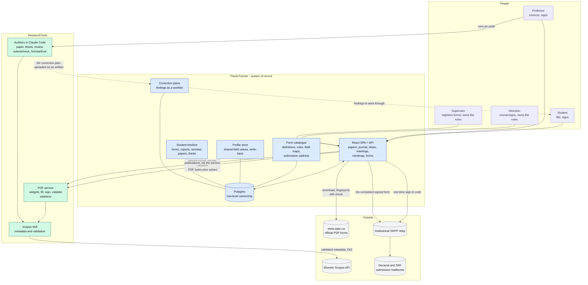

**Dependency direction is one way: ThesisTracker depends on ResearchTools, never the reverse.**
ThesisTracker never calls Elsevier and never holds the Scopus key. The key, the throttling, and the
approved-publisher policy stay in ResearchTools. Note what moved with the revision: ThesisTracker
now downloads and fingerprints the UQAC PDFs itself, because it owns the catalogue, and a download
plus a SHA-256 is a `fetch` in Node.

---

## 3. The two repositories

| | ResearchTools | ThesisTracker |
|---|---|---|
| Role | Stateless PDF mechanics, plus the academic toolbox that audits the work | System of record: catalogue, rules, data, timeline, interface |
| Stack | Python 3.13, FastAPI, `pypdf`, `pyhanko`, plus the Claude Code agents | Node 20 ESM, React 19, Vite 8, Postgres |
| Visibility | Public | Private |
| Knows about | What a PDF widget is, how to write a value into one, how to sign, and how to judge a paper or a thesis against the literature | Which forms exist, who fills what, in what order, with which data, and what is expected of each student by when |
| Does **not** know | Which forms exist, who a student is, what any field means, how anyone signs in, what a deadline is | How to parse a PDF, how to validate a reference |
| State it keeps | None per request. A signing certificate, nothing else | Everything: catalogue, rules, maps, profiles, documents, workflow position, timeline, findings |
| New surface | `.claude/skills/uqac-forms/` (PDF mechanics), `deploy/form-service/` | `api/_lib/routes/`, `server/`, the catalogue, the profile store, the workflow engine, the timeline, correction-plan intake, email-code sign-in |
| Direction of travel | Produces artifacts: filled bytes, signed bytes, an improvement plan | Consumes them, tracks them, and shows them to a person |

The boundary rule, corrected: **ResearchTools manipulates PDF bytes, ThesisTracker knows what they
mean.** A form code, a profile key, a role, an email address, and an ownership guard never appear in
ResearchTools code. A `pypdf` call never appears in ThesisTracker code.

The consequence worth stating plainly: **the ResearchTools service is a function, not a system.**
Hand it a PDF and a set of field values and it hands back a PDF. It cannot answer "which forms
exist", "who signs this next", or "what is this student's address", because it holds nothing. That
is what makes it safe to deploy publicly-sourced code beside private student data: it has no data.

Identity is entirely ThesisTracker's. The service authenticates a **machine** with a shared secret
and never sees a user, a session, or an email address.

---

## 4. Runtime topology

One compose file, one network, one public door.

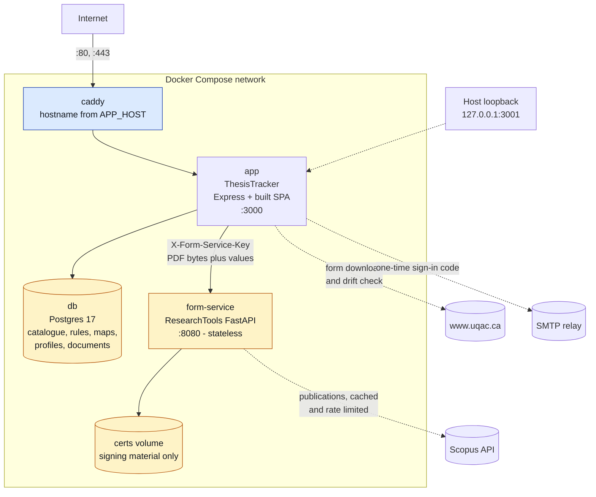

Deliberate properties:

- **The form service has no published host port.** It is reachable only on the compose network, so
  the shared secret never crosses a public interface.
- **The form service keeps one volume, for signing material.** It no longer caches PDFs or stores
  field maps: those are rows in the ThesisTracker database.
- The app is published on `127.0.0.1` only; everything public goes through Caddy.
- Every hostname comes from the environment. No domain is hardcoded anywhere.
- The `pgvector` extension is needed by RT-7 only. It rides whichever Postgres the deployment
  gives it; the compose files are written so a merged or a separate instance both work.

Vercel remains the second front door until retirement (section 14). One implementation, two doors:
`api/_lib/routes/*.js` holds every handler, a thin Vercel entry dispatches on method plus query
parameter, and the Express app mounts the same handlers on REST paths.

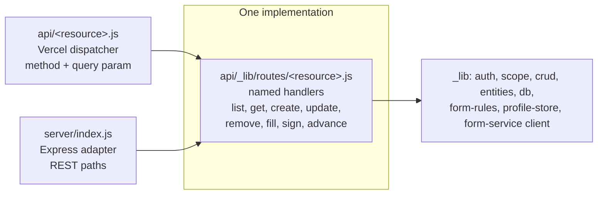

---

## 5. Per-form workflow rules

**Every registered PDF carries its own rules.** They are defined once, when the PDF is added to the
catalogue, and they say who touches the form, in what order, and what each of them may do.

### 5.1 The capability model

A form definition owns an ordered list of steps. Each step names one **actor role** and grants a
subset of five capabilities:

| Capability | Meaning | Enforced by |
|---|---|---|
| `fill` | may write a field that is currently **empty** | the route rejects a write to a non-empty field |
| `modify` | may **overwrite** a field that already has a value, to correct an error | the route rejects any write when absent |
| `sign` | must sign the signature field named by the step | the step cannot complete without it |
| `return` | may send the form back to an earlier step, with a reason that is recorded | the route rejects a return by a step that lacks it, and a return with no reason |
| `submit` | performs the final submission by email to the destination on the definition | only a step with this capability may submit, and only when every earlier step is complete |

What each actor does, in the University's own terms:

| Step | Actor | `fill` | `modify` | `sign` | `return` | What they actually do |
|---|---|---|---|---|---|---|
| 1 | `student` | yes | **yes, own situation only** | yes | no | Sees the form already filled in. Adds or corrects anything about their own situation, then signs. |
| 2 | `professor` | yes | yes | yes | **yes, to the student** | Corrects an error, sends it back for the student's approval, then flags it forward. |
| 3 | `direction` | no | no | yes | **yes, to the professor** | Countersigns, or returns it to the professor when something is wrong. |

Two things in that table are new and both matter.

**The student may modify, not only fill.** The form arrives pre-filled from the profile store, and a
pre-filled value is not necessarily right: an address changes, a program code was entered wrongly
last year. The student corrects anything about their **own situation**, which in practice means every
field their step owns. What they cannot touch is a field belonging to the professor's step or the
Direction's.

**A form can go backwards, and sometimes it must.** This is the part that is not a preference:

> A PAdES signature covers the revision of the document that existed when it was applied. When the
> professor modifies a field at step 2 that the student signed at step 1, the student's signature
> stays cryptographically **valid over its own revision** but no longer **covers the final content**.
> A viewer reports exactly that: signed, and altered since signing.

So the engine does not leave the return to the professor's judgement. **When a step modifies a field
that an earlier step signed, the instance is routed back to that signer automatically**, and cannot
advance until they approve and re-sign. The professor's "send back to the student" is therefore the
normal path after any correction, not an exception, and the professor's own step is not complete
until the student has approved.

A `return` that follows no modification is still available and still useful: the Direction returning
a form to the professor because a date is wrong, or the professor returning it to the student because
a required attachment is missing. Every return carries a reason, and the reason is shown to the person
it lands on. A return with no reason is refused, because "sent back" with no explanation is a message
nobody can act on.

Two guards keep the loop from being abused:

- A step may only return to an **earlier** step, never forward. Forward movement is signing.
- A return is recorded in the audit trail with its reason, so a form that has bounced three times
  shows why each time.

### 5.2 Three worked examples, each ending in a submission

Every form ends the same way: **submitted by email to the office that owns it.** The destination is
`form_definitions.submission_email`, set when the form is registered.

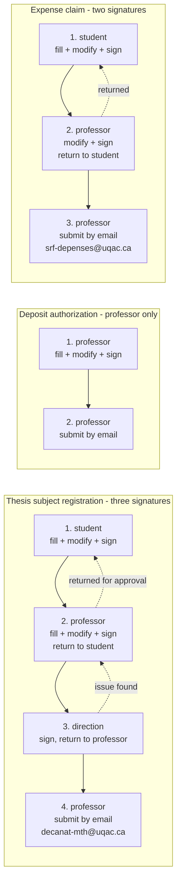

The dotted edges are returns. In example A the professor correcting a student field sends the form
back automatically, because the student's signature no longer covers the corrected content.

A form with a single professor step never appears in a student's list at all. A form whose first step
is the student's appears for the student and only reaches the professor when the student completes
their step.

### 5.3 The submission step

The last step of every definition carries `submit`. It is deliberately **a step with an actor, not an
automatic side effect of the last signature**, for one reason: emailing a signed official document to
an administrative office is outward-facing and cannot be undone. A person presses it.

| Property | Decision |
|---|---|
| Where the address lives | `form_definitions.submission_email`, plus optional `submission_cc`. Set at registration, editable by `owner` or `direction` only. |
| Who may change it | Nobody else. **The client never supplies a destination at submission time**, so no caller can email an official signed form to an address of their choosing. |
| What is sent | The final signed PDF, and nothing else. No profile data in the body. |
| What is recorded | A `form_step_events` row with `action = 'submit'`, the destination, the message id from the relay, and the document SHA-256. |
| On failure | The instance stays `AwaitingSubmission` and the failure is shown with the relay's message. A retry is the same button. Nothing is silently marked submitted. |
| Can it be sent twice | No. Once a submission is recorded, the step is complete and the button is gone. A resend is an `owner` action that records why. |

The relay is the same institutional SMTP relay that carries the sign-in codes (section 13), so a
signed official form never transits a third-party mail vendor.

### 5.4 Who defines the rules

**`owner` (superuser) or `direction`. Never a professor, never a student.** Every PDF comes from the
University administration, so a professor neither adds a form nor rewrites the rules of an official
document; they use them.

Registration is a guided flow, because the rules cannot be guessed from the file:

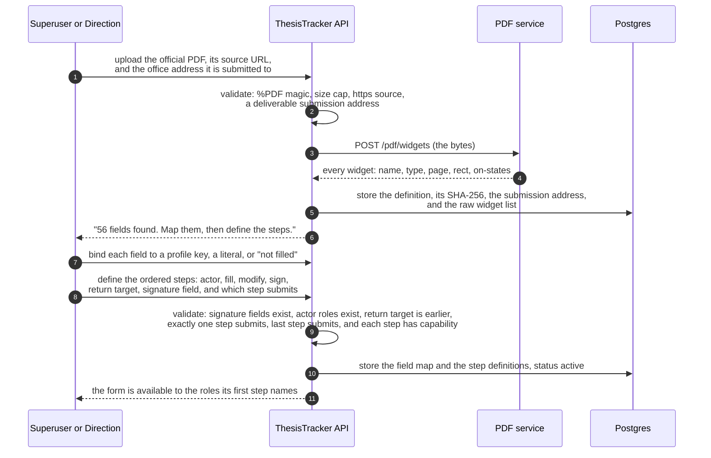

Nothing is inferred. A field nobody fills is marked as such explicitly, so a blank on an official
form is a decision on the record rather than an oversight. The submission address is asked for at
registration rather than at submission time, so nobody has to know it under pressure and no caller
can choose it.

---

## 6. Shared fields and the profile store

Many forms ask for the same things: name, permanent code, address, program, supervisor. A student
types them once.

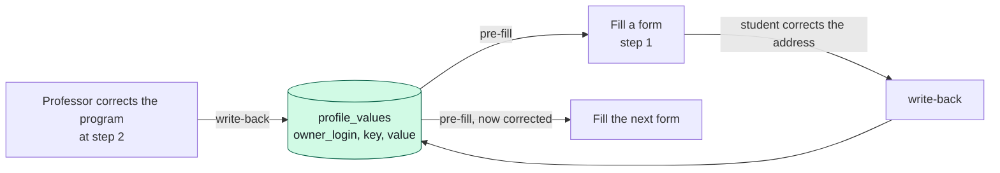

Rules, each enforced server-side:

- A field bound to a profile key is **pre-filled** from the store, so the student sees it already
  entered and only corrects it if it is wrong.
- **Any `fill` or `modify` writes back.** A student correcting their address, or a professor
  correcting a program code, updates the store and therefore every later form.
- The write-back is **owner-scoped**: it updates the profile of the student the form belongs to,
  never the profile of the person doing the editing. A professor correcting a student's address
  writes the student's profile, and the audit trail records who did it.
- Every change is versioned, so "the address was wrong on the form I submitted in March" is an
  answerable question.
- A field bound to a literal or marked as not filled is never written back.

---

## 7. The student timeline

**When a professor admits a student, the whole timeline appears.** Not a blank tracker: the forms, the
reports, the seminar, one entry per planned paper, and the thesis milestones from initial to final
deposit. A doctoral candidate should not have to discover what is expected of them one deadline at a
time.

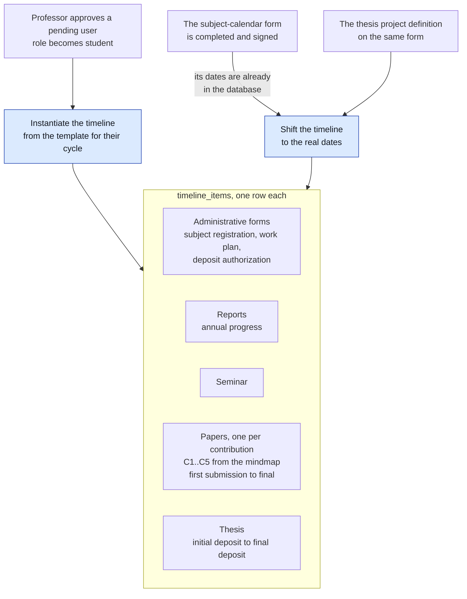

### 7.1 Where the dates come from

Three sources, in increasing authority:

| Source | Gives | Authority |
|---|---|---|
| The template for the student's cycle | the shape: which items exist and their offsets from admission | lowest, a starting point |
| The **subject-calendar form**, once completed | the real dates, and the thesis project definition | **overrides the template** |
| A professor or the student editing an item | one date at a time, with a reason | highest, and recorded |

The calendar form needs no parser and no upload: **its values are already rows.** A form's field map
binds each widget to a profile key, so once the calendar form is filled, the dates are in the
database and the timeline reads them directly. That is a direct benefit of having put the form data
in ThesisTracker rather than in a ResearchTools registry.

### 7.2 What a timeline item is

One row per expected thing, whatever kind it is, so one view shows the whole degree:

| Kind | Links to | Completed when |
|---|---|---|
| `form` | a `form_definitions.code`, and its instance once created | the instance is `Submitted` |
| `report` | a document | the document is accepted |
| `seminar` | a date and a title | marked done by the professor |
| `paper` | a `papers` row, and therefore a contribution `C1` to `C5` | the paper reaches `Published` |
| `thesis` | a milestone, `initial_deposit` or `final_deposit` | the deposit is recorded |

The paper items come from the contributions the mindmap already draws, so the timeline and the
mindmap are two views of one plan rather than two plans that drift apart. A paper item tracks the
whole arc the `papers` entity already models, from first submission to final acceptance, through the
nine statuses that exist today.

### 7.3 What the timeline is not

- **It is not a scheduler.** Nothing runs because a date arrives. Deadline reminders are Phase 3
  (section 14) and need one cron, not a workflow engine.
- **It is not a gate.** A late item is late and visible; it does not block a form or a signature. The
  administration's rules gate those, not this timeline.
- **It is not fixed.** A thesis changes shape. Every item is editable by the professor, with the
  change recorded, and the template only ever seeds.

---

## 8. Validation and correction plans

**ResearchTools validates, ThesisTracker tracks.** This is the same boundary as everywhere else, applied
to academic content instead of forms.

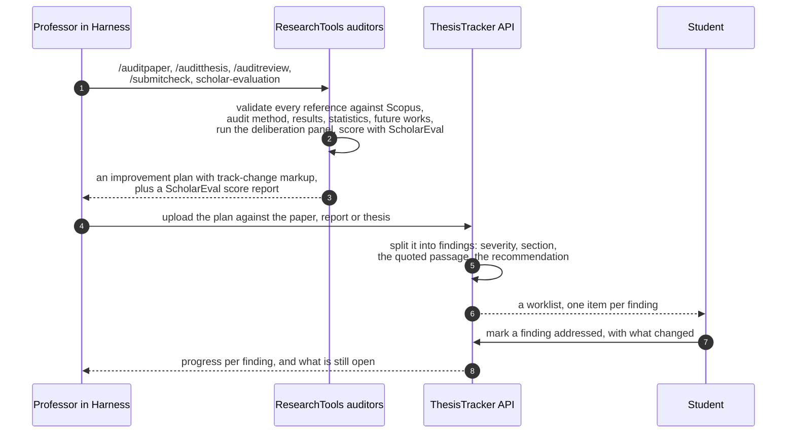

### 8.1 Why the audit is not a service endpoint

The auditors are not functions. `paper-auditor` reads a whole manuscript, validates every reference
against Scopus, runs a two-round cross-model deliberation panel, scores with `scholar-evaluation`, and
pauses for a human at defined checkpoints. Running that behind an HTTP request would mean
reimplementing it as something it is not.

So the artifact crosses the boundary, not the computation: **the plan is produced in Claude Code, as
today, and ingested by ThesisTracker.** ThesisTracker turns it into findings and tracks them. It never
re-implements the audit, and it never claims a score it did not receive.

> If the intent was a live endpoint that audits on demand, say so and this section changes. The
> artifact route is what the existing agents actually support, and it is why this unit is small.

### 8.2 What a finding is

| Field | Meaning |
|---|---|
| `severity` | `critical`, `major`, `minor`, from the auditor's own classification |
| `section` | where in the work, so the student can find it |
| `quote` | the passage the auditor flagged, verbatim |
| `recommendation` | what to do about it |
| `status` | `open`, `addressed`, or `rejected` with a reason |

**A finding is never silently closed.** `rejected` needs a reason, because a student disagreeing with
an auditor is a legitimate outcome that the professor should see rather than a state to hide. And a
score is stored as received: ThesisTracker displays what ResearchTools reported and does not compute
its own.

---

## 9. The drift guard

The piece that makes the engine survive contact with UQAC. Forms can be added, modified, or
withdrawn by the administration at any time, always at the same URL. **This now lives in
ThesisTracker**, which owns the catalogue: a download and a SHA-256 comparison is a `fetch` in Node.

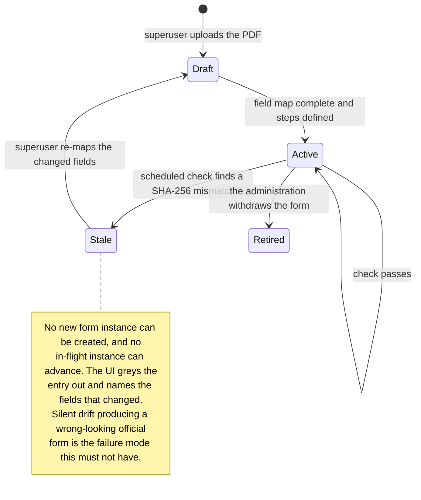

The check re-downloads each active definition, compares the SHA-256, and on a mismatch asks the PDF
service for the new widget list, diffs it against the stored map (added, removed, relocated fields),
marks the definition `stale`, and notifies the superuser and the Direction. An in-flight instance is
frozen rather than silently continued on a form that no longer matches its map.

---

## 10. Form instance lifecycle

A form instance walks its definition's steps, forwards by signing and backwards by returning. Status
is derived from the position, not typed in by hand, which is why the previous fixed six-status flow is
gone.

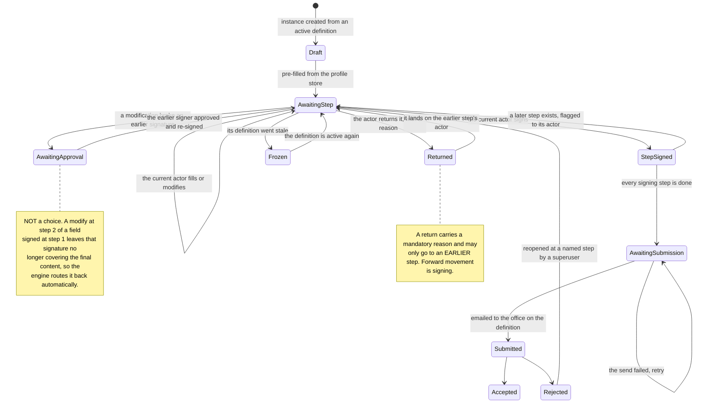

Signatures accumulate: each step's signature is a PAdES incremental update appended to the previous
one, so signature 2 does not invalidate signature 1 and the final PDF carries a verifiable chain in
step order. What a later **modification** does break is the *coverage* of an earlier signature, which
is what `AwaitingApproval` exists to repair.

`AwaitingSubmission` is a real resting state, not a formality: a form can sit there because the relay
was down. It is never marked `Submitted` until a message id comes back.

---

## 11. Data model

New tables in bold. The four original entities are unchanged, and they and the form tables share one
ownership and audit layer, which is why `crud.js`, `scope.js` and `auth.js` are not modified.

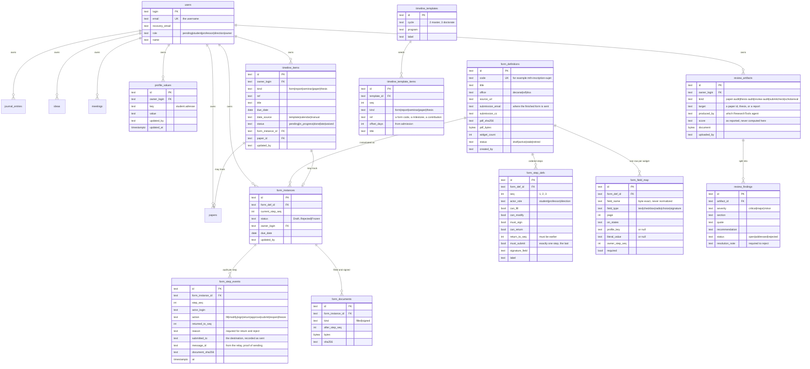

`form_field_map.field_name` holds the PDF's own byte-exact widget name and is never normalized: the
probed forms carry accented, space-bearing and generic names such as `code permanent`,
`no_matricule` and `TachesAEffectuerRow1`, and two forms name the same thing differently. That is
precisely why one profile key maps to many field names.

On the ResearchTools side there is no state to model. The service holds a signing certificate and
nothing else.

---

## 12. The twenty units

One plan document, one branch, one issue each. Every branch is cut from its repository's `main` and
its only commit is its own plan file.

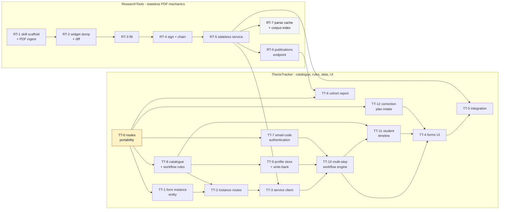

**Execution order:** TT-0 first, it unblocks every ThesisTracker unit and frees the function budget.
Then TT-7, because until it lands every new user needs a GitHub account. RT-1 through RT-5 run in
parallel with TT-8 and TT-9. TT-3 needs RT-5. TT-10 needs TT-9 for the profile store and TT-7 for
the `direction` role. TT-11 needs TT-10 and TT-8, because a timeline item tracks a form instance and
reads the calendar form's values. TT-12 needs only TT-0 and can run early: it touches no form.
RT-6 and RT-7 branch off RT-5 and are independent of each other. TT-6 needs RT-6. RT-7 is on no
critical path and can land last.

| Unit | Branch | Issue | Deliverable |
|---|---|---|---|
| RT-1 | `feat/uqac-forms-registry` | ResearchTools #4 | `uqac-forms` skill scaffold and the validated PDF-ingest contract (`%PDF` magic, size cap, https only, capped redirects). **Scope reduced:** the registry and the drift check moved to TT-8. **Delivered 2026-08-31.** |
| RT-2 | `feat/uqac-forms-field-map` | ResearchTools #5 | `dump_widgets` with byte-exact names and `/AP /N` on-states, and `diff_widgets(a, b)` for drift reporting. **Scope reduced:** the map and the vocabulary are TT-8's rows. |
| RT-3 | `feat/uqac-forms-filler` | ResearchTools #6 | Stateless `fill(pdf_bytes, values, flatten_fields) -> bytes`, `NeedAppearances`, selective field locking. **Scope reduced:** no profile, no map, no stale gate. |
| RT-4 | `feat/uqac-forms-signer` | ResearchTools #7 | Stateless PAdES sign of a named field, pluggable signer, and the guarantee that a new signature preserves every previous one. |
| RT-5 | `feat/uqac-forms-service` | ResearchTools #8 | Stateless service: `/pdf/widgets`, `/pdf/fill`, `/pdf/sign`, `/pdf/validate`. Shared-secret gate, no CORS, nothing persisted, no map volume. |
| RT-6 | `feat/publications-endpoint` | ResearchTools #9 | `scopus_api.author_documents`, cached and rate-limited `GET /publications`, approved-publisher flag |
| RT-7 | `feat/corpus-index` | ResearchTools #10 | Content-addressed parse cache, deterministic chunker, injected embedder, pgvector store, opt-in build |
| TT-0 | `feat/routes-portability` | ThesisTracker #1 | Named handlers, thin Vercel dispatchers, `pg` swap, Express front door, container |
| TT-1 | `feat/forms-entity` | ThesisTracker #2 | `form_instances` entity and its additive migration; `crud.js`, `scope.js`, `auth.js` untouched |
| TT-2 | `feat/forms-routes` | ThesisTracker #3 | Owner-scoped instance routes, signing queues, binary document routes |
| TT-3 | `feat/forms-service-client` | ThesisTracker #4 | Injected-fetch client for the stateless PDF service, with a complete failure-to-status mapping |
| TT-4 | `feat/forms-ui` | ThesisTracker #5 | Step-aware Forms view, per-role queues, pre-filled fields, the rules editor for a superuser |
| TT-5 | `feat/forms-integration` | ThesisTracker #6 | Combined compose, executable acceptance checklist, Vercel retirement checklist |
| TT-6 | `feat/cohort-report` | ThesisTracker #7 | Publications client method, staff-only roster walk, printable cohort report |
| TT-7 | `feat/email-code-auth` | ThesisTracker #9 | Email one-time code replaces GitHub OAuth; domain allowlist with no default; the `direction` role |
| TT-8 | `feat/form-catalogue` | ThesisTracker #10 | `form_definitions` (with `submission_email`), `form_step_defs` (with `can_return`, `return_to_seq`, `must_submit`), `form_field_map`; superuser-only registration and rules editing; the drift check in Node |
| TT-9 | `feat/profile-store` | ThesisTracker #11 | `profile_values` with history, pre-fill resolution, owner-scoped write-back on every fill and modify |
| TT-10 | `feat/workflow-engine` | ThesisTracker #12 | Step instances; actor and capability enforcement; **returns with a mandatory reason**; **forced re-approval when a modification breaks an earlier signature**; signature stacking; **submission by email to the definition's address**; reopen at a named step |
| TT-11 | `feat/student-timeline` | ThesisTracker #13 | Timeline template and instantiation on admission; forms, reports, seminar, papers per contribution, thesis milestones; dates shifted from the subject-calendar form's stored values |
| TT-12 | `feat/correction-plans` | ThesisTracker #14 | Intake of ResearchTools audit artifacts; `review_findings` as a student worklist; a rejected finding needs a reason; the score is stored as reported, never recomputed |

Plans live at `docs/superpowers/plans/2026-07-29-<unit>.md` on each unit's own branch. Every plan
whose scope the 2026-07-29 revision changed carries a scope-change block at the top pointing here.

---

## 13. Security and Law 25

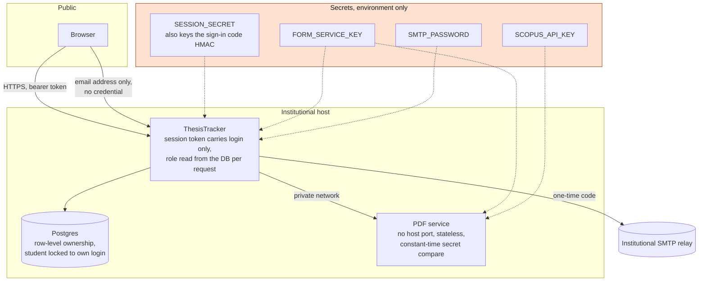

Binding rules, each enforced by a test or a startup check:

| Rule | Where |
|---|---|
| A student reads and writes only rows where `owner_login` equals their login; a cross-tenant id returns 404 | `scope.js`, `crud.js`, unchanged by every unit |
| Only the actor of the **current** step may act on an instance, and only within that step's capabilities | TT-10 workflow engine |
| A step without `modify` cannot overwrite a non-empty field; a step without `fill` cannot write at all | TT-10, asserted per capability |
| A modification that breaks an earlier signature's coverage **forces** a return to that signer; the instance cannot advance until they approve and re-sign | TT-10, asserted by test |
| A return may only target an **earlier** step, and needs a reason; a return with no reason is refused | TT-10 |
| The submission destination comes from `form_definitions.submission_email` and is **never accepted from the client**; only `owner` or `direction` may change it | TT-8, TT-10 |
| A submission is recorded with the destination and the relay's message id, and an instance is never marked `Submitted` without one. A second send needs an `owner` action with a reason | TT-10 |
| A rejected review finding requires a resolution note; nothing is silently closed. A ScholarEval score is stored as reported and never recomputed | TT-12 |
| The `direction` role can sign and edit rules, and can never write a form field or browse a tracker | TT-7 role, TT-8 rules routes, TT-10 capabilities |
| Only `owner` or `direction` may add a form definition or change its rules; a professor gets 403 | TT-8 |
| A profile write-back updates the **form owner's** profile, never the editor's, and records who did it | TT-9 |
| A new signature preserves every previous one; the chain is verifiable in step order | RT-4, asserted by test |
| An instance whose definition went stale is frozen, not silently advanced | TT-8 drift check, TT-10 gate |
| The PDF service persists nothing from a request and logs no field value | RT-5, asserted by test |
| The form service refuses to start without a shared secret of at least 32 characters, compared in constant time | RT-5 `config.load_settings`, `security.keys_match` |
| No CORS middleware anywhere on the service | server to server only |
| Only an address on an approved institutional domain may sign in; the allowlist has **no default** and the app refuses to start when empty | TT-7 `email-policy.allowedDomains`, called in `createApp()` |
| A sign-in code is stored only as `HMAC-SHA256(code, SESSION_SECRET)`, single use, 10 minutes, 5 attempts, rate limited | TT-7 `login-codes.js` |
| The code request answers identically whether or not the account exists, and all invalid-code reasons return one body | TT-7, asserted by test |
| A personal address can never sign in; rebinding an institutional address is an `owner` action | TT-7 |
| Downloads are HTTPS only, magic-byte validated, size capped, redirect capped | TT-8 ingest, RT-1 contract |
| Stored documents must start with `%PDF` and stay under the cap | TT-2 |
| No AGPL dependency in the deployable image | `deploy/form-service/requirements.txt` |
| Dependencies pinned exactly, `pip-audit --strict` before use | both requirements files |
| TLS verified against the system trust store for any remote database host | `api/_lib/db.js` |
| No email address, code, session token, profile value, or PDF byte is ever logged | asserted by tests across RT-3, RT-5, TT-2, TT-3, TT-7, TT-9 |

Law 25 drives the runtime decision: matricules, addresses, and signed expense claims stay on the
institutional host. Retiring Vercel removes the last location of student personal information
outside the institution. The same reasoning chooses the mail relay, and it is also why the PDF
service is stateless: publicly-sourced code runs beside private student data while holding none of
it.

---

## 14. Deferred and open

### Phase 3, n8n

Not dropped, deferred with explicit entry criteria. Reintroduce when any **two** hold:

1. Three or more scheduled automations exist that share credentials and need retry.
2. A non-developer must change rules without a deploy.
3. Two or more OAuth-bound external systems are in play.
4. Failed automations have become a support burden needing run history and a retry UI.

Note that criterion 2 is now **partly satisfied by design rather than by n8n**: the form rules are
editable in the UI by a superuser or the Direction, with no deploy. That was the requirement the
original specification implied, and TT-8 answers it directly. Constraints for that phase if it
arrives: self-hosted on the same UQAC host, never n8n Cloud; workflows authored from scratch and
reviewed as source, never imported; paper metadata from the `scopus` skill, never a scraper or
Google Scholar; no LLM node drafts scientific prose. Full rationale in ThesisTracker issue #8.

### Vercel retirement

Planned, not urgent, checklist written in TT-5. Order: choose the host, provision Postgres, migrate
with row-count verification, confirm the new host can send mail, set DNS, run the acceptance
checklist, keep Vercel read-only for two weeks, delete.

**The rollback is free at every step: stop the new stack.** That was not true when this project
started. The original step 4 was repointing the GitHub OAuth callback, and it was the pivot:
everything before it could be undone by stopping a container, everything after it needed a second
change in a third-party account. TT-7 removed it, so nothing outside the two hosts has to change.

### Open items

| Item | Status | Who answers |
|---|---|---|
| Does the Décanat des études accept a PAdES cryptographic signature on a thesis form, and which certificate authority does it recognize? | **Unverified.** The signer is pluggable with a self-signed development default, so implementation proceeds. A production credential is a configuration change, not a code change. | Someone must ask the Décanat |
| Does the Service des ressources financières accept a PAdES signature on an expense claim? | **Unverified**, same shape | Someone must ask the SRF |
| Does either office accept a **three-signature chain** in one PDF, or do they expect a separate signature page? | **Unverified.** The engine produces a stacked PAdES chain in step order, which is the technically correct form; whether the office reads it that way is not confirmed. | Same two offices, same conversation |
| Which institutional Docker host, and who administers it? | **Undecided by choice.** The stack is host-agnostic | The professor, with UQAC IT |
| Backup policy for the institutional Postgres | Open. A `pg_dump` cron container is the intended answer and needs no n8n | Whoever administers the host |
| Who holds the `direction` account, and does one account serve the whole Direction de programme or one per person? | Open. One per person gives a real audit trail; a shared account does not | The professor, with the Direction |

---

## 15. Where to look next

| You want | Read |
|---|---|
| The academic tooling inventory | `ResearchTools/README.md`, `ResearchTools/Architecture.md` |
| The routing table for agents, skills, commands | `ResearchTools/.claude/CLAUDE.md` |
| How to add a skill, agent, or command | `ResearchTools/docs/authoring-and-mirrors.md` |
| One unit's implementation steps | `docs/superpowers/plans/2026-07-29-<unit>.md` on that unit's branch |
| The app's own roadmap | `ThesisTracker/ROADMAP.md` |
| The acceptance checklist, once TT-5 lands | `ThesisTracker/docs/acceptance-forms.md` |
| The retirement procedure, once TT-5 lands | `ThesisTracker/docs/vercel-retirement.md` |
