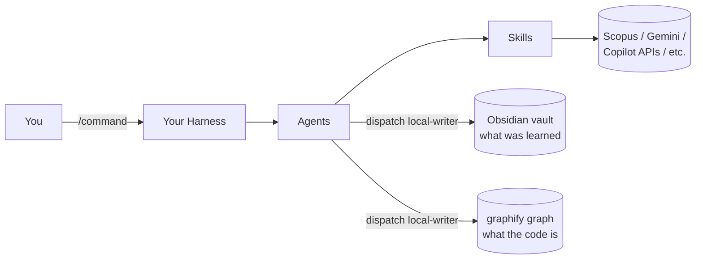

# ResearchTools — Manual

[](LICENSE)
[](docs/manual/01-installation.md)
[](docs/manual/01-installation.md)
[](docs/manual/00-purpose.md)

<p align="center">
  
</p>

Ask for my book (French version): Vibe Design. 30$ contribution via:

[](https://ko-fi.com/s/89b1e1cc6c)
[](https://www.paypal.me/MartinJDOtis)

ResearchTools is an AI-assisted toolbox for researcher-professors and graduate students
who want to design, find and fix the issues hiding in their academic design and writing
before a reviewer, a thesis committee, or a grant panel does. On the software side,
in code, PCB, and 3D CAD design. Full pitch, the 2026 roadmap, and this manual's own
conventions: [docs/manual/00-purpose.md](docs/manual/00-purpose.md).

**Never let an LLM do your work for you. Use it to improve your work, find your weaknesses,
and help you improve yourself. Never use these tools to conduct a formal or professional
assessment, and do not let the tool make decisions for you. Use at your own risk.**

This file is the entry point only. The manual is split into chapters under `docs/manual/`,
the same way [Architecture.md](Architecture.md) is already split into layers instead of kept
as one flat file — this keeps each topic at a readable size instead of one 1300-line page.

## See it in action


The `rt-observe` dashboard watching a live session: hook flow, fan-out to the two memories
(Obsidian vault, `graphify` graph), and a spawned subagent, all on loopback with no external
service. Full walkthrough: [docs/manual/07-rt-observe-dashboard.md](docs/manual/07-rt-observe-dashboard.md).

## Quickstart

```powershell
git clone https://github.com/LARi-UQAC/ResearchTools.git
cd ResearchTools
.\setup.ps1 -All -Personal   # config + Claude links + all tool mirrors
.\setup.ps1 -InstallPython   # optional: creates .venv-skills for the offline test suite
```

Full install steps (junctions, other-tool mirrors, prerequisites table):
[docs/manual/01-installation.md](docs/manual/01-installation.md).

## The two memories

Two memories back this toolkit, and neither is read or written directly: the Obsidian vault
(what was learned, across every project) and the `graphify` code graph in `graphify-out/`
(what this repository's code IS right now). Both are reached only by dispatching the
`local-writer` agent. The graph's own state is read-only via
`scripts/audit/check-graph-health.ps1`. Full design:
[docs/manual/04-skills.md](docs/manual/04-skills.md#the-two-memories---the-vault-and-the-code-graph).

## Manual chapters

At a glance — commands drive agents, agents draw on skills, and both memories are reached
only through `local-writer` (detail: [04-skills.md](docs/manual/04-skills.md)):



| # | Chapter | Covers |
|---|---|---|
| 00 | [Purpose & overview](docs/manual/00-purpose.md) | Mission, 2026 roadmap, manual conventions |
| 01 | [Installation](docs/manual/01-installation.md) | `setup.ps1` / `install.ps1` / `install-junctions.ps1`, prerequisites, the 5 install steps |
| 02 | [Profiles & environment](docs/manual/02-profiles.md) | Domain profiles, API keys |
| 03 | [Token management](docs/manual/03-token-management.md) | Output modes, `/slim` `/concis` `/focus` `/ctx` |
| 04 | [Skills](docs/manual/04-skills.md) | All 15 skills, the two memories |
| 05 | [Security audit](docs/manual/05-security-audit.md) | SkillSpector findings |
| 06 | [Aider nightly pipeline](docs/manual/06-aider-pipeline.md) | `aider-setup`, the student `aider-kit.zip`, vs. `local-coder` |
| 07 | [rt-observe & dashboard](docs/manual/07-rt-observe-dashboard.md) | Mirror matrix, `/rt-dashboard` |
| 08 | [Commands](docs/manual/08-commands.md) | All slash commands |
| 09 | [ThesisTracker integration](docs/manual/09-thesistracker-integration.md) | The sibling repository, `NEW_ARCHITECTURE.md`, the `form-service` boundary |
| 10 | [Agents](docs/manual/10-agents.md) | All agents, local delegation, loop engineering |
| 11 | [File locations](docs/manual/11-file-locations.md) | Directory tree summary |

Relationship diagrams and the 7-layer execution architecture for **this** repository:
[Architecture.md](Architecture.md). The architecture **shared with the sibling repository
ThesisTracker** (form catalogue, twenty-unit delivery plan) is a separate file,
[NEW_ARCHITECTURE.md](NEW_ARCHITECTURE.md) — see chapter 09 above; do not confuse the two.
