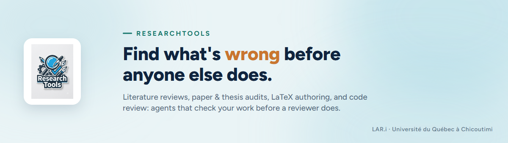

---
hide:
  - navigation
  - toc
title: ResearchTools
---

# ResearchTools

An AI-assisted toolbox for researcher-professors and graduate students.
It finds and fixes what's wrong before a reviewer, a thesis committee, or a grant panel
does.

[Read the manual](manual/00-purpose.md){ .md-button .md-button--primary }
[Quickstart](manual/01-installation.md){ .md-button }
[View on GitHub](https://github.com/LARi-UQAC/ResearchTools){ .md-button }

### 📚 Academic writing

Literature reviews, paper and thesis audits, BibTeX cleanup, reviewer responses, submission
packages — a ScholarEval score before the reviewer ever sees it.

[Skills →](manual/04-skills.md)

### 🛠️ Software & hardware review

Code, PCB, and 3D CAD design review, with the `rt-observe` dashboard to watch the agents work
and log what they did.

[See it in action →](manual/07-rt-observe-dashboard.md)

### ⚙️ Local-model dev loop

`local-writer` / `local-coder` push routine generation to a local Ollama model instead of the
cloud — a design/plan/code/review loop that keeps token cost down.

[Agents →](manual/10-agents.md)

## Why ResearchTools

| Without | With ResearchTools |
|---|---|
| Catch a missing reference or a broken hypothesis flow after the reviewer does | An auditor scores the manuscript first, against the same ScholarEval rubric a committee uses |
| Re-read a cited paper's abstract and hope the citation says what you think it says | `extract-contributions` checks the citing sentence against the paper's own stated contribution |
| Burn cloud tokens on routine docstrings and refactors | `local-writer` / `local-coder` push that generation to a local model, for free |

---

This page is the homepage of the themed MkDocs Material site (`mkdocs.yml` at the repo root,
brand palette in [assets/extra.css](assets/extra.css) — navy `#10243E`, teal `#1F9E8F`, amber
`#C9762F`, taken from the project's own design system in `post-media/Series Template.dc.html`).
Nothing here duplicates the manual; every link points at the same file a Claude Code session
or a plain GitHub browse would read.

**Preview locally:** `.venv-docs\Scripts\python.exe -m mkdocs serve` (env: `pip install -r
requirements-docs.txt` into `.venv-docs`), then open the printed `http://127.0.0.1:8000`.
**Publish:** `mkdocs gh-deploy`, run by hand whenever the docs change — no GitHub Actions
workflow, matching this repo's no-CI/CD policy — then enable Settings → Pages → Deploy from
a branch → `gh-pages`. Two known gaps in the built site (not on the raw GitHub browse): links
that reach outside `docs/` (to `README.md`, `Architecture.md`, `.claude/CLAUDE.md`) resolve
on GitHub but not inside the MkDocs build, since its `docs_dir` is `docs/` only; and
`04-skills.md`'s internal table of contents uses GitHub's heading-slug algorithm, which
differs slightly from MkDocs' own slugifier, so those specific in-page anchors don't jump
correctly inside the built site.

## Start here

The manual lives in [`manual/`](manual/00-purpose.md), one chapter per topic:

| # | Chapter |
|---|---|
| 00 | [Purpose & overview](manual/00-purpose.md) |
| 01 | [Installation](manual/01-installation.md) |
| 02 | [Profiles & environment](manual/02-profiles.md) |
| 03 | [Token management](manual/03-token-management.md) |
| 04 | [Skills](manual/04-skills.md) |
| 05 | [Security audit](manual/05-security-audit.md) |
| 06 | [Aider nightly pipeline](manual/06-aider-pipeline.md) |
| 07 | [rt-observe & dashboard](manual/07-rt-observe-dashboard.md) |
| 08 | [Commands](manual/08-commands.md) |
| 09 | [ThesisTracker integration](manual/09-thesistracker-integration.md) |
| 10 | [Agents](manual/10-agents.md) |
| 11 | [File locations](manual/11-file-locations.md) |

## Deep-dive references

Longer, single-topic documents that a manual chapter points into rather than repeats:

- [aider-setup.md](aider-setup.md) — the aider nightly pipeline, full manual
- [rt-observe.md](rt-observe.md) — the toolkit-state dashboard, full reference
- [authoring-and-mirrors.md](authoring-and-mirrors.md) — adding or editing an agent, skill,
  or command, and regenerating the per-tool mirrors
- [contributor-notes.md](contributor-notes.md) — shared conventions (English-only definition
  files, agent/skill layout, local-model routing, git/GitHub workflow)
- [github-repo-setup-playbook.md](github-repo-setup-playbook.md) — portable step-by-step for
  bringing another repo's GitHub presentation up to this same standard (README structure,
  doc-site setup, community files, repo settings, Issue/board/PR process rules), written for a
  Claude Code session to execute, not for a human to read once

## Elsewhere in the repository

- [../README.md](../README.md) — repository root entry point
- [../Architecture.md](../Architecture.md) — this repository's own 7-layer component
  architecture
- [../NEW_ARCHITECTURE.md](../NEW_ARCHITECTURE.md) — the architecture shared with the
  sibling repository ThesisTracker
- [../CONTRIBUTING.md](../CONTRIBUTING.md) · [../CODE_OF_CONDUCT.md](../CODE_OF_CONDUCT.md)
